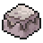
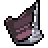
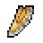
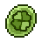
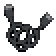

| New Items | Effect |
                    | :--: | :-- |
                    |  Peat Block | A block of muddy material that is for fuel. It’s loved by a certain Pokémon. |
|  Black Augurite | A glassy black stone that produces a sharp cutting edge when split. It’s loved by a certain Pokémon. |
|  Leader's Crest | A shard of what appears to be an old blade of some sort. It is held only by a head of certain Pokémon group. |
|  Joy Stone | A peculiar stone that makes certain species of Pokémon evolve. It radiates joyous emotions. |
|  Link Cord | A peculiary weird cable created by Bill that seems to make certain Pokémon evolve. |

