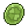
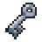

| New Items | Effect |
                    | :--: | :-- |
                    |  Peat Block | A block of muddy material that is for fuel. It’s loved by a certain Pokémon. |
|  Black Augurite | A glassy black stone that produces a sharp cutting edge when split. It’s loved by a certain Pokémon. |
|  Leader's Crest | A shard of what appears to be an old blade of some sort. It is held only by a head of certain Pokémon group. |
|  Link Cord | A peculiary weird cable created by Bill that seems to make certain Pokémon evolve. |
|  Joy Stone | A peculiar stone that makes certain species of Pokémon evolve. It radiates joyous emotions. |
|  Vinview Storage Key | A key for the Storage House in Vinview Town. |
|  Meteorite Shard | A shard of the Mt. Tephra Meteorite. |
|  Meteorite | A meteorite emitting great power, used to calm the volcano Mt. Tephra. |
|  Axe | This can be used to cut trees. |
|  Pickaxe | This can be used to smash rocks. |
|  Strength Gauntlets | This can be used to push big objects. |
|  Flippers | This can be used to swim. |
|  Somersault Cloud | Leap upon a flying cloud and ride it to your destination. |
|  Lantern | This can be used to illuminate area. |
|  Scuba Gear | It allows you breath under water. |
|  Float Barclet | Unique barclet that allow the user to swim up a waterfall. |
|  Climbing Gear | This can be used to climb big ledges. |
|  Ice Pick | This can be used on ice barriers to break at ease. |
|  Ranger Badge | A Badge to prove you are part of the Pokémon Ranger Club. |

