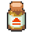
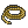
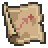
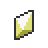
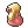

| Item Name | Route | Specific Location | Method | Requirements |
            | :--- | :--- | :--- | :--- | :--- |
            |  Vinview Storage Key | Vinview Town | Found in puddle next to the Professor's Lab | Hidden Item |  |
|  Amulet Coin | Vinview Town | Player House | NPC Gift | Received your starter Pokémon |
|  Antidote | Route 1 | North west of the Route | Pokéball |  |
|  Awakening | Rubble Cave 2F | When the cave branches into 3 paths, instead run straight down between some rocks | Pokéball |  |
|  Calcium | Rubble Cave 2F | Within the stone maze | Pokéball |  |
|  Dome Fossil | Rubble Cave B1F | Backpacker in the western part | NPC Gift | Pick either Dome or Helix fossil |
|  Escape Rope | Route 1 | From Oliver in front of Rubble Cave | NPC Gift | Main Story |
|  Eviolite | Vinview Town | Storage House | NPC Gift | Storage Key found in puddle next to the Professor's Lab |
|  Go Goggles | Seapearl City | Single house to the far left of the town | NPC Gift | Main Story |
|  Helix Fossil | Rubble Cave B1F | Backpacker in the western part | NPC Gift | Pick either Helix or Dome fossil |
|  Moon Stone | Rubble Cave 3F | On the lower level, up a pair of stairs | Pokéball |  |
|  Old Sea Map | Rubble Cave 2F | Entrance from Team Nova's explosion in Route 2 | Pokéball | Defeat the Pokémon League |
|  Poke Ball | Vinview Town | Behind the Player House | Pokéball |  |
|  Potion | Route 1 | To the right as you leave Vinview Town | Pokéball |  |
|  Rare Candy | Vinview Town | South East corner by the new resident | Pokéball | 4th Gym Badge |
|  Repel | Rubble Cave 1F | Jump down the cliff to find a Pokéball | Pokéball |  |
|  Revive | Rubble Cave 2F | Close to the ladder to 1F | Pokéball |  |
|  Soft Sand | Rubble Cave B1F | Sand patch in the south western part | Pokéball |  |
|  Super Potion | Rubble Cave 2F | To the left of Hiker James | Pokéball |  |

            