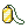
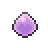
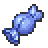

| Item Name | Route | Specific Location | Method | Requirements |
            | :--- | :--- | :--- | :--- | :--- |
            |  Amulet Coin | Vinview Town | Player House | NPC Gift | Received your starter Pokémon |
|  Eviolite | Vinview Town | Storage House | NPC Gift | Storage Key found in puddle next to the Professor's Lab |
|  Go Goggles | Seapearl City | Single house to the far left of the town | NPC Gift | Main Story |
|  Poke Ball | Vinview Town | Behind the Player House | Pokéball |  |
|  Potion | Route 1 | To the right as you leave Vinview Town | Pokéball |  |
|  Rare Candy | Vinview Town | South East corner by the new resident | Pokéball | 4th Gym Badge |

            