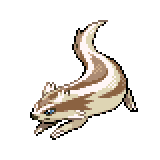

  

  

    

      
Types

      

        
        
      

    

    

      
Abilities

      

        <a href='' title="At the end of each turn, if another Pokemon consumed or Flung a held item that turn, this Pokemon picks up the item if it is not already holding one.  After each battle, this Pokemon has a 10% chance of picking up an item if it is not already holding one.  The air balloon and eject button cannot be picked up.  The items that may be found vary by game, and, since Pokemon Emerald, by the Pokemon's level.  This ability is checked after the battle ends, at which point any temporary ability changes have worn off.">Pickup</a>
        /<a href='' title="This Pokemon eats any held Berry triggered by low HP when it falls below 50% of its HP, regardless of the Berry's usual threshold.">Gluttony</a>
      

    

    

      
Hidden Ability

      

        <a href='' title="Whenever this Pokemon has a major status ailment, it has 1.5x its Speed.  This Pokemon is not affected by the usual Speed cut from paralysis.  Overworld: If the lead Pokemon has this ability, the wild encounter rate is halved.">Quick-feet</a>
      

    

  

## Base Stats
<table style="width: 100%">
  <tbody style="width: 100%;">
    <tr style="display: flex; align-items: center;">
      <th style="color: #737373;" >HP</th>
      <td style="border-top: none; width: 70px">78</td>
      <td style="width: 100%; min-width: 450px; border-top: none;">
        

        

      </td>
    </tr>
    <tr style="display: flex; align-items: center;">
      <th style="color: #737373;">Attack</th>
      <td style="border-top: none; width: 70px">70</td>
      <td style="width: 100%; min-width: 450px; border-top: none;">
        

        

      </td>
    </tr>
    <tr style="display: flex; align-items: center;">
      <th style="color: #737373;">Defense</th>
      <td style="border-top: none; width: 70px">61</td>
      <td style="width: 100%; min-width: 450px; border-top: none;">
        

        

      </td>
    </tr>
    <tr style="display: flex; align-items: center;">
      <th style="color: #737373;">SP Attack</th>
      <td style="border-top: none; width: 70px">50</td>
      <td style="width: 100%; min-width: 450px; border-top: none;">
        

        

      </td>
    </tr>
    <tr style="display: flex; align-items: center;">
      <th style="color: #737373;">SP Defense</th>
      <td style="border-top: none; width: 70px">61</td>
      <td style="width: 100%; min-width: 450px; border-top: none;">
        

        

      </td>
    </tr>
    <tr style="display: flex; align-items: center;">
      <th style="color: #737373;">Speed</th>
      <td style="border-top: none; width: 70px">100</td>
      <td style="width: 100%; min-width: 450px; border-top: none;">
        

        

      </td>
    </tr>
  </tbody>
</table>

## Moveset

=== "Level Up Moves"
    | Level | Name | Power | Accuracy | PP | Type | Damage Class |
        | -- | -- | -- | -- | -- | -- | -- |
        	| 1 | Tackle | 40 | 100 | 35 |  |  |
	| 1 | Play-rough | 90 | 90 | 10 |  |  |
	| 1 | Switcheroo | - | 100 | 10 |  |  |
	| 1 | Rototiller | - | - | 10 |  |  |
	| 1 | Growl | - | 100 | 40 |  |  |
	| 5 | Tail-whip | - | 100 | 30 |  |  |
	| 7 | Sand-attack | - | 100 | 15 |  |  |
	| 11 | Headbutt | 70 | 100 | 15 |  |  |
	| 13 | Odor-sleuth | - | - | 40 |  |  |
	| 17 | Mud-sport | - | - | 15 |  |  |
	| 19 | Fury-swipes | 18 | 80 | 15 |  |  |
	| 24 | Covet | 60 | 100 | 25 |  |  |
	| 27 | Bestow | - | - | 15 |  |  |
	| 32 | Slash | 70 | 100 | 20 |  |  |
	| 35 | Double-edge | 120 | 100 | 15 |  |  |
	| 43 | Belly-drum | - | - | 10 |  |  |

        

=== "Machine Moves"
    | Machine | Name | Power | Accuracy | PP | Type | Damage Class |
        | -- | -- | -- | -- | -- | -- | -- |
        	| TM27 | Toxic | - | 90 | 10 |  |  |
	| TM36 | Thunderbolt | 90 | 100 | 15 |  |  |
	| TM100 | Confide | - | - | 20 |  |  |
	| TM27 | Return | - | 100 | 20 |  |  |
	| TM87 | Swagger | - | 85 | 15 |  |  |
	| TM05 | Rest | - | - | 5 |  |  |
	| TM56 | Fling | - | 100 | 10 |  |  |
	| TM38 | Thunder | 110 | 70 | 10 |  |  |
	| TM88 | Sleep-talk | - | - | 10 |  |  |
	| TM65 | Shadow-claw | 70 | 100 | 15 |  |  |
	| TM05 | Roar | - | - | 20 |  |  |
	| TM32 | Double-team | - | - | 15 |  |  |
	| TM46 | Thief | 60 | 100 | 25 |  |  |
	| TM86 | Grass-knot | - | 100 | 20 |  |  |
	| TM10 | Hidden-power | 60 | 100 | 15 |  |  |
	| TM21 | Frustration | - | 100 | 20 |  |  |
	| TM30 | Shadow-ball | 80 | 100 | 15 |  |  |
	| TM57 | Charge-beam | 50 | 90 | 10 |  |  |
	| TM45 | Attract | - | 100 | 15 |  |  |
	| TM55 | Ice-beam | 90 | 100 | 10 |  |  |
	| TM11 | Sunny-day | - | - | 5 |  |  |
	| TM08 | Substitute | - | - | 10 |  |  |
	| TM48 | Hyper-beam | 150 | 90 | 5 |  |  |
	| TM07 | Protect | - | - | 10 |  |  |
	| TM12 | Facade | 70 | 100 | 20 |  |  |
	| TM01 | Work-up | - | - | 30 |  |  |
	| TM48 | Round | 60 | 100 | 15 |  |  |
	| TM49 | Echoed-voice | 40 | 100 | 15 |  |  |
	| TM14 | Blizzard | 110 | 70 | 5 |  |  |
	| TM18 | Rain-dance | - | - | 5 |  |  |
	| TM68 | Giga-impact | 150 | 90 | 5 |  |  |
	| TM16 | Thunder-wave | - | 90 | 20 |  |  |
	| TM94 | Surf | 90 | 100 | 15 |  |  |

        
