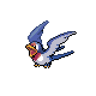

  

  

    

      
Types

      

        
        
      

    

    

      
Abilities

      

        <a href='' title="Whenever this Pokemon is asleep, burned, paralyzed, or poisoned, it has 1.5x its Attack.  This Pokemon is not affected by the usual Attack cut from a burn.  This bonus does not count as a stat modifier.">Guts</a>
        /<a href='' title="When this Pokemon uses or loses its held item, its Speed is doubled.  If it gains another item or leaves battle, this bonus is lost.  This includes when the Pokemon drops its item because of knock off.  This bonus does not count as a stat modifier.  There is no notification when this ability takes effect.">Unburden</a>
        /<a href='' title="This Pokemon ignores ghost-type Pokemon's immunity to normal- and fighting-type moves.  Ghost Pokemon's other types affect damage as usual.">Hidden: Scrappy</a>
      

    

  

## Base Stats
<table style="width: 100%">
  <tbody style="width: 100%;">
    <tr style="display: flex; align-items: center;">
      <th style="color: #737373;" >HP</th>
      <td style="border-top: none; width: 70px">40</td>
      <td style="width: 100%; min-width: 450px; border-top: none;">
        

        

      </td>
    </tr>
    <tr style="display: flex; align-items: center;">
      <th style="color: #737373;">Attack</th>
      <td style="border-top: none; width: 70px">55</td>
      <td style="width: 100%; min-width: 450px; border-top: none;">
        

        

      </td>
    </tr>
    <tr style="display: flex; align-items: center;">
      <th style="color: #737373;">Defense</th>
      <td style="border-top: none; width: 70px">30</td>
      <td style="width: 100%; min-width: 450px; border-top: none;">
        

        

      </td>
    </tr>
    <tr style="display: flex; align-items: center;">
      <th style="color: #737373;">SP Attack</th>
      <td style="border-top: none; width: 70px">30</td>
      <td style="width: 100%; min-width: 450px; border-top: none;">
        

        

      </td>
    </tr>
    <tr style="display: flex; align-items: center;">
      <th style="color: #737373;">SP Defense</th>
      <td style="border-top: none; width: 70px">30</td>
      <td style="width: 100%; min-width: 450px; border-top: none;">
        

        

      </td>
    </tr>
    <tr style="display: flex; align-items: center;">
      <th style="color: #737373;">Speed</th>
      <td style="border-top: none; width: 70px">85</td>
      <td style="width: 100%; min-width: 450px; border-top: none;">
        

        

      </td>
    </tr>
  </tbody>
</table>

## Locations
| Route | Area | Encounter Rate | Extra Instructions |
        | -- | -- | -- | -- |
        	| Sowset Town | Grass | 22 |  |

        

## Moveset

=== "Level Up Moves"
    | Level | Name | Power | Accuracy | PP | Type | Damage Class |
        | -- | -- | -- | -- | -- | -- | -- |
        	| 1 | Peck | 35 | 100 | 35 |  |  |
	| 1 | Growl | - | 100 | 40 |  |  |
	| 5 | Focus-energy | - | - | 30 |  |  |
	| 9 | Quick-attack | 40 | 100 | 30 |  |  |
	| 13 | Wing-attack | 60 | 100 | 35 |  |  |
	| 25 | Quick-guard | - | - | 15 |  |  |
	| 29 | Agility | - | - | 30 |  |  |
	| 33 | Air-slash | 75 | 95 | 15 |  |  |
	| 37 | Endeavor | - | 100 | 5 |  |  |
	| 41 | Brave-bird | 120 | 100 | 15 |  |  |
	| 45 | Reversal | - | 100 | 15 |  |  |

        

=== "Machine Moves"
    | Machine | Name | Power | Accuracy | PP | Type | Damage Class |
        | -- | -- | -- | -- | -- | -- | -- |
        	| TM27 | Toxic | - | 90 | 10 |  |  |
	| TM100 | Confide | - | - | 20 |  |  |
	| TM27 | Return | - | 100 | 20 |  |  |
	| TM87 | Swagger | - | 85 | 15 |  |  |
	| TM05 | Rest | - | - | 5 |  |  |
	| TM88 | Sleep-talk | - | - | 10 |  |  |
	| TM32 | Double-team | - | - | 15 |  |  |
	| TM51 | Steel-wing | 70 | 90 | 25 |  |  |
	| TM46 | Thief | 60 | 100 | 25 |  |  |
	| TM89 | U-turn | 70 | 100 | 20 |  |  |
	| TM10 | Hidden-power | 60 | 100 | 15 |  |  |
	| TM21 | Frustration | - | 100 | 20 |  |  |
	| TM19 | Roost | - | - | 5 |  |  |
	| TM40 | Aerial-ace | 60 | - | 20 |  |  |
	| TM45 | Attract | - | 100 | 15 |  |  |
	| TM11 | Sunny-day | - | - | 5 |  |  |
	| TM08 | Substitute | - | - | 10 |  |  |
	| TM07 | Protect | - | - | 10 |  |  |
	| TM12 | Facade | 70 | 100 | 20 |  |  |
	| TM01 | Work-up | - | - | 30 |  |  |
	| TM48 | Round | 60 | 100 | 15 |  |  |
	| TM76 | Fly | 90 | 95 | 15 |  |  |
	| TM49 | Echoed-voice | 40 | 100 | 15 |  |  |
	| TM18 | Rain-dance | - | - | 5 |  |  |

        
