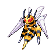

  

  

    

      
Types

      

        
        
      

    

    

      
Abilities

      

        <a href='' title="This Pokemon inflicts twice as much damage with moves whose types match its own, rather than the usual same-type attack bonus of 1.5x.">Adaptability</a>
        
      

    

  

## Base Stats
<table style="width: 100%">
  <tbody style="width: 100%;">
    <tr style="display: flex; align-items: center;">
      <th style="color: #737373;" >HP</th>
      <td style="border-top: none; width: 70px">65</td>
      <td style="width: 100%; min-width: 450px; border-top: none;">
        

        

      </td>
    </tr>
    <tr style="display: flex; align-items: center;">
      <th style="color: #737373;">Attack</th>
      <td style="border-top: none; width: 70px">150</td>
      <td style="width: 100%; min-width: 450px; border-top: none;">
        

        

      </td>
    </tr>
    <tr style="display: flex; align-items: center;">
      <th style="color: #737373;">Defense</th>
      <td style="border-top: none; width: 70px">40</td>
      <td style="width: 100%; min-width: 450px; border-top: none;">
        

        

      </td>
    </tr>
    <tr style="display: flex; align-items: center;">
      <th style="color: #737373;">SP Attack</th>
      <td style="border-top: none; width: 70px">15</td>
      <td style="width: 100%; min-width: 450px; border-top: none;">
        

        

      </td>
    </tr>
    <tr style="display: flex; align-items: center;">
      <th style="color: #737373;">SP Defense</th>
      <td style="border-top: none; width: 70px">80</td>
      <td style="width: 100%; min-width: 450px; border-top: none;">
        

        

      </td>
    </tr>
    <tr style="display: flex; align-items: center;">
      <th style="color: #737373;">Speed</th>
      <td style="border-top: none; width: 70px">145</td>
      <td style="width: 100%; min-width: 450px; border-top: none;">
        

        

      </td>
    </tr>
  </tbody>
</table>

## Moveset

=== "Level Up Moves"
    | Level | Name | Power | Accuracy | PP | Type | Damage Class |
        | -- | -- | -- | -- | -- | -- | -- |
        	| 1 | Twineedle | 25 | 100 | 20 |  |  |
	| 1 | Peck | 35 | 100 | 35 |  |  |
	| 13 | Rage | 20 | 100 | 20 |  |  |
	| 16 | Fury-attack | 15 | 85 | 20 |  |  |
	| 17 | Pursuit | 40 | 100 | 20 |  |  |
	| 19 | Focus-energy | - | - | 30 |  |  |
	| 25 | Agility | - | - | 30 |  |  |
	| 26 | Assurance | 60 | 100 | 10 |  |  |
	| 28 | Pin-missile | 25 | 95 | 20 |  |  |
	| 29 | Toxic-spikes | - | - | 20 |  |  |
	| 41 | Endeavor | - | 100 | 5 |  |  |
	| 44 | Fell-stinger | 50 | 100 | 25 |  |  |

        

=== "Machine Moves"
    | Machine | Name | Power | Accuracy | PP | Type | Damage Class |
        | -- | -- | -- | -- | -- | -- | -- |
        	| TM27 | Toxic | - | 90 | 10 |  |  |
	| TM66 | Payback | 50 | 100 | 10 |  |  |
	| TM100 | Confide | - | - | 20 |  |  |
	| TM27 | Return | - | 100 | 20 |  |  |
	| TM87 | Swagger | - | 85 | 15 |  |  |
	| TM09 | Venoshock | 65 | 100 | 10 |  |  |
	| TM54 | False-swipe | 40 | 100 | 40 |  |  |
	| TM05 | Rest | - | - | 5 |  |  |
	| TM84 | Poison-jab | 80 | 100 | 20 |  |  |
	| TM36 | Sludge-bomb | 90 | 100 | 10 |  |  |
	| TM62 | Acrobatics | 55 | 100 | 15 |  |  |
	| TM01 | Headbutt | 70 | 100 | 15 |  |  |
	| TM88 | Sleep-talk | - | - | 10 |  |  |
	| TM58 | Drill-run | 80 | 95 | 10 |  |  |
	| TM32 | Double-team | - | - | 15 |  |  |
	| TM46 | Thief | 60 | 100 | 25 |  |  |
	| TM89 | U-turn | 70 | 100 | 20 |  |  |
	| TM13 | Brick-break | 75 | 100 | 15 |  |  |
	| TM10 | Hidden-power | 60 | 100 | 15 |  |  |
	| TM21 | Frustration | - | 100 | 20 |  |  |
	| TM19 | Roost | - | - | 5 |  |  |
	| TM40 | Aerial-ace | 60 | - | 20 |  |  |
	| TM83 | Infestation | 20 | 100 | 20 |  |  |
	| TM45 | Attract | - | 100 | 15 |  |  |
	| TM45 | Solar-beam | 120 | 100 | 10 |  |  |
	| TM59 | Brutal-swing | 60 | 100 | 20 |  |  |
	| TM11 | Sunny-day | - | - | 5 |  |  |
	| TM08 | Substitute | - | - | 10 |  |  |
	| TM39 | Outrage | 120 | 100 | 10 |  |  |
	| TM48 | Hyper-beam | 150 | 90 | 5 |  |  |
	| TM07 | Protect | - | - | 10 |  |  |
	| TM12 | Facade | 70 | 100 | 20 |  |  |
	| TM81 | X-scissor | 80 | 100 | 15 |  |  |
	| TM48 | Round | 60 | 100 | 15 |  |  |
	| TM53 | Mega-drain | 40 | 100 | 15 |  |  |
	| TM68 | Giga-impact | 150 | 90 | 5 |  |  |
	| TM33 | Reflect | - | - | 20 |  |  |
	| TM75 | Swords-dance | - | - | 20 |  |  |

        
