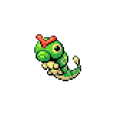

  

  

    

      
Types

      

        
        
      

    

    

      
Abilities

      

        <a href='' title="This Pokemon is immune to the extra effects of moves used against it.  An extra effect is a move's chance, listed as an "effect chance", to inflict a status ailment, cause a stat change, or make the target flinch in addition to the move's main effect.  For example, thunder shock's paralysis is an extra effect, but thunder wave's is not, nor are knock off's item removal and air cutter's increased critical hit rate.">Shield-dust</a>
        
      

    

    

      
Hidden Ability

      

        <a href='' title="This Pokemon is always successful fleeing from wild battles, even if trapped by a move or ability.">Run-away</a>
      

    

  

## Base Stats
<table style="width: 100%">
  <tbody style="width: 100%;">
    <tr style="display: flex; align-items: center;">
      <th style="color: #737373;" >HP</th>
      <td style="border-top: none; width: 70px">45</td>
      <td style="width: 100%; min-width: 450px; border-top: none;">
        

        

      </td>
    </tr>
    <tr style="display: flex; align-items: center;">
      <th style="color: #737373;">Attack</th>
      <td style="border-top: none; width: 70px">30</td>
      <td style="width: 100%; min-width: 450px; border-top: none;">
        

        

      </td>
    </tr>
    <tr style="display: flex; align-items: center;">
      <th style="color: #737373;">Defense</th>
      <td style="border-top: none; width: 70px">35</td>
      <td style="width: 100%; min-width: 450px; border-top: none;">
        

        

      </td>
    </tr>
    <tr style="display: flex; align-items: center;">
      <th style="color: #737373;">SP Attack</th>
      <td style="border-top: none; width: 70px">20</td>
      <td style="width: 100%; min-width: 450px; border-top: none;">
        

        

      </td>
    </tr>
    <tr style="display: flex; align-items: center;">
      <th style="color: #737373;">SP Defense</th>
      <td style="border-top: none; width: 70px">20</td>
      <td style="width: 100%; min-width: 450px; border-top: none;">
        

        

      </td>
    </tr>
    <tr style="display: flex; align-items: center;">
      <th style="color: #737373;">Speed</th>
      <td style="border-top: none; width: 70px">45</td>
      <td style="width: 100%; min-width: 450px; border-top: none;">
        

        

      </td>
    </tr>
  </tbody>
</table>

## Locations
| Route | Area | Encounter Rate | Extra Instructions |
        | -- | -- | -- | -- |
        	| Darkroot Forest | Grass | 20 |  |

        

## Moveset

=== "Level Up Moves"
    | Level | Name | Power | Accuracy | PP | Type | Damage Class |
        | -- | -- | -- | -- | -- | -- | -- |
        	| 1 | Tackle | 40 | 100 | 35 |  |  |
	| 1 | String-shot | - | 95 | 40 |  |  |
	| 9 | Bug-bite | 60 | 100 | 20 |  |  |

        

=== "Machine Moves"
    | Machine | Name | Power | Accuracy | PP | Type | Damage Class |
        | -- | -- | -- | -- | -- | -- | -- |
        
        
