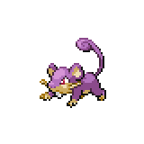

  

  

    

      
Types

      

        
        
      

    

    

      
Abilities

      

        <a href='' title="This Pokemon is always successful fleeing from wild battles, even if trapped by a move or ability.">Run-away</a>
        /<a href='' title="Whenever this Pokemon is asleep, burned, paralyzed, or poisoned, it has 1.5x its Attack.  This Pokemon is not affected by the usual Attack cut from a burn.  This bonus does not count as a stat modifier.">Guts</a>
      

    

  

## Base Stats
<table style="width: 100%">
  <tbody style="width: 100%;">
    <tr style="display: flex; align-items: center;">
      <th style="color: #737373;" >HP</th>
      <td style="border-top: none; width: 70px">30</td>
      <td style="width: 100%; min-width: 450px; border-top: none;">
        

        

      </td>
    </tr>
    <tr style="display: flex; align-items: center;">
      <th style="color: #737373;">Attack</th>
      <td style="border-top: none; width: 70px">56</td>
      <td style="width: 100%; min-width: 450px; border-top: none;">
        

        

      </td>
    </tr>
    <tr style="display: flex; align-items: center;">
      <th style="color: #737373;">Defense</th>
      <td style="border-top: none; width: 70px">35</td>
      <td style="width: 100%; min-width: 450px; border-top: none;">
        

        

      </td>
    </tr>
    <tr style="display: flex; align-items: center;">
      <th style="color: #737373;">SP Attack</th>
      <td style="border-top: none; width: 70px">25</td>
      <td style="width: 100%; min-width: 450px; border-top: none;">
        

        

      </td>
    </tr>
    <tr style="display: flex; align-items: center;">
      <th style="color: #737373;">SP Defense</th>
      <td style="border-top: none; width: 70px">35</td>
      <td style="width: 100%; min-width: 450px; border-top: none;">
        

        

      </td>
    </tr>
    <tr style="display: flex; align-items: center;">
      <th style="color: #737373;">Speed</th>
      <td style="border-top: none; width: 70px">72</td>
      <td style="width: 100%; min-width: 450px; border-top: none;">
        

        

      </td>
    </tr>
  </tbody>
</table>

## Locations
| Route | Area | Encounter Rate | Extra Instructions |
        | -- | -- | -- | -- |
        	| Sowset Town | Grass | 18 |  |

        

## Moveset

=== "Level Up Moves"
    | Level | Name | Power | Accuracy | PP | Type | Damage Class |
        | -- | -- | -- | -- | -- | -- | -- |
        	| 1 | Tackle | 40 | 100 | 35 |  |  |
	| 3 | Tail-whip | - | 100 | 30 |  |  |
	| 6 | Quick-attack | 40 | 100 | 30 |  |  |
	| 9 | Focus-energy | - | - | 30 |  |  |
	| 12 | Bite | 60 | 100 | 25 |  |  |
	| 13 | Pursuit | 40 | 100 | 20 |  |  |
	| 15 | Super-fang | - | 90 | 10 |  |  |
	| 18 | Crunch | 80 | 100 | 15 |  |  |
	| 19 | Assurance | 60 | 100 | 10 |  |  |
	| 21 | Hyper-fang | 80 | 90 | 15 |  |  |
	| 24 | Sucker-punch | 70 | 100 | 5 |  |  |
	| 27 | Double-edge | 120 | 100 | 15 |  |  |
	| 34 | Endeavor | - | 100 | 5 |  |  |

        

=== "Machine Moves"
    | Machine | Name | Power | Accuracy | PP | Type | Damage Class |
        | -- | -- | -- | -- | -- | -- | -- |
        	| TM27 | Toxic | - | 90 | 10 |  |  |
	| TM36 | Thunderbolt | 90 | 100 | 15 |  |  |
	| TM100 | Confide | - | - | 20 |  |  |
	| TM27 | Return | - | 100 | 20 |  |  |
	| TM97 | Dark-pulse | 80 | 100 | 15 |  |  |
	| TM87 | Swagger | - | 85 | 15 |  |  |
	| TM05 | Rest | - | - | 5 |  |  |
	| TM36 | Sludge-bomb | 90 | 100 | 10 |  |  |
	| TM38 | Thunder | 110 | 70 | 10 |  |  |
	| TM01 | Headbutt | 70 | 100 | 15 |  |  |
	| TM88 | Sleep-talk | - | - | 10 |  |  |
	| TM65 | Shadow-claw | 70 | 100 | 15 |  |  |
	| TM63 | Embargo | - | 100 | 15 |  |  |
	| TM32 | Double-team | - | - | 15 |  |  |
	| TM41 | Torment | - | 100 | 15 |  |  |
	| TM46 | Thief | 60 | 100 | 25 |  |  |
	| TM89 | U-turn | 70 | 100 | 20 |  |  |
	| TM10 | Dig | 80 | 100 | 10 |  |  |
	| TM86 | Grass-knot | - | 100 | 20 |  |  |
	| TM10 | Hidden-power | 60 | 100 | 15 |  |  |
	| TM21 | Frustration | - | 100 | 20 |  |  |
	| TM19 | Iron-tail | 100 | 75 | 15 |  |  |
	| TM30 | Shadow-ball | 80 | 100 | 15 |  |  |
	| TM57 | Charge-beam | 50 | 90 | 10 |  |  |
	| TM45 | Attract | - | 100 | 15 |  |  |
	| TM95 | Snarl | 55 | 95 | 15 |  |  |
	| TM55 | Ice-beam | 90 | 100 | 10 |  |  |
	| TM11 | Sunny-day | - | - | 5 |  |  |
	| TM08 | Substitute | - | - | 10 |  |  |
	| TM93 | Wild-charge | 90 | 100 | 15 |  |  |
	| TM07 | Protect | - | - | 10 |  |  |
	| TM12 | Facade | 70 | 100 | 20 |  |  |
	| TM12 | Taunt | - | 100 | 20 |  |  |
	| TM01 | Work-up | - | - | 30 |  |  |
	| TM48 | Round | 60 | 100 | 15 |  |  |
	| TM60 | Quash | - | 100 | 15 |  |  |
	| TM14 | Blizzard | 110 | 70 | 5 |  |  |
	| TM18 | Rain-dance | - | - | 5 |  |  |
	| TM16 | Thunder-wave | - | 90 | 20 |  |  |

        
