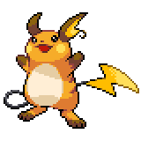

  

  

    

      
Types

      

        
        
      

    

    

      
Abilities

      

        <a href='' title="Whenever a move makes contact with this Pokemon, the move's user has a 30% chance of being paralyzed.  Pokemon that are immune to electric-type moves can still be paralyzed by this ability.  Overworld: If the lead Pokemon has this ability, there is a 50% chance that encounters will be with an electric Pokemon, if applicable.">Static</a>
        /<a href='' title="All other Pokemon's single-target electric-type moves are redirected to this Pokemon if it is an eligible target.  Other Pokemon's Electric moves raise this Pokemon's Special Attack one stage, negating any other effect on it, and cannot miss it.  If the move's intended target also has this ability, the move is not redirected.  When multiple Pokemon with this ability are possible targets for redirection, the move is redirected to the one with the highest Speed stat, or, in the case of a tie, to a random tied Pokemon.  follow me takes precedence over this ability.  If the Pokemon is a ground-type and thus immune to Electric moves, its immunity prevents the Special Attack boost.">Lightning-rod</a>
      

    

  

## Base Stats
<table style="width: 100%">
  <tbody style="width: 100%;">
    <tr style="display: flex; align-items: center;">
      <th style="color: #737373;" >HP</th>
      <td style="border-top: none; width: 70px">60</td>
      <td style="width: 100%; min-width: 450px; border-top: none;">
        

        

      </td>
    </tr>
    <tr style="display: flex; align-items: center;">
      <th style="color: #737373;">Attack</th>
      <td style="border-top: none; width: 70px">90</td>
      <td style="width: 100%; min-width: 450px; border-top: none;">
        

        

      </td>
    </tr>
    <tr style="display: flex; align-items: center;">
      <th style="color: #737373;">Defense</th>
      <td style="border-top: none; width: 70px">55</td>
      <td style="width: 100%; min-width: 450px; border-top: none;">
        

        

      </td>
    </tr>
    <tr style="display: flex; align-items: center;">
      <th style="color: #737373;">SP Attack</th>
      <td style="border-top: none; width: 70px">90</td>
      <td style="width: 100%; min-width: 450px; border-top: none;">
        

        

      </td>
    </tr>
    <tr style="display: flex; align-items: center;">
      <th style="color: #737373;">SP Defense</th>
      <td style="border-top: none; width: 70px">80</td>
      <td style="width: 100%; min-width: 450px; border-top: none;">
        

        

      </td>
    </tr>
    <tr style="display: flex; align-items: center;">
      <th style="color: #737373;">Speed</th>
      <td style="border-top: none; width: 70px">110</td>
      <td style="width: 100%; min-width: 450px; border-top: none;">
        

        

      </td>
    </tr>
  </tbody>
</table>

## Moveset

=== "Level Up Moves"
    | Level | Name | Power | Accuracy | PP | Type | Damage Class |
        | -- | -- | -- | -- | -- | -- | -- |
        	| 1 | Encore | - | 100 | 5 |  |  |
	| 1 | Tail-whip | - | 100 | 30 |  |  |
	| 1 | Fake-out | 40 | 100 | 10 |  |  |
	| 1 | Double-team | - | - | 15 |  |  |
	| 1 | Speed-swap | - | - | 10 |  |  |
	| 1 | Thunder-shock | 40 | 100 | 30 |  |  |
	| 1 | Quick-attack | 40 | 100 | 30 |  |  |
	| 1 | Growl | - | 100 | 40 |  |  |

        

=== "Machine Moves"
    | Machine | Name | Power | Accuracy | PP | Type | Damage Class |
        | -- | -- | -- | -- | -- | -- | -- |
        	| TM27 | Toxic | - | 90 | 10 |  |  |
	| TM36 | Thunderbolt | 90 | 100 | 15 |  |  |
	| TM100 | Confide | - | - | 20 |  |  |
	| TM27 | Return | - | 100 | 20 |  |  |
	| TM87 | Swagger | - | 85 | 15 |  |  |
	| TM05 | Rest | - | - | 5 |  |  |
	| TM56 | Fling | - | 100 | 10 |  |  |
	| TM38 | Thunder | 110 | 70 | 10 |  |  |
	| TM01 | Headbutt | 70 | 100 | 15 |  |  |
	| TM04 | Calm-mind | - | - | 20 |  |  |
	| TM04 | Teleport | - | - | 20 |  |  |
	| TM57 | Pay-day | 40 | 100 | 20 |  |  |
	| TM88 | Sleep-talk | - | - | 10 |  |  |
	| TM46 | Thief | 60 | 100 | 25 |  |  |
	| TM13 | Brick-break | 75 | 100 | 15 |  |  |
	| TM10 | Dig | 80 | 100 | 10 |  |  |
	| TM86 | Grass-knot | - | 100 | 20 |  |  |
	| TM29 | Psychic | 90 | 100 | 10 |  |  |
	| TM10 | Hidden-power | 60 | 100 | 15 |  |  |
	| TM21 | Frustration | - | 100 | 20 |  |  |
	| TM19 | Iron-tail | 100 | 75 | 15 |  |  |
	| TM03 | Helping-hand | - | - | 20 |  |  |
	| TM57 | Charge-beam | 50 | 90 | 10 |  |  |
	| TM45 | Attract | - | 100 | 15 |  |  |
	| TM52 | Focus-blast | 120 | 70 | 5 |  |  |
	| TM08 | Substitute | - | - | 10 |  |  |
	| TM16 | Light-screen | - | - | 30 |  |  |
	| TM72 | Volt-switch | 70 | 100 | 20 |  |  |
	| TM136 | Thunder-punch | 75 | 100 | 15 |  |  |
	| TM93 | Wild-charge | 90 | 100 | 15 |  |  |
	| TM20 | Safeguard | - | - | 25 |  |  |
	| TM48 | Hyper-beam | 150 | 90 | 5 |  |  |
	| TM07 | Protect | - | - | 10 |  |  |
	| TM03 | Psyshock | 80 | 100 | 10 |  |  |
	| TM12 | Facade | 70 | 100 | 20 |  |  |
	| TM15 | Seismic-toss | - | 100 | 20 |  |  |
	| TM48 | Round | 60 | 100 | 15 |  |  |
	| TM49 | Echoed-voice | 40 | 100 | 15 |  |  |
	| TM18 | Rain-dance | - | - | 5 |  |  |
	| TM68 | Giga-impact | 150 | 90 | 5 |  |  |
	| TM33 | Reflect | - | - | 20 |  |  |
	| TM16 | Thunder-wave | - | 90 | 20 |  |  |

        
