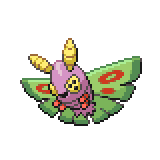

  

  

    

      
Types

      

        
        
      

    

    

      
Abilities

      

        <a href='' title="This Pokemon is immune to the extra effects of moves used against it.  An extra effect is a move's chance, listed as an "effect chance", to inflict a status ailment, cause a stat change, or make the target flinch in addition to the move's main effect.  For example, thunder shock's paralysis is an extra effect, but thunder wave's is not, nor are knock off's item removal and air cutter's increased critical hit rate.">Shield-dust</a>
        /<a href='' title="This Pokemon's moves have 1.3x their accuracy.  This ability has no effect on the one-hit KO moves (fissure, guillotine, horn drill, and sheer cold).  Overworld: If the first Pokemon in the party has this ability, the chance of a wild Pokemon holding a particular item is raised from 50%, 5%, or 1% to 60%, 20%, or 5%, respectively.">Compound-eyes</a>
      

    

  

## Base Stats
<table style="width: 100%">
  <tbody style="width: 100%;">
    <tr style="display: flex; align-items: center;">
      <th style="color: #737373;" >HP</th>
      <td style="border-top: none; width: 70px">60</td>
      <td style="width: 100%; min-width: 450px; border-top: none;">
        

        

      </td>
    </tr>
    <tr style="display: flex; align-items: center;">
      <th style="color: #737373;">Attack</th>
      <td style="border-top: none; width: 70px">50</td>
      <td style="width: 100%; min-width: 450px; border-top: none;">
        

        

      </td>
    </tr>
    <tr style="display: flex; align-items: center;">
      <th style="color: #737373;">Defense</th>
      <td style="border-top: none; width: 70px">70</td>
      <td style="width: 100%; min-width: 450px; border-top: none;">
        

        

      </td>
    </tr>
    <tr style="display: flex; align-items: center;">
      <th style="color: #737373;">SP Attack</th>
      <td style="border-top: none; width: 70px">50</td>
      <td style="width: 100%; min-width: 450px; border-top: none;">
        

        

      </td>
    </tr>
    <tr style="display: flex; align-items: center;">
      <th style="color: #737373;">SP Defense</th>
      <td style="border-top: none; width: 70px">90</td>
      <td style="width: 100%; min-width: 450px; border-top: none;">
        

        

      </td>
    </tr>
    <tr style="display: flex; align-items: center;">
      <th style="color: #737373;">Speed</th>
      <td style="border-top: none; width: 70px">65</td>
      <td style="width: 100%; min-width: 450px; border-top: none;">
        

        

      </td>
    </tr>
  </tbody>
</table>

## Locations
| Route | Area | Encounter Rate | Extra Instructions |
        | -- | -- | -- | -- |
        	| Atropine Woods | Grass | 15 |  |
	| Deeper Atropine | Grass | 15 |  |

        

## Moveset

=== "Level Up Moves"
    | Level | Name | Power | Accuracy | PP | Type | Damage Class |
        | -- | -- | -- | -- | -- | -- | -- |
        	| 1 | Gust | 40 | 100 | 35 |  |  |
	| 12 | Confusion | 50 | 100 | 25 |  |  |
	| 15 | Poison-powder | - | 75 | 35 |  |  |
	| 17 | Moonlight | - | - | 5 |  |  |
	| 22 | Psybeam | 65 | 100 | 20 |  |  |
	| 25 | Silver-wind | 60 | 100 | 5 |  |  |
	| 30 | Whirlwind | - | - | 20 |  |  |
	| 35 | Bug-buzz | 90 | 100 | 10 |  |  |
	| 40 | Quiver-dance | - | - | 20 |  |  |

        

=== "Machine Moves"
    | Machine | Name | Power | Accuracy | PP | Type | Damage Class |
        | -- | -- | -- | -- | -- | -- | -- |
        	| TM27 | Toxic | - | 90 | 10 |  |  |
	| TM100 | Confide | - | - | 20 |  |  |
	| TM27 | Return | - | 100 | 20 |  |  |
	| TM87 | Swagger | - | 85 | 15 |  |  |
	| TM09 | Venoshock | 65 | 100 | 10 |  |  |
	| TM05 | Rest | - | - | 5 |  |  |
	| TM36 | Sludge-bomb | 90 | 100 | 10 |  |  |
	| TM62 | Acrobatics | 55 | 100 | 15 |  |  |
	| TM88 | Sleep-talk | - | - | 10 |  |  |
	| TM32 | Double-team | - | - | 15 |  |  |
	| TM46 | Thief | 60 | 100 | 25 |  |  |
	| TM89 | U-turn | 70 | 100 | 20 |  |  |
	| TM29 | Psychic | 90 | 100 | 10 |  |  |
	| TM10 | Hidden-power | 60 | 100 | 15 |  |  |
	| TM21 | Frustration | - | 100 | 20 |  |  |
	| TM30 | Shadow-ball | 80 | 100 | 15 |  |  |
	| TM53 | Energy-ball | 90 | 100 | 10 |  |  |
	| TM19 | Roost | - | - | 5 |  |  |
	| TM40 | Aerial-ace | 60 | - | 20 |  |  |
	| TM83 | Infestation | 20 | 100 | 20 |  |  |
	| TM45 | Attract | - | 100 | 15 |  |  |
	| TM45 | Solar-beam | 120 | 100 | 10 |  |  |
	| TM11 | Sunny-day | - | - | 5 |  |  |
	| TM08 | Substitute | - | - | 10 |  |  |
	| TM16 | Light-screen | - | - | 30 |  |  |
	| TM48 | Hyper-beam | 150 | 90 | 5 |  |  |
	| TM07 | Protect | - | - | 10 |  |  |
	| TM12 | Facade | 70 | 100 | 20 |  |  |
	| TM48 | Round | 60 | 100 | 15 |  |  |
	| TM68 | Giga-impact | 150 | 90 | 5 |  |  |

        
