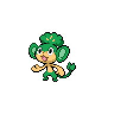

  

  

    

      
Types

      

        
        
      

    

    

      
Abilities

      

        <a href='' title="This Pokemon eats any held Berry triggered by low HP when it falls below 50% of its HP, regardless of the Berry's usual threshold.">Gluttony</a>
        /<a href='' title="When this Pokemon has 1/3 or less of its HP remaining, its grass-type moves inflict 1.5x as much regular damage.">Overgrow</a>
      

    

    

      
Hidden Ability

      

        <a href='' title="Whenever a grass-type move hits this Pokemon, its Attack rises one stage, negating any other effect on it.">Sap-sipper</a>
      

    

  

## Base Stats
<table style="width: 100%">
  <tbody style="width: 100%;">
    <tr style="display: flex; align-items: center;">
      <th style="color: #737373;" >HP</th>
      <td style="border-top: none; width: 70px">50</td>
      <td style="width: 100%; min-width: 450px; border-top: none;">
        

        

      </td>
    </tr>
    <tr style="display: flex; align-items: center;">
      <th style="color: #737373;">Attack</th>
      <td style="border-top: none; width: 70px">53</td>
      <td style="width: 100%; min-width: 450px; border-top: none;">
        

        

      </td>
    </tr>
    <tr style="display: flex; align-items: center;">
      <th style="color: #737373;">Defense</th>
      <td style="border-top: none; width: 70px">48</td>
      <td style="width: 100%; min-width: 450px; border-top: none;">
        

        

      </td>
    </tr>
    <tr style="display: flex; align-items: center;">
      <th style="color: #737373;">SP Attack</th>
      <td style="border-top: none; width: 70px">53</td>
      <td style="width: 100%; min-width: 450px; border-top: none;">
        

        

      </td>
    </tr>
    <tr style="display: flex; align-items: center;">
      <th style="color: #737373;">SP Defense</th>
      <td style="border-top: none; width: 70px">48</td>
      <td style="width: 100%; min-width: 450px; border-top: none;">
        

        

      </td>
    </tr>
    <tr style="display: flex; align-items: center;">
      <th style="color: #737373;">Speed</th>
      <td style="border-top: none; width: 70px">64</td>
      <td style="width: 100%; min-width: 450px; border-top: none;">
        

        

      </td>
    </tr>
  </tbody>
</table>

## Locations
| Route | Area | Encounter Rate | Extra Instructions |
        | -- | -- | -- | -- |
        	| Brightroot Clearing | Grass | 25 |  |

        

## Moveset

=== "Level Up Moves"
    | Level | Name | Power | Accuracy | PP | Type | Damage Class |
        | -- | -- | -- | -- | -- | -- | -- |
        	| 1 | Play-nice | - | - | 20 |  |  |
	| 1 | Scratch | 40 | 100 | 35 |  |  |
	| 4 | Leer | - | 100 | 30 |  |  |
	| 7 | Lick | 30 | 100 | 30 |  |  |
	| 10 | Vine-whip | 45 | 100 | 25 |  |  |
	| 13 | Fury-swipes | 18 | 80 | 15 |  |  |
	| 16 | Leech-seed | - | 90 | 10 |  |  |
	| 19 | Bite | 60 | 100 | 25 |  |  |
	| 22 | Seed-bomb | 80 | 100 | 15 |  |  |
	| 37 | Recycle | - | - | 10 |  |  |
	| 40 | Natural-gift | - | 100 | 15 |  |  |
	| 43 | Crunch | 80 | 100 | 15 |  |  |

        

=== "Machine Moves"
    | Machine | Name | Power | Accuracy | PP | Type | Damage Class |
        | -- | -- | -- | -- | -- | -- | -- |
        	| TM47 | Low-sweep | 65 | 100 | 20 |  |  |
	| TM27 | Toxic | - | 90 | 10 |  |  |
	| TM66 | Payback | 50 | 100 | 10 |  |  |
	| TM100 | Confide | - | - | 20 |  |  |
	| TM27 | Return | - | 100 | 20 |  |  |
	| TM87 | Swagger | - | 85 | 15 |  |  |
	| TM05 | Rest | - | - | 5 |  |  |
	| TM56 | Fling | - | 100 | 10 |  |  |
	| TM62 | Acrobatics | 55 | 100 | 15 |  |  |
	| TM88 | Sleep-talk | - | - | 10 |  |  |
	| TM65 | Shadow-claw | 70 | 100 | 15 |  |  |
	| TM32 | Double-team | - | - | 15 |  |  |
	| TM41 | Torment | - | 100 | 15 |  |  |
	| TM46 | Thief | 60 | 100 | 25 |  |  |
	| TM39 | Rock-tomb | 60 | 95 | 15 |  |  |
	| TM86 | Grass-knot | - | 100 | 20 |  |  |
	| TM10 | Hidden-power | 60 | 100 | 15 |  |  |
	| TM21 | Frustration | - | 100 | 20 |  |  |
	| TM53 | Energy-ball | 90 | 100 | 10 |  |  |
	| TM45 | Attract | - | 100 | 15 |  |  |
	| TM45 | Solar-beam | 120 | 100 | 10 |  |  |
	| TM11 | Sunny-day | - | - | 5 |  |  |
	| TM08 | Substitute | - | - | 10 |  |  |
	| TM07 | Protect | - | - | 10 |  |  |
	| TM12 | Facade | 70 | 100 | 20 |  |  |
	| TM12 | Taunt | - | 100 | 20 |  |  |
	| TM01 | Work-up | - | - | 30 |  |  |
	| TM96 | Nature-power | - | - | 20 |  |  |
	| TM48 | Round | 60 | 100 | 15 |  |  |

        
