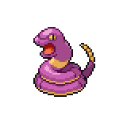

  

  

    

      
Types

      

        
        
      

    

    

      
Abilities

      

        <a href='' title="When this Pokemon enters battle, the opponent's Attack is lowered by one stage.  In a double battle, both opponents are affected.  This ability also takes effect when acquired during a battle, but will not take effect again if lost and reobtained without leaving battle.  This ability has no effect on an opponent that has a substitute.  Overworld: If the first Pokemon in the party has this ability, any random encounter with a Pokemon five or more levels lower than it has a 50% chance of being skipped.">Intimidate</a>
        /<a href='' title="After each turn, this Pokemon has a 33% of being cured of any major status ailment.">Shed-skin</a>
        /<a href='' title="Opposing Pokemon cannot eat held Berries while this Pokemon is in battle.  Affected Pokemon can still use bug bite or pluck to eat a target's Berry.">Hidden: Unnerve</a>
      

    

  

## Base Stats
<table style="width: 100%">
  <tbody style="width: 100%;">
    <tr style="display: flex; align-items: center;">
      <th style="color: #737373;" >HP</th>
      <td style="border-top: none; width: 70px">35</td>
      <td style="width: 100%; min-width: 450px; border-top: none;">
        

        

      </td>
    </tr>
    <tr style="display: flex; align-items: center;">
      <th style="color: #737373;">Attack</th>
      <td style="border-top: none; width: 70px">60</td>
      <td style="width: 100%; min-width: 450px; border-top: none;">
        

        

      </td>
    </tr>
    <tr style="display: flex; align-items: center;">
      <th style="color: #737373;">Defense</th>
      <td style="border-top: none; width: 70px">44</td>
      <td style="width: 100%; min-width: 450px; border-top: none;">
        

        

      </td>
    </tr>
    <tr style="display: flex; align-items: center;">
      <th style="color: #737373;">SP Attack</th>
      <td style="border-top: none; width: 70px">40</td>
      <td style="width: 100%; min-width: 450px; border-top: none;">
        

        

      </td>
    </tr>
    <tr style="display: flex; align-items: center;">
      <th style="color: #737373;">SP Defense</th>
      <td style="border-top: none; width: 70px">54</td>
      <td style="width: 100%; min-width: 450px; border-top: none;">
        

        

      </td>
    </tr>
    <tr style="display: flex; align-items: center;">
      <th style="color: #737373;">Speed</th>
      <td style="border-top: none; width: 70px">55</td>
      <td style="width: 100%; min-width: 450px; border-top: none;">
        

        

      </td>
    </tr>
  </tbody>
</table>

## Locations
| Route | Area | Encounter Rate | Extra Instructions |
        | -- | -- | -- | -- |
        	| Darkroot Forest | Grass | 10 |  |

        

## Moveset

=== "Level Up Moves"
    | Level | Name | Power | Accuracy | PP | Type | Damage Class |
        | -- | -- | -- | -- | -- | -- | -- |
        	| 1 | Poison-sting | 15 | 100 | 35 |  |  |
	| 1 | Wrap | 15 | 90 | 20 |  |  |
	| 4 | Leer | - | 100 | 30 |  |  |
	| 8 | Acid | 40 | 100 | 30 |  |  |
	| 12 | Bite | 60 | 100 | 25 |  |  |
	| 16 | Haze | - | - | 30 |  |  |
	| 20 | Glare | - | 100 | 30 |  |  |
	| 25 | Spit-up | - | 100 | 10 |  |  |
	| 25 | Swallow | - | - | 10 |  |  |
	| 25 | Stockpile | - | - | 20 |  |  |
	| 28 | Acid-spray | 40 | 100 | 20 |  |  |
	| 28 | Slam | 80 | 75 | 20 |  |  |
	| 32 | Screech | - | 85 | 40 |  |  |
	| 33 | Mud-bomb | 65 | 85 | 10 |  |  |
	| 36 | Gastro-acid | - | 100 | 10 |  |  |
	| 38 | Belch | 120 | 90 | 10 |  |  |
	| 44 | Coil | - | - | 20 |  |  |
	| 49 | Gunk-shot | 120 | 80 | 5 |  |  |

        

=== "Machine Moves"
    | Machine | Name | Power | Accuracy | PP | Type | Damage Class |
        | -- | -- | -- | -- | -- | -- | -- |
        	| TM22 | Rock-slide | 75 | 90 | 10 |  |  |
	| TM27 | Toxic | - | 90 | 10 |  |  |
	| TM66 | Payback | 50 | 100 | 10 |  |  |
	| TM100 | Confide | - | - | 20 |  |  |
	| TM27 | Return | - | 100 | 20 |  |  |
	| TM97 | Dark-pulse | 80 | 100 | 15 |  |  |
	| TM87 | Swagger | - | 85 | 15 |  |  |
	| TM09 | Venoshock | 65 | 100 | 10 |  |  |
	| TM05 | Rest | - | - | 5 |  |  |
	| TM84 | Poison-jab | 80 | 100 | 20 |  |  |
	| TM36 | Sludge-bomb | 90 | 100 | 10 |  |  |
	| TM01 | Headbutt | 70 | 100 | 15 |  |  |
	| TM41 | Earthquake | 100 | 100 | 10 |  |  |
	| TM88 | Sleep-talk | - | - | 10 |  |  |
	| TM32 | Double-team | - | - | 15 |  |  |
	| TM41 | Torment | - | 100 | 15 |  |  |
	| TM46 | Thief | 60 | 100 | 25 |  |  |
	| TM39 | Rock-tomb | 60 | 95 | 15 |  |  |
	| TM10 | Dig | 80 | 100 | 10 |  |  |
	| TM34 | Sludge-wave | 95 | 100 | 10 |  |  |
	| TM10 | Hidden-power | 60 | 100 | 15 |  |  |
	| TM21 | Frustration | - | 100 | 20 |  |  |
	| TM19 | Iron-tail | 100 | 75 | 15 |  |  |
	| TM78 | Bulldoze | 60 | 100 | 20 |  |  |
	| TM83 | Infestation | 20 | 100 | 20 |  |  |
	| TM45 | Attract | - | 100 | 15 |  |  |
	| TM59 | Brutal-swing | 60 | 100 | 20 |  |  |
	| TM11 | Sunny-day | - | - | 5 |  |  |
	| TM08 | Substitute | - | - | 10 |  |  |
	| TM07 | Protect | - | - | 10 |  |  |
	| TM12 | Facade | 70 | 100 | 20 |  |  |
	| TM48 | Round | 60 | 100 | 15 |  |  |
	| TM53 | Mega-drain | 40 | 100 | 15 |  |  |
	| TM18 | Rain-dance | - | - | 5 |  |  |

        
