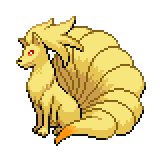

  

  

    

      
Types

      

        
        
      

    

    

      
Abilities

      

        <a href='' title="This Pokemon is immune to fire-type moves.  Once this Pokemon has been hit by a Fire move, its own Fire moves will inflict 1.5x as much damage until it leaves battle.  This ability has no effect while the Pokemon is frozen.  The Fire damage bonus is retained even if the Pokemon is frozen and thawed or the ability is lost or disabled.  Fire moves will ignore this Pokemon's substitute.  This ability takes effect even on non-damaging moves, i.e. will o wisp.">Flash-fire</a>
        /<a href='' title="The weather changes to strong sunlight when this Pokemon enters battle and does not end unless cancelled by another weather condition.  If multiple Pokemon with this ability, drizzle, sand stream, or snow warning are sent out at the same time, the abilities will activate in order of Speed, respecting trick room.  Each ability's weather will cancel the previous weather, and only the weather summoned by the slowest of the Pokemon will stay.">Drought</a>
      

    

  

## Base Stats
<table style="width: 100%">
  <tbody style="width: 100%;">
    <tr style="display: flex; align-items: center;">
      <th style="color: #737373;" >HP</th>
      <td style="border-top: none; width: 70px">73</td>
      <td style="width: 100%; min-width: 450px; border-top: none;">
        

        

      </td>
    </tr>
    <tr style="display: flex; align-items: center;">
      <th style="color: #737373;">Attack</th>
      <td style="border-top: none; width: 70px">76</td>
      <td style="width: 100%; min-width: 450px; border-top: none;">
        

        

      </td>
    </tr>
    <tr style="display: flex; align-items: center;">
      <th style="color: #737373;">Defense</th>
      <td style="border-top: none; width: 70px">75</td>
      <td style="width: 100%; min-width: 450px; border-top: none;">
        

        

      </td>
    </tr>
    <tr style="display: flex; align-items: center;">
      <th style="color: #737373;">SP Attack</th>
      <td style="border-top: none; width: 70px">81</td>
      <td style="width: 100%; min-width: 450px; border-top: none;">
        

        

      </td>
    </tr>
    <tr style="display: flex; align-items: center;">
      <th style="color: #737373;">SP Defense</th>
      <td style="border-top: none; width: 70px">100</td>
      <td style="width: 100%; min-width: 450px; border-top: none;">
        

        

      </td>
    </tr>
    <tr style="display: flex; align-items: center;">
      <th style="color: #737373;">Speed</th>
      <td style="border-top: none; width: 70px">100</td>
      <td style="width: 100%; min-width: 450px; border-top: none;">
        

        

      </td>
    </tr>
  </tbody>
</table>

## Moveset

=== "Level Up Moves"
    | Level | Name | Power | Accuracy | PP | Type | Damage Class |
        | -- | -- | -- | -- | -- | -- | -- |
        	| 1 | Tail-whip | - | 100 | 30 |  |  |
	| 1 | Tackle | 40 | 100 | 35 |  |  |
	| 1 | Ember | 40 | 100 | 25 |  |  |
	| 1 | Imprison | - | - | 10 |  |  |
	| 1 | Nasty-plot | - | - | 20 |  |  |
	| 1 | Quick-attack | 40 | 100 | 30 |  |  |
	| 1 | Mist | - | - | 30 |  |  |
	| 1 | Ice-shard | 40 | 100 | 30 |  |  |
	| 1 | Confuse-ray | - | 100 | 10 |  |  |
	| 1 | Hypnosis | - | 60 | 20 |  |  |

        

=== "Machine Moves"
    | Machine | Name | Power | Accuracy | PP | Type | Damage Class |
        | -- | -- | -- | -- | -- | -- | -- |
        	| TM27 | Toxic | - | 90 | 10 |  |  |
	| TM66 | Payback | 50 | 100 | 10 |  |  |
	| TM100 | Confide | - | - | 20 |  |  |
	| TM21 | Foul-play | 95 | 100 | 15 |  |  |
	| TM27 | Return | - | 100 | 20 |  |  |
	| TM97 | Dark-pulse | 80 | 100 | 15 |  |  |
	| TM87 | Swagger | - | 85 | 15 |  |  |
	| TM85 | Dream-eater | 100 | 100 | 15 |  |  |
	| TM05 | Rest | - | - | 5 |  |  |
	| TM01 | Headbutt | 70 | 100 | 15 |  |  |
	| TM61 | Will-o-wisp | - | 85 | 15 |  |  |
	| TM04 | Calm-mind | - | - | 20 |  |  |
	| TM88 | Sleep-talk | - | - | 10 |  |  |
	| TM05 | Roar | - | - | 20 |  |  |
	| TM32 | Double-team | - | - | 15 |  |  |
	| TM10 | Dig | 80 | 100 | 10 |  |  |
	| TM38 | Fire-blast | 110 | 85 | 5 |  |  |
	| TM50 | Overheat | 130 | 90 | 5 |  |  |
	| TM07 | Hail | - | - | 10 |  |  |
	| TM43 | Flame-charge | 50 | 100 | 20 |  |  |
	| TM10 | Hidden-power | 60 | 100 | 15 |  |  |
	| TM21 | Frustration | - | 100 | 20 |  |  |
	| TM19 | Iron-tail | 100 | 75 | 15 |  |  |
	| TM53 | Energy-ball | 90 | 100 | 10 |  |  |
	| TM70 | Aurora-veil | - | - | 20 |  |  |
	| TM99 | Dazzling-gleam | 80 | 100 | 10 |  |  |
	| TM45 | Attract | - | 100 | 15 |  |  |
	| TM79 | Frost-breath | 60 | 90 | 10 |  |  |
	| TM45 | Solar-beam | 120 | 100 | 10 |  |  |
	| TM55 | Ice-beam | 90 | 100 | 10 |  |  |
	| TM11 | Sunny-day | - | - | 5 |  |  |
	| TM08 | Substitute | - | - | 10 |  |  |
	| TM20 | Safeguard | - | - | 25 |  |  |
	| TM48 | Hyper-beam | 150 | 90 | 5 |  |  |
	| TM07 | Protect | - | - | 10 |  |  |
	| TM03 | Psyshock | 80 | 100 | 10 |  |  |
	| TM12 | Facade | 70 | 100 | 20 |  |  |
	| TM77 | Psych-up | - | - | 10 |  |  |
	| TM48 | Round | 60 | 100 | 15 |  |  |
	| TM14 | Blizzard | 110 | 70 | 5 |  |  |
	| TM18 | Rain-dance | - | - | 5 |  |  |
	| TM68 | Giga-impact | 150 | 90 | 5 |  |  |
	| TM35 | Flamethrower | 90 | 100 | 15 |  |  |
	| TM33 | Reflect | - | - | 20 |  |  |

        
