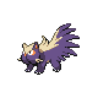

  

  

    

      
Types

      

        
        
      

    

    

      
Abilities

      

        <a href='' title="This Pokemon's damaging moves have a 10% chance to make the target flinch with each hit if they do not already cause flinching as a secondary effect.  This ability does not stack with a held item.  Overworld: The wild encounter rate is halved while this Pokemon is first in the party.">Stench</a>
        /<a href='' title="When this Pokemon is knocked out by a move that makes contact, the move's user takes 1/4 its maximum HP in damage.">Aftermath</a>
      

    

    

      
Hidden Ability

      

        <a href='' title="This Pokemon cannot have its accuracy lowered.  This ability does not prevent any accuracy losses other than stat modifiers, such as the accuracy cut from fog; nor does it prevent other Pokemon's evasion from making this Pokemon's moves less accurate.  This Pokemon can still be passed negative accuracy modifiers through heart swap.  Overworld: If the first Pokemon in the party has this ability, any random encounter with a Pokemon five or more levels lower than it has a 50% chance of being skipped.">Keen-eye</a>
      

    

  

## Base Stats
<table style="width: 100%">
  <tbody style="width: 100%;">
    <tr style="display: flex; align-items: center;">
      <th style="color: #737373;" >HP</th>
      <td style="border-top: none; width: 70px">63</td>
      <td style="width: 100%; min-width: 450px; border-top: none;">
        

        

      </td>
    </tr>
    <tr style="display: flex; align-items: center;">
      <th style="color: #737373;">Attack</th>
      <td style="border-top: none; width: 70px">63</td>
      <td style="width: 100%; min-width: 450px; border-top: none;">
        

        

      </td>
    </tr>
    <tr style="display: flex; align-items: center;">
      <th style="color: #737373;">Defense</th>
      <td style="border-top: none; width: 70px">47</td>
      <td style="width: 100%; min-width: 450px; border-top: none;">
        

        

      </td>
    </tr>
    <tr style="display: flex; align-items: center;">
      <th style="color: #737373;">SP Attack</th>
      <td style="border-top: none; width: 70px">41</td>
      <td style="width: 100%; min-width: 450px; border-top: none;">
        

        

      </td>
    </tr>
    <tr style="display: flex; align-items: center;">
      <th style="color: #737373;">SP Defense</th>
      <td style="border-top: none; width: 70px">41</td>
      <td style="width: 100%; min-width: 450px; border-top: none;">
        

        

      </td>
    </tr>
    <tr style="display: flex; align-items: center;">
      <th style="color: #737373;">Speed</th>
      <td style="border-top: none; width: 70px">74</td>
      <td style="width: 100%; min-width: 450px; border-top: none;">
        

        

      </td>
    </tr>
  </tbody>
</table>

## Locations
| Route | Area | Encounter Rate | Extra Instructions |
        | -- | -- | -- | -- |
        	| Darkroot Forest | Grass | 10 |  |

        

## Moveset

=== "Level Up Moves"
    | Level | Name | Power | Accuracy | PP | Type | Damage Class |
        | -- | -- | -- | -- | -- | -- | -- |
        	| 1 | Scratch | 40 | 100 | 35 |  |  |
	| 1 | Focus-energy | - | - | 30 |  |  |
	| 3 | Poison-gas | - | 90 | 40 |  |  |
	| 7 | Screech | - | 85 | 40 |  |  |
	| 9 | Fury-swipes | 18 | 80 | 15 |  |  |
	| 13 | Smokescreen | - | 100 | 20 |  |  |
	| 15 | Feint | 30 | 100 | 10 |  |  |
	| 19 | Acid-spray | 40 | 100 | 20 |  |  |
	| 21 | Bite | 60 | 100 | 25 |  |  |
	| 25 | Slash | 70 | 100 | 20 |  |  |
	| 31 | Night-slash | 70 | 100 | 15 |  |  |
	| 33 | Memento | - | 100 | 10 |  |  |
	| 37 | Venom-drench | - | 100 | 20 |  |  |
	| 39 | Sucker-punch | 70 | 100 | 5 |  |  |
	| 43 | Belch | 120 | 90 | 10 |  |  |

        

=== "Machine Moves"
    | Machine | Name | Power | Accuracy | PP | Type | Damage Class |
        | -- | -- | -- | -- | -- | -- | -- |
        	| TM27 | Toxic | - | 90 | 10 |  |  |
	| TM66 | Payback | 50 | 100 | 10 |  |  |
	| TM100 | Confide | - | - | 20 |  |  |
	| TM27 | Return | - | 100 | 20 |  |  |
	| TM97 | Dark-pulse | 80 | 100 | 15 |  |  |
	| TM87 | Swagger | - | 85 | 15 |  |  |
	| TM09 | Venoshock | 65 | 100 | 10 |  |  |
	| TM05 | Rest | - | - | 5 |  |  |
	| TM36 | Sludge-bomb | 90 | 100 | 10 |  |  |
	| TM88 | Sleep-talk | - | - | 10 |  |  |
	| TM65 | Shadow-claw | 70 | 100 | 15 |  |  |
	| TM05 | Roar | - | - | 20 |  |  |
	| TM32 | Double-team | - | - | 15 |  |  |
	| TM41 | Torment | - | 100 | 15 |  |  |
	| TM46 | Thief | 60 | 100 | 25 |  |  |
	| TM38 | Fire-blast | 110 | 85 | 5 |  |  |
	| TM10 | Hidden-power | 60 | 100 | 15 |  |  |
	| TM21 | Frustration | - | 100 | 20 |  |  |
	| TM30 | Shadow-ball | 80 | 100 | 15 |  |  |
	| TM45 | Attract | - | 100 | 15 |  |  |
	| TM95 | Snarl | 55 | 95 | 15 |  |  |
	| TM11 | Sunny-day | - | - | 5 |  |  |
	| TM08 | Substitute | - | - | 10 |  |  |
	| TM07 | Protect | - | - | 10 |  |  |
	| TM64 | Explosion | 250 | 100 | 5 |  |  |
	| TM12 | Facade | 70 | 100 | 20 |  |  |
	| TM12 | Taunt | - | 100 | 20 |  |  |
	| TM48 | Round | 60 | 100 | 15 |  |  |
	| TM18 | Rain-dance | - | - | 5 |  |  |
	| TM35 | Flamethrower | 90 | 100 | 15 |  |  |

        
