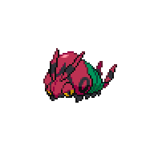

  

  

    

      
Types

      

        
        
      

    

    

      
Abilities

      

        <a href='' title="Whenever a move makes contact with this Pokemon, the move's user has a 30% chance of being poisoned.">Poison-point</a>
        /<a href='' title="When this Pokemon has 1/3 or less of its HP remaining, its bug-type moves inflict 1.5x as much regular damage.  Overworld: If the lead Pokemon has this ability, the wild encounter rate is increased.">Swarm</a>
      

    

    

      
Hidden Ability

      

        <a href='' title="This Pokemon's Speed rises one stage after each turn.">Speed-boost</a>
      

    

  

## Base Stats
<table style="width: 100%">
  <tbody style="width: 100%;">
    <tr style="display: flex; align-items: center;">
      <th style="color: #737373;" >HP</th>
      <td style="border-top: none; width: 70px">30</td>
      <td style="width: 100%; min-width: 450px; border-top: none;">
        

        

      </td>
    </tr>
    <tr style="display: flex; align-items: center;">
      <th style="color: #737373;">Attack</th>
      <td style="border-top: none; width: 70px">45</td>
      <td style="width: 100%; min-width: 450px; border-top: none;">
        

        

      </td>
    </tr>
    <tr style="display: flex; align-items: center;">
      <th style="color: #737373;">Defense</th>
      <td style="border-top: none; width: 70px">59</td>
      <td style="width: 100%; min-width: 450px; border-top: none;">
        

        

      </td>
    </tr>
    <tr style="display: flex; align-items: center;">
      <th style="color: #737373;">SP Attack</th>
      <td style="border-top: none; width: 70px">30</td>
      <td style="width: 100%; min-width: 450px; border-top: none;">
        

        

      </td>
    </tr>
    <tr style="display: flex; align-items: center;">
      <th style="color: #737373;">SP Defense</th>
      <td style="border-top: none; width: 70px">39</td>
      <td style="width: 100%; min-width: 450px; border-top: none;">
        

        

      </td>
    </tr>
    <tr style="display: flex; align-items: center;">
      <th style="color: #737373;">Speed</th>
      <td style="border-top: none; width: 70px">57</td>
      <td style="width: 100%; min-width: 450px; border-top: none;">
        

        

      </td>
    </tr>
  </tbody>
</table>

## Locations
| Route | Area | Encounter Rate | Extra Instructions |
        | -- | -- | -- | -- |
        	| Deeper Darkroot | Grass | 5 |  |
	| Deeper Atropine | Special | 100 |  |

        

## Moveset

=== "Level Up Moves"
    | Level | Name | Power | Accuracy | PP | Type | Damage Class |
        | -- | -- | -- | -- | -- | -- | -- |
        	| 1 | Defense-curl | - | - | 40 |  |  |
	| 1 | Rollout | 30 | 90 | 20 |  |  |
	| 5 | Poison-sting | 15 | 100 | 35 |  |  |
	| 8 | Screech | - | 85 | 40 |  |  |
	| 12 | Pursuit | 40 | 100 | 20 |  |  |
	| 19 | Poison-tail | 50 | 100 | 25 |  |  |
	| 22 | Bug-bite | 60 | 100 | 20 |  |  |
	| 29 | Agility | - | - | 30 |  |  |
	| 33 | Steamroller | 65 | 100 | 20 |  |  |
	| 38 | Venom-drench | - | 100 | 20 |  |  |
	| 40 | Rock-climb | 90 | 85 | 20 |  |  |
	| 43 | Double-edge | 120 | 100 | 15 |  |  |

        

=== "Machine Moves"
    | Machine | Name | Power | Accuracy | PP | Type | Damage Class |
        | -- | -- | -- | -- | -- | -- | -- |
        	| TM27 | Toxic | - | 90 | 10 |  |  |
	| TM66 | Payback | 50 | 100 | 10 |  |  |
	| TM100 | Confide | - | - | 20 |  |  |
	| TM27 | Return | - | 100 | 20 |  |  |
	| TM87 | Swagger | - | 85 | 15 |  |  |
	| TM09 | Venoshock | 65 | 100 | 10 |  |  |
	| TM05 | Rest | - | - | 5 |  |  |
	| TM84 | Poison-jab | 80 | 100 | 20 |  |  |
	| TM36 | Sludge-bomb | 90 | 100 | 10 |  |  |
	| TM88 | Sleep-talk | - | - | 10 |  |  |
	| TM32 | Double-team | - | - | 15 |  |  |
	| TM10 | Hidden-power | 60 | 100 | 15 |  |  |
	| TM21 | Frustration | - | 100 | 20 |  |  |
	| TM83 | Infestation | 20 | 100 | 20 |  |  |
	| TM74 | Gyro-ball | - | 100 | 5 |  |  |
	| TM45 | Attract | - | 100 | 15 |  |  |
	| TM45 | Solar-beam | 120 | 100 | 10 |  |  |
	| TM11 | Sunny-day | - | - | 5 |  |  |
	| TM08 | Substitute | - | - | 10 |  |  |
	| TM07 | Protect | - | - | 10 |  |  |
	| TM12 | Facade | 70 | 100 | 20 |  |  |
	| TM48 | Round | 60 | 100 | 15 |  |  |

        
