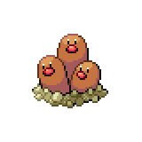

  

  

    

      
Types

      

        
        
      

    

    

      
Abilities

      

        <a href='' title="During a sandstorm, this Pokemon has 1.25x its evasion, and it does not take sandstorm damage regardless of type.  The evasion bonus does not count as a stat modifier.  Overworld: If the lead Pokemon has this ability, the wild encounter rate is halved in a sandstorm.">Sand-veil</a>
        /<a href='' title="While this Pokemon is in battle, opposing Pokemon cannot flee or switch out.  flying-type Pokemon and Pokemon in the air, e.g. due to levitate or magnet rise, are unaffected.  Pokemon with run away can still flee.  Pokemon can still switch out with the use of a move or item.  Overworld: If the lead Pokemon has this ability, the wild encounter rate is doubled.">Arena-trap</a>
      

    

  

## Base Stats
<table style="width: 100%">
  <tbody style="width: 100%;">
    <tr style="display: flex; align-items: center;">
      <th style="color: #737373;" >HP</th>
      <td style="border-top: none; width: 70px">35</td>
      <td style="width: 100%; min-width: 450px; border-top: none;">
        

        

      </td>
    </tr>
    <tr style="display: flex; align-items: center;">
      <th style="color: #737373;">Attack</th>
      <td style="border-top: none; width: 70px">100</td>
      <td style="width: 100%; min-width: 450px; border-top: none;">
        

        

      </td>
    </tr>
    <tr style="display: flex; align-items: center;">
      <th style="color: #737373;">Defense</th>
      <td style="border-top: none; width: 70px">50</td>
      <td style="width: 100%; min-width: 450px; border-top: none;">
        

        

      </td>
    </tr>
    <tr style="display: flex; align-items: center;">
      <th style="color: #737373;">SP Attack</th>
      <td style="border-top: none; width: 70px">50</td>
      <td style="width: 100%; min-width: 450px; border-top: none;">
        

        

      </td>
    </tr>
    <tr style="display: flex; align-items: center;">
      <th style="color: #737373;">SP Defense</th>
      <td style="border-top: none; width: 70px">70</td>
      <td style="width: 100%; min-width: 450px; border-top: none;">
        

        

      </td>
    </tr>
    <tr style="display: flex; align-items: center;">
      <th style="color: #737373;">Speed</th>
      <td style="border-top: none; width: 70px">120</td>
      <td style="width: 100%; min-width: 450px; border-top: none;">
        

        

      </td>
    </tr>
  </tbody>
</table>

## Moveset

=== "Level Up Moves"
    | Level | Name | Power | Accuracy | PP | Type | Damage Class |
        | -- | -- | -- | -- | -- | -- | -- |
        	| 1 | Screech | - | 85 | 40 |  |  |
	| 1 | Sand-tomb | 35 | 85 | 15 |  |  |
	| 1 | Scratch | 40 | 100 | 35 |  |  |
	| 1 | Metal-claw | 50 | 95 | 35 |  |  |
	| 1 | Night-slash | 70 | 100 | 15 |  |  |
	| 1 | Rototiller | - | - | 10 |  |  |
	| 4 | Sand-attack | - | 100 | 15 |  |  |
	| 7 | Astonish | 30 | 100 | 15 |  |  |
	| 8 | Growl | - | 100 | 40 |  |  |
	| 10 | Mud-slap | 20 | 100 | 10 |  |  |
	| 12 | Agility | - | - | 30 |  |  |
	| 14 | Magnitude | - | 100 | 30 |  |  |
	| 15 | Fury-swipes | 18 | 80 | 15 |  |  |
	| 21 | Slash | 70 | 100 | 20 |  |  |
	| 25 | Mud-bomb | 65 | 85 | 10 |  |  |
	| 25 | Sucker-punch | 70 | 100 | 5 |  |  |
	| 30 | Earth-power | 90 | 100 | 10 |  |  |
	| 41 | Iron-head | 80 | 100 | 15 |  |  |
	| 45 | Fissure | - | 30 | 5 |  |  |

        

=== "Machine Moves"
    | Machine | Name | Power | Accuracy | PP | Type | Damage Class |
        | -- | -- | -- | -- | -- | -- | -- |
        	| TM22 | Rock-slide | 75 | 90 | 10 |  |  |
	| TM27 | Toxic | - | 90 | 10 |  |  |
	| TM100 | Confide | - | - | 20 |  |  |
	| TM27 | Return | - | 100 | 20 |  |  |
	| TM87 | Swagger | - | 85 | 15 |  |  |
	| TM05 | Rest | - | - | 5 |  |  |
	| TM36 | Sludge-bomb | 90 | 100 | 10 |  |  |
	| TM01 | Headbutt | 70 | 100 | 15 |  |  |
	| TM41 | Earthquake | 100 | 100 | 10 |  |  |
	| TM28 | Tri-attack | 80 | 100 | 10 |  |  |
	| TM88 | Sleep-talk | - | - | 10 |  |  |
	| TM65 | Shadow-claw | 70 | 100 | 15 |  |  |
	| TM32 | Double-team | - | - | 15 |  |  |
	| TM46 | Thief | 60 | 100 | 25 |  |  |
	| TM39 | Rock-tomb | 60 | 95 | 15 |  |  |
	| TM10 | Dig | 80 | 100 | 10 |  |  |
	| TM34 | Sludge-wave | 95 | 100 | 10 |  |  |
	| TM10 | Hidden-power | 60 | 100 | 15 |  |  |
	| TM56 | Stealth-rock | - | - | 20 |  |  |
	| TM21 | Frustration | - | 100 | 20 |  |  |
	| TM40 | Aerial-ace | 60 | - | 20 |  |  |
	| TM78 | Bulldoze | 60 | 100 | 20 |  |  |
	| TM45 | Attract | - | 100 | 15 |  |  |
	| TM37 | Sandstorm | - | - | 10 |  |  |
	| TM71 | Stone-edge | 100 | 80 | 5 |  |  |
	| TM11 | Sunny-day | - | - | 5 |  |  |
	| TM54 | Flash-cannon | 80 | 100 | 10 |  |  |
	| TM08 | Substitute | - | - | 10 |  |  |
	| TM48 | Hyper-beam | 150 | 90 | 5 |  |  |
	| TM07 | Protect | - | - | 10 |  |  |
	| TM12 | Facade | 70 | 100 | 20 |  |  |
	| TM01 | Work-up | - | - | 30 |  |  |
	| TM48 | Round | 60 | 100 | 15 |  |  |
	| TM49 | Echoed-voice | 40 | 100 | 15 |  |  |
	| TM68 | Giga-impact | 150 | 90 | 5 |  |  |

        
