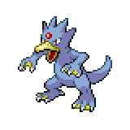

  

  

    

      
Types

      

        
        
      

    

    

      
Abilities

      

        <a href='' title="While this Pokemon is in battle, self destruct and explosion will fail and aftermath will not take effect.">Damp</a>
        /<a href='' title="While this Pokemon is in battle, weather can still be in play, but will not have any of its effects.  This ability functions identically to air lock.">Cloud-nine</a>
      

    

  

## Base Stats
<table style="width: 100%">
  <tbody style="width: 100%;">
    <tr style="display: flex; align-items: center;">
      <th style="color: #737373;" >HP</th>
      <td style="border-top: none; width: 70px">80</td>
      <td style="width: 100%; min-width: 450px; border-top: none;">
        

        

      </td>
    </tr>
    <tr style="display: flex; align-items: center;">
      <th style="color: #737373;">Attack</th>
      <td style="border-top: none; width: 70px">82</td>
      <td style="width: 100%; min-width: 450px; border-top: none;">
        

        

      </td>
    </tr>
    <tr style="display: flex; align-items: center;">
      <th style="color: #737373;">Defense</th>
      <td style="border-top: none; width: 70px">78</td>
      <td style="width: 100%; min-width: 450px; border-top: none;">
        

        

      </td>
    </tr>
    <tr style="display: flex; align-items: center;">
      <th style="color: #737373;">SP Attack</th>
      <td style="border-top: none; width: 70px">95</td>
      <td style="width: 100%; min-width: 450px; border-top: none;">
        

        

      </td>
    </tr>
    <tr style="display: flex; align-items: center;">
      <th style="color: #737373;">SP Defense</th>
      <td style="border-top: none; width: 70px">80</td>
      <td style="width: 100%; min-width: 450px; border-top: none;">
        

        

      </td>
    </tr>
    <tr style="display: flex; align-items: center;">
      <th style="color: #737373;">Speed</th>
      <td style="border-top: none; width: 70px">85</td>
      <td style="width: 100%; min-width: 450px; border-top: none;">
        

        

      </td>
    </tr>
  </tbody>
</table>

## Moveset

=== "Level Up Moves"
    | Level | Name | Power | Accuracy | PP | Type | Damage Class |
        | -- | -- | -- | -- | -- | -- | -- |
        	| 1 | Encore | - | 100 | 5 |  |  |
	| 1 | Me-first | - | - | 20 |  |  |
	| 1 | Scratch | 40 | 100 | 35 |  |  |
	| 1 | Aqua-jet | 40 | 100 | 20 |  |  |
	| 1 | Yawn | - | - | 10 |  |  |
	| 1 | Water-sport | - | - | 15 |  |  |
	| 5 | Tail-whip | - | 100 | 30 |  |  |
	| 9 | Water-gun | 40 | 100 | 25 |  |  |
	| 14 | Confusion | 50 | 100 | 25 |  |  |
	| 16 | Water-pulse | 60 | 100 | 20 |  |  |
	| 18 | Fury-swipes | 18 | 80 | 15 |  |  |
	| 23 | Disable | - | 100 | 20 |  |  |
	| 25 | Zen-headbutt | 80 | 90 | 15 |  |  |
	| 27 | Psybeam | 65 | 100 | 20 |  |  |
	| 28 | Aqua-tail | 90 | 90 | 10 |  |  |
	| 31 | Soak | - | 100 | 20 |  |  |
	| 32 | Screech | - | 85 | 40 |  |  |
	| 51 | Wonder-room | - | - | 10 |  |  |
	| 53 | Amnesia | - | - | 20 |  |  |
	| 63 | Hydro-pump | 110 | 80 | 5 |  |  |

        

=== "Machine Moves"
    | Machine | Name | Power | Accuracy | PP | Type | Damage Class |
        | -- | -- | -- | -- | -- | -- | -- |
        	| TM47 | Low-sweep | 65 | 100 | 20 |  |  |
	| TM27 | Toxic | - | 90 | 10 |  |  |
	| TM100 | Confide | - | - | 20 |  |  |
	| TM27 | Return | - | 100 | 20 |  |  |
	| TM87 | Swagger | - | 85 | 15 |  |  |
	| TM05 | Rest | - | - | 5 |  |  |
	| TM56 | Fling | - | 100 | 10 |  |  |
	| TM01 | Headbutt | 70 | 100 | 15 |  |  |
	| TM04 | Calm-mind | - | - | 20 |  |  |
	| TM57 | Pay-day | 40 | 100 | 20 |  |  |
	| TM88 | Sleep-talk | - | - | 10 |  |  |
	| TM65 | Shadow-claw | 70 | 100 | 15 |  |  |
	| TM32 | Double-team | - | - | 15 |  |  |
	| TM13 | Brick-break | 75 | 100 | 15 |  |  |
	| TM10 | Dig | 80 | 100 | 10 |  |  |
	| TM29 | Psychic | 90 | 100 | 10 |  |  |
	| TM35 | Ice-punch | 75 | 100 | 15 |  |  |
	| TM07 | Hail | - | - | 10 |  |  |
	| TM10 | Hidden-power | 60 | 100 | 15 |  |  |
	| TM21 | Frustration | - | 100 | 20 |  |  |
	| TM19 | Iron-tail | 100 | 75 | 15 |  |  |
	| TM40 | Aerial-ace | 60 | - | 20 |  |  |
	| TM55 | Scald | 80 | 100 | 15 |  |  |
	| TM45 | Attract | - | 100 | 15 |  |  |
	| TM52 | Focus-blast | 120 | 70 | 5 |  |  |
	| TM55 | Ice-beam | 90 | 100 | 10 |  |  |
	| TM08 | Substitute | - | - | 10 |  |  |
	| TM16 | Light-screen | - | - | 30 |  |  |
	| TM48 | Hyper-beam | 150 | 90 | 5 |  |  |
	| TM07 | Protect | - | - | 10 |  |  |
	| TM03 | Psyshock | 80 | 100 | 10 |  |  |
	| TM12 | Facade | 70 | 100 | 20 |  |  |
	| TM15 | Seismic-toss | - | 100 | 20 |  |  |
	| TM77 | Psych-up | - | - | 10 |  |  |
	| TM48 | Round | 60 | 100 | 15 |  |  |
	| TM14 | Blizzard | 110 | 70 | 5 |  |  |
	| TM18 | Rain-dance | - | - | 5 |  |  |
	| TM68 | Giga-impact | 150 | 90 | 5 |  |  |
	| TM98 | Waterfall | 80 | 100 | 15 |  |  |
	| TM94 | Surf | 90 | 100 | 15 |  |  |

        
