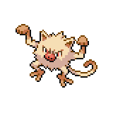

  

  

    

      
Types

      

        
        
      

    

    

      
Abilities

      

        <a href='' title="This Pokemon cannot be asleep.  This causes rest to fail altogether.  If a Pokemon is asleep and acquires this ability, it will immediately wake up; this includes when regaining a lost ability upon leaving battle.  This ability functions identically to insomnia in battle.  Overworld: If the lead Pokemon has this ability, higher-levelled Pokemon have their encounter rate increased.">Vital-spirit</a>
        /<a href='' title="Whenever this Pokemon receives a critical hit, its Attack rises to the maximum of 6 stages.  This ability will still take effect if the critical hit is received by a substitute.">Anger-point</a>
      

    

  

## Base Stats
<table style="width: 100%">
  <tbody style="width: 100%;">
    <tr style="display: flex; align-items: center;">
      <th style="color: #737373;" >HP</th>
      <td style="border-top: none; width: 70px">40</td>
      <td style="width: 100%; min-width: 450px; border-top: none;">
        

        

      </td>
    </tr>
    <tr style="display: flex; align-items: center;">
      <th style="color: #737373;">Attack</th>
      <td style="border-top: none; width: 70px">80</td>
      <td style="width: 100%; min-width: 450px; border-top: none;">
        

        

      </td>
    </tr>
    <tr style="display: flex; align-items: center;">
      <th style="color: #737373;">Defense</th>
      <td style="border-top: none; width: 70px">35</td>
      <td style="width: 100%; min-width: 450px; border-top: none;">
        

        

      </td>
    </tr>
    <tr style="display: flex; align-items: center;">
      <th style="color: #737373;">SP Attack</th>
      <td style="border-top: none; width: 70px">35</td>
      <td style="width: 100%; min-width: 450px; border-top: none;">
        

        

      </td>
    </tr>
    <tr style="display: flex; align-items: center;">
      <th style="color: #737373;">SP Defense</th>
      <td style="border-top: none; width: 70px">45</td>
      <td style="width: 100%; min-width: 450px; border-top: none;">
        

        

      </td>
    </tr>
    <tr style="display: flex; align-items: center;">
      <th style="color: #737373;">Speed</th>
      <td style="border-top: none; width: 70px">70</td>
      <td style="width: 100%; min-width: 450px; border-top: none;">
        

        

      </td>
    </tr>
  </tbody>
</table>

## Moveset

=== "Level Up Moves"
    | Level | Name | Power | Accuracy | PP | Type | Damage Class |
        | -- | -- | -- | -- | -- | -- | -- |
        	| 1 | Covet | 60 | 100 | 25 |  |  |
	| 1 | Leer | - | 100 | 30 |  |  |
	| 1 | Scratch | 40 | 100 | 35 |  |  |
	| 5 | Focus-energy | - | - | 30 |  |  |
	| 12 | Pursuit | 40 | 100 | 20 |  |  |
	| 13 | Karate-chop | 50 | 100 | 25 |  |  |
	| 16 | Fury-swipes | 18 | 80 | 15 |  |  |
	| 21 | Low-kick | - | 100 | 20 |  |  |
	| 22 | Cross-chop | 100 | 80 | 5 |  |  |
	| 26 | Assurance | 60 | 100 | 10 |  |  |
	| 29 | Punishment | - | 100 | 5 |  |  |
	| 32 | Screech | - | 85 | 40 |  |  |
	| 36 | Close-combat | 120 | 100 | 5 |  |  |
	| 37 | Thrash | 120 | 100 | 10 |  |  |
	| 43 | Stomping-tantrum | 75 | 100 | 10 |  |  |
	| 50 | Final-gambit | - | 100 | 5 |  |  |

        

=== "Machine Moves"
    | Machine | Name | Power | Accuracy | PP | Type | Damage Class |
        | -- | -- | -- | -- | -- | -- | -- |
        	| TM47 | Low-sweep | 65 | 100 | 20 |  |  |
	| TM22 | Rock-slide | 75 | 90 | 10 |  |  |
	| TM27 | Toxic | - | 90 | 10 |  |  |
	| TM36 | Thunderbolt | 90 | 100 | 15 |  |  |
	| TM66 | Payback | 50 | 100 | 10 |  |  |
	| TM08 | Bulk-up | - | - | 20 |  |  |
	| TM100 | Confide | - | - | 20 |  |  |
	| TM27 | Return | - | 100 | 20 |  |  |
	| TM87 | Swagger | - | 85 | 15 |  |  |
	| TM23 | Smack-down | 50 | 100 | 15 |  |  |
	| TM135 | Fire-punch | 75 | 100 | 15 |  |  |
	| TM05 | Rest | - | - | 5 |  |  |
	| TM56 | Fling | - | 100 | 10 |  |  |
	| TM84 | Poison-jab | 80 | 100 | 20 |  |  |
	| TM62 | Acrobatics | 55 | 100 | 15 |  |  |
	| TM38 | Thunder | 110 | 70 | 10 |  |  |
	| TM01 | Headbutt | 70 | 100 | 15 |  |  |
	| TM41 | Earthquake | 100 | 100 | 10 |  |  |
	| TM57 | Pay-day | 40 | 100 | 20 |  |  |
	| TM88 | Sleep-talk | - | - | 10 |  |  |
	| TM32 | Double-team | - | - | 15 |  |  |
	| TM46 | Thief | 60 | 100 | 25 |  |  |
	| TM39 | Rock-tomb | 60 | 95 | 15 |  |  |
	| TM89 | U-turn | 70 | 100 | 20 |  |  |
	| TM13 | Brick-break | 75 | 100 | 15 |  |  |
	| TM10 | Dig | 80 | 100 | 10 |  |  |
	| TM134 | Ice-punch | 75 | 100 | 15 |  |  |
	| TM50 | Overheat | 130 | 90 | 5 |  |  |
	| TM10 | Hidden-power | 60 | 100 | 15 |  |  |
	| TM21 | Frustration | - | 100 | 20 |  |  |
	| TM19 | Iron-tail | 100 | 75 | 15 |  |  |
	| TM03 | Helping-hand | - | - | 20 |  |  |
	| TM40 | Aerial-ace | 60 | - | 20 |  |  |
	| TM78 | Bulldoze | 60 | 100 | 20 |  |  |
	| TM45 | Attract | - | 100 | 15 |  |  |
	| TM52 | Focus-blast | 120 | 70 | 5 |  |  |
	| TM11 | Sunny-day | - | - | 5 |  |  |
	| TM08 | Substitute | - | - | 10 |  |  |
	| TM136 | Thunder-punch | 75 | 100 | 15 |  |  |
	| TM39 | Outrage | 120 | 100 | 10 |  |  |
	| TM07 | Protect | - | - | 10 |  |  |
	| TM12 | Facade | 70 | 100 | 20 |  |  |
	| TM12 | Taunt | - | 100 | 20 |  |  |
	| TM15 | Seismic-toss | - | 100 | 20 |  |  |
	| TM01 | Work-up | - | - | 30 |  |  |
	| TM48 | Round | 60 | 100 | 15 |  |  |
	| TM18 | Rain-dance | - | - | 5 |  |  |

        
