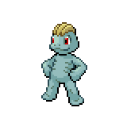

  

  

    

      
Types

      

        
        
      

    

    

      
Abilities

      

        <a href='' title="Whenever this Pokemon is asleep, burned, paralyzed, or poisoned, it has 1.5x its Attack.  This Pokemon is not affected by the usual Attack cut from a burn.  This bonus does not count as a stat modifier.">Guts</a>
        /<a href='' title="Moves used by or against this Pokemon never miss.  One-hit KO moves are unaffected.  Moves affected by this ability can hit Pokemon during the preparation turn of moves like dig or fly.  Overworld: If the lead Pokemon has this ability, the wild encounter rate is doubled.">No-guard</a>
      

    

  

## Base Stats
<table style="width: 100%">
  <tbody style="width: 100%;">
    <tr style="display: flex; align-items: center;">
      <th style="color: #737373;" >HP</th>
      <td style="border-top: none; width: 70px">70</td>
      <td style="width: 100%; min-width: 450px; border-top: none;">
        

        

      </td>
    </tr>
    <tr style="display: flex; align-items: center;">
      <th style="color: #737373;">Attack</th>
      <td style="border-top: none; width: 70px">80</td>
      <td style="width: 100%; min-width: 450px; border-top: none;">
        

        

      </td>
    </tr>
    <tr style="display: flex; align-items: center;">
      <th style="color: #737373;">Defense</th>
      <td style="border-top: none; width: 70px">50</td>
      <td style="width: 100%; min-width: 450px; border-top: none;">
        

        

      </td>
    </tr>
    <tr style="display: flex; align-items: center;">
      <th style="color: #737373;">SP Attack</th>
      <td style="border-top: none; width: 70px">35</td>
      <td style="width: 100%; min-width: 450px; border-top: none;">
        

        

      </td>
    </tr>
    <tr style="display: flex; align-items: center;">
      <th style="color: #737373;">SP Defense</th>
      <td style="border-top: none; width: 70px">35</td>
      <td style="width: 100%; min-width: 450px; border-top: none;">
        

        

      </td>
    </tr>
    <tr style="display: flex; align-items: center;">
      <th style="color: #737373;">Speed</th>
      <td style="border-top: none; width: 70px">35</td>
      <td style="width: 100%; min-width: 450px; border-top: none;">
        

        

      </td>
    </tr>
  </tbody>
</table>

## Locations
| Route | Area | Encounter Rate | Extra Instructions |
        | -- | -- | -- | -- |
        	| Rubble Cave 2F | Cave | 10 |  |

        

## Moveset

=== "Level Up Moves"
    | Level | Name | Power | Accuracy | PP | Type | Damage Class |
        | -- | -- | -- | -- | -- | -- | -- |
        	| 1 | Leer | - | 100 | 30 |  |  |
	| 1 | Low-kick | - | 100 | 20 |  |  |
	| 4 | Focus-energy | - | - | 30 |  |  |
	| 8 | Bide | - | - | 10 |  |  |
	| 9 | Foresight | - | - | 40 |  |  |
	| 16 | Karate-chop | 50 | 100 | 25 |  |  |
	| 19 | Revenge | 60 | 100 | 10 |  |  |
	| 21 | Knock-off | 65 | 100 | 20 |  |  |
	| 25 | Vital-throw | 70 | - | 10 |  |  |
	| 26 | Submission | 80 | 80 | 20 |  |  |
	| 27 | Wake-up-slap | 70 | 100 | 10 |  |  |
	| 31 | Dual-chop | 40 | 90 | 15 |  |  |
	| 39 | Cross-chop | 100 | 80 | 5 |  |  |
	| 43 | Scary-face | - | 100 | 10 |  |  |
	| 45 | Dynamic-punch | 100 | 50 | 5 |  |  |

        

=== "Machine Moves"
    | Machine | Name | Power | Accuracy | PP | Type | Damage Class |
        | -- | -- | -- | -- | -- | -- | -- |
        	| TM47 | Low-sweep | 65 | 100 | 20 |  |  |
	| TM22 | Rock-slide | 75 | 90 | 10 |  |  |
	| TM27 | Toxic | - | 90 | 10 |  |  |
	| TM66 | Payback | 50 | 100 | 10 |  |  |
	| TM08 | Bulk-up | - | - | 20 |  |  |
	| TM100 | Confide | - | - | 20 |  |  |
	| TM27 | Return | - | 100 | 20 |  |  |
	| TM87 | Swagger | - | 85 | 15 |  |  |
	| TM23 | Smack-down | 50 | 100 | 15 |  |  |
	| TM135 | Fire-punch | 75 | 100 | 15 |  |  |
	| TM05 | Rest | - | - | 5 |  |  |
	| TM56 | Fling | - | 100 | 10 |  |  |
	| TM84 | Poison-jab | 80 | 100 | 20 |  |  |
	| TM01 | Headbutt | 70 | 100 | 15 |  |  |
	| TM41 | Earthquake | 100 | 100 | 10 |  |  |
	| TM88 | Sleep-talk | - | - | 10 |  |  |
	| TM32 | Double-team | - | - | 15 |  |  |
	| TM46 | Thief | 60 | 100 | 25 |  |  |
	| TM39 | Rock-tomb | 60 | 95 | 15 |  |  |
	| TM13 | Brick-break | 75 | 100 | 15 |  |  |
	| TM10 | Dig | 80 | 100 | 10 |  |  |
	| TM38 | Fire-blast | 110 | 85 | 5 |  |  |
	| TM134 | Ice-punch | 75 | 100 | 15 |  |  |
	| TM10 | Hidden-power | 60 | 100 | 15 |  |  |
	| TM21 | Frustration | - | 100 | 20 |  |  |
	| TM03 | Helping-hand | - | - | 20 |  |  |
	| TM78 | Bulldoze | 60 | 100 | 20 |  |  |
	| TM45 | Attract | - | 100 | 15 |  |  |
	| TM52 | Focus-blast | 120 | 70 | 5 |  |  |
	| TM11 | Sunny-day | - | - | 5 |  |  |
	| TM08 | Substitute | - | - | 10 |  |  |
	| TM16 | Light-screen | - | - | 30 |  |  |
	| TM136 | Thunder-punch | 75 | 100 | 15 |  |  |
	| TM07 | Protect | - | - | 10 |  |  |
	| TM12 | Facade | 70 | 100 | 20 |  |  |
	| TM15 | Seismic-toss | - | 100 | 20 |  |  |
	| TM01 | Work-up | - | - | 30 |  |  |
	| TM48 | Round | 60 | 100 | 15 |  |  |
	| TM49 | Superpower | 120 | 100 | 5 |  |  |
	| TM18 | Rain-dance | - | - | 5 |  |  |
	| TM35 | Flamethrower | 90 | 100 | 15 |  |  |

        
