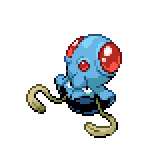

  

  

    

      
Types

      

        
        
      

    

    

      
Abilities

      

        <a href='' title="This Pokemon cannot have its stats lowered by other Pokemon.  This ability does not prevent any stat losses other than stat modifiers, such as the Speed cut from paralysis.  This Pokemon can still be passed negative stat modifiers through guard swap, heart swap, or power swap.  This ability functions identically to white smoke in battle.">Clear-body</a>
        /<a href='' title="Whenever a Pokemon would heal after hitting this Pokemon with a leeching move like absorb, it instead loses as many HP as it would usually gain.  dream eater is unaffected.">Liquid-ooze</a>
      

    

  

## Base Stats
<table style="width: 100%">
  <tbody style="width: 100%;">
    <tr style="display: flex; align-items: center;">
      <th style="color: #737373;" >HP</th>
      <td style="border-top: none; width: 70px">40</td>
      <td style="width: 100%; min-width: 450px; border-top: none;">
        

        

      </td>
    </tr>
    <tr style="display: flex; align-items: center;">
      <th style="color: #737373;">Attack</th>
      <td style="border-top: none; width: 70px">40</td>
      <td style="width: 100%; min-width: 450px; border-top: none;">
        

        

      </td>
    </tr>
    <tr style="display: flex; align-items: center;">
      <th style="color: #737373;">Defense</th>
      <td style="border-top: none; width: 70px">35</td>
      <td style="width: 100%; min-width: 450px; border-top: none;">
        

        

      </td>
    </tr>
    <tr style="display: flex; align-items: center;">
      <th style="color: #737373;">SP Attack</th>
      <td style="border-top: none; width: 70px">50</td>
      <td style="width: 100%; min-width: 450px; border-top: none;">
        

        

      </td>
    </tr>
    <tr style="display: flex; align-items: center;">
      <th style="color: #737373;">SP Defense</th>
      <td style="border-top: none; width: 70px">100</td>
      <td style="width: 100%; min-width: 450px; border-top: none;">
        

        

      </td>
    </tr>
    <tr style="display: flex; align-items: center;">
      <th style="color: #737373;">Speed</th>
      <td style="border-top: none; width: 70px">70</td>
      <td style="width: 100%; min-width: 450px; border-top: none;">
        

        

      </td>
    </tr>
  </tbody>
</table>

## Moveset

=== "Level Up Moves"
    | Level | Name | Power | Accuracy | PP | Type | Damage Class |
        | -- | -- | -- | -- | -- | -- | -- |
        	| 1 | Poison-sting | 15 | 100 | 35 |  |  |
	| 4 | Constrict | 10 | 100 | 35 |  |  |
	| 9 | Supersonic | - | 55 | 20 |  |  |
	| 13 | Acid | 40 | 100 | 30 |  |  |
	| 13 | Toxic-spikes | - | - | 20 |  |  |
	| 16 | Water-pulse | 60 | 100 | 20 |  |  |
	| 18 | Bubble-beam | 65 | 100 | 20 |  |  |
	| 22 | Acid-spray | 40 | 100 | 20 |  |  |
	| 22 | Wrap | 15 | 90 | 20 |  |  |
	| 31 | Barrier | - | - | 20 |  |  |
	| 34 | Brine | 65 | 100 | 10 |  |  |
	| 40 | Screech | - | 85 | 40 |  |  |
	| 40 | Hex | 65 | 100 | 10 |  |  |
	| 45 | Hydro-pump | 110 | 80 | 5 |  |  |
	| 49 | Wring-out | - | 100 | 5 |  |  |

        

=== "Machine Moves"
    | Machine | Name | Power | Accuracy | PP | Type | Damage Class |
        | -- | -- | -- | -- | -- | -- | -- |
        	| TM27 | Toxic | - | 90 | 10 |  |  |
	| TM66 | Payback | 50 | 100 | 10 |  |  |
	| TM100 | Confide | - | - | 20 |  |  |
	| TM27 | Return | - | 100 | 20 |  |  |
	| TM87 | Swagger | - | 85 | 15 |  |  |
	| TM09 | Venoshock | 65 | 100 | 10 |  |  |
	| TM05 | Rest | - | - | 5 |  |  |
	| TM84 | Poison-jab | 80 | 100 | 20 |  |  |
	| TM36 | Sludge-bomb | 90 | 100 | 10 |  |  |
	| TM01 | Headbutt | 70 | 100 | 15 |  |  |
	| TM88 | Sleep-talk | - | - | 10 |  |  |
	| TM32 | Double-team | - | - | 15 |  |  |
	| TM46 | Thief | 60 | 100 | 25 |  |  |
	| TM34 | Sludge-wave | 95 | 100 | 10 |  |  |
	| TM07 | Hail | - | - | 10 |  |  |
	| TM10 | Hidden-power | 60 | 100 | 15 |  |  |
	| TM21 | Frustration | - | 100 | 20 |  |  |
	| TM99 | Dazzling-gleam | 80 | 100 | 10 |  |  |
	| TM83 | Infestation | 20 | 100 | 20 |  |  |
	| TM55 | Scald | 80 | 100 | 15 |  |  |
	| TM45 | Attract | - | 100 | 15 |  |  |
	| TM55 | Ice-beam | 90 | 100 | 10 |  |  |
	| TM08 | Substitute | - | - | 10 |  |  |
	| TM20 | Safeguard | - | - | 25 |  |  |
	| TM07 | Protect | - | - | 10 |  |  |
	| TM12 | Facade | 70 | 100 | 20 |  |  |
	| TM48 | Round | 60 | 100 | 15 |  |  |
	| TM14 | Blizzard | 110 | 70 | 5 |  |  |
	| TM53 | Mega-drain | 40 | 100 | 15 |  |  |
	| TM18 | Rain-dance | - | - | 5 |  |  |
	| TM33 | Reflect | - | - | 20 |  |  |
	| TM98 | Waterfall | 80 | 100 | 15 |  |  |
	| TM75 | Swords-dance | - | - | 20 |  |  |
	| TM94 | Surf | 90 | 100 | 15 |  |  |

        
