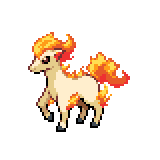

  

  

    

      
Types

      

        
        
      

    

    

      
Abilities

      

        <a href='' title="This Pokemon is always successful fleeing from wild battles, even if trapped by a move or ability.">Run-away</a>
        /<a href='' title="This Pokemon is immune to fire-type moves.  Once this Pokemon has been hit by a Fire move, its own Fire moves will inflict 1.5x as much damage until it leaves battle.  This ability has no effect while the Pokemon is frozen.  The Fire damage bonus is retained even if the Pokemon is frozen and thawed or the ability is lost or disabled.  Fire moves will ignore this Pokemon's substitute.  This ability takes effect even on non-damaging moves, i.e. will o wisp.">Flash-fire</a>
      

    

  

## Base Stats
<table style="width: 100%">
  <tbody style="width: 100%;">
    <tr style="display: flex; align-items: center;">
      <th style="color: #737373;" >HP</th>
      <td style="border-top: none; width: 70px">50</td>
      <td style="width: 100%; min-width: 450px; border-top: none;">
        

        

      </td>
    </tr>
    <tr style="display: flex; align-items: center;">
      <th style="color: #737373;">Attack</th>
      <td style="border-top: none; width: 70px">85</td>
      <td style="width: 100%; min-width: 450px; border-top: none;">
        

        

      </td>
    </tr>
    <tr style="display: flex; align-items: center;">
      <th style="color: #737373;">Defense</th>
      <td style="border-top: none; width: 70px">55</td>
      <td style="width: 100%; min-width: 450px; border-top: none;">
        

        

      </td>
    </tr>
    <tr style="display: flex; align-items: center;">
      <th style="color: #737373;">SP Attack</th>
      <td style="border-top: none; width: 70px">65</td>
      <td style="width: 100%; min-width: 450px; border-top: none;">
        

        

      </td>
    </tr>
    <tr style="display: flex; align-items: center;">
      <th style="color: #737373;">SP Defense</th>
      <td style="border-top: none; width: 70px">65</td>
      <td style="width: 100%; min-width: 450px; border-top: none;">
        

        

      </td>
    </tr>
    <tr style="display: flex; align-items: center;">
      <th style="color: #737373;">Speed</th>
      <td style="border-top: none; width: 70px">90</td>
      <td style="width: 100%; min-width: 450px; border-top: none;">
        

        

      </td>
    </tr>
  </tbody>
</table>

## Moveset

=== "Level Up Moves"
    | Level | Name | Power | Accuracy | PP | Type | Damage Class |
        | -- | -- | -- | -- | -- | -- | -- |
        	| 1 | Tail-whip | - | 100 | 30 |  |  |
	| 1 | Tackle | 40 | 100 | 35 |  |  |
	| 1 | Growl | - | 100 | 40 |  |  |
	| 5 | Ember | 40 | 100 | 25 |  |  |
	| 10 | Quick-attack | 40 | 100 | 30 |  |  |
	| 13 | Flame-wheel | 60 | 100 | 25 |  |  |
	| 15 | Double-kick | 30 | 100 | 30 |  |  |
	| 20 | Stomp | 65 | 100 | 20 |  |  |
	| 26 | Fire-spin | 35 | 85 | 15 |  |  |
	| 32 | Agility | - | - | 30 |  |  |
	| 33 | Inferno | 100 | 50 | 5 |  |  |
	| 44 | Take-down | 90 | 85 | 20 |  |  |
	| 45 | Bounce | 85 | 85 | 5 |  |  |
	| 51 | Flare-blitz | 120 | 100 | 15 |  |  |

        

=== "Machine Moves"
    | Machine | Name | Power | Accuracy | PP | Type | Damage Class |
        | -- | -- | -- | -- | -- | -- | -- |
        	| TM27 | Toxic | - | 90 | 10 |  |  |
	| TM100 | Confide | - | - | 20 |  |  |
	| TM27 | Return | - | 100 | 20 |  |  |
	| TM87 | Swagger | - | 85 | 15 |  |  |
	| TM05 | Rest | - | - | 5 |  |  |
	| TM01 | Headbutt | 70 | 100 | 15 |  |  |
	| TM61 | Will-o-wisp | - | 85 | 15 |  |  |
	| TM88 | Sleep-talk | - | - | 10 |  |  |
	| TM32 | Double-team | - | - | 15 |  |  |
	| TM38 | Fire-blast | 110 | 85 | 5 |  |  |
	| TM50 | Overheat | 130 | 90 | 5 |  |  |
	| TM43 | Flame-charge | 50 | 100 | 20 |  |  |
	| TM10 | Hidden-power | 60 | 100 | 15 |  |  |
	| TM21 | Frustration | - | 100 | 20 |  |  |
	| TM19 | Iron-tail | 100 | 75 | 15 |  |  |
	| TM45 | Attract | - | 100 | 15 |  |  |
	| TM45 | Solar-beam | 120 | 100 | 10 |  |  |
	| TM11 | Sunny-day | - | - | 5 |  |  |
	| TM08 | Substitute | - | - | 10 |  |  |
	| TM93 | Wild-charge | 90 | 100 | 15 |  |  |
	| TM07 | Protect | - | - | 10 |  |  |
	| TM12 | Facade | 70 | 100 | 20 |  |  |
	| TM48 | Round | 60 | 100 | 15 |  |  |
	| TM49 | Echoed-voice | 40 | 100 | 15 |  |  |
	| TM35 | Flamethrower | 90 | 100 | 15 |  |  |
	| TM33 | Reflect | - | - | 20 |  |  |

        
