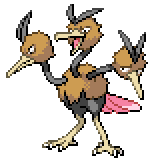

  

  

    

      
Types

      

        
        
      

    

    

      
Abilities

      

        <a href='' title="This Pokemon is always successful fleeing from wild battles, even if trapped by a move or ability.">Run-away</a>
        /<a href='' title="This Pokemon's remaining sleep turn count falls by 2 rather than 1.  If this Pokemon's sleep counter is at 1, it will fall to 0 and then the Pokemon will wake up.">Early-bird</a>
      

    

  

## Base Stats
<table style="width: 100%">
  <tbody style="width: 100%;">
    <tr style="display: flex; align-items: center;">
      <th style="color: #737373;" >HP</th>
      <td style="border-top: none; width: 70px">60</td>
      <td style="width: 100%; min-width: 450px; border-top: none;">
        

        

      </td>
    </tr>
    <tr style="display: flex; align-items: center;">
      <th style="color: #737373;">Attack</th>
      <td style="border-top: none; width: 70px">110</td>
      <td style="width: 100%; min-width: 450px; border-top: none;">
        

        

      </td>
    </tr>
    <tr style="display: flex; align-items: center;">
      <th style="color: #737373;">Defense</th>
      <td style="border-top: none; width: 70px">70</td>
      <td style="width: 100%; min-width: 450px; border-top: none;">
        

        

      </td>
    </tr>
    <tr style="display: flex; align-items: center;">
      <th style="color: #737373;">SP Attack</th>
      <td style="border-top: none; width: 70px">60</td>
      <td style="width: 100%; min-width: 450px; border-top: none;">
        

        

      </td>
    </tr>
    <tr style="display: flex; align-items: center;">
      <th style="color: #737373;">SP Defense</th>
      <td style="border-top: none; width: 70px">60</td>
      <td style="width: 100%; min-width: 450px; border-top: none;">
        

        

      </td>
    </tr>
    <tr style="display: flex; align-items: center;">
      <th style="color: #737373;">Speed</th>
      <td style="border-top: none; width: 70px">110</td>
      <td style="width: 100%; min-width: 450px; border-top: none;">
        

        

      </td>
    </tr>
  </tbody>
</table>

## Moveset

=== "Level Up Moves"
    | Level | Name | Power | Accuracy | PP | Type | Damage Class |
        | -- | -- | -- | -- | -- | -- | -- |
        	| 1 | Supersonic | - | 55 | 20 |  |  |
	| 1 | Peck | 35 | 100 | 35 |  |  |
	| 1 | Mirror-move | - | - | 20 |  |  |
	| 1 | Growl | - | 100 | 40 |  |  |
	| 5 | Quick-attack | 40 | 100 | 30 |  |  |
	| 10 | Rage | 20 | 100 | 20 |  |  |
	| 15 | Pursuit | 40 | 100 | 20 |  |  |
	| 16 | Fury-attack | 15 | 85 | 20 |  |  |
	| 19 | Pluck | 60 | 100 | 20 |  |  |
	| 22 | Agility | - | - | 30 |  |  |
	| 22 | Double-hit | 35 | 90 | 10 |  |  |
	| 27 | Drill-peck | 80 | 100 | 20 |  |  |
	| 29 | Uproar | 90 | 100 | 10 |  |  |
	| 34 | Acupressure | - | - | 30 |  |  |
	| 37 | Swords-dance | - | - | 20 |  |  |
	| 48 | Jump-kick | 100 | 95 | 10 |  |  |
	| 52 | Endeavor | - | 100 | 5 |  |  |
	| 59 | Thrash | 120 | 100 | 10 |  |  |

        

=== "Machine Moves"
    | Machine | Name | Power | Accuracy | PP | Type | Damage Class |
        | -- | -- | -- | -- | -- | -- | -- |
        	| TM27 | Toxic | - | 90 | 10 |  |  |
	| TM66 | Payback | 50 | 100 | 10 |  |  |
	| TM100 | Confide | - | - | 20 |  |  |
	| TM27 | Return | - | 100 | 20 |  |  |
	| TM87 | Swagger | - | 85 | 15 |  |  |
	| TM05 | Rest | - | - | 5 |  |  |
	| TM01 | Headbutt | 70 | 100 | 15 |  |  |
	| TM28 | Tri-attack | 80 | 100 | 10 |  |  |
	| TM88 | Sleep-talk | - | - | 10 |  |  |
	| TM32 | Double-team | - | - | 15 |  |  |
	| TM41 | Torment | - | 100 | 15 |  |  |
	| TM51 | Steel-wing | 70 | 90 | 25 |  |  |
	| TM46 | Thief | 60 | 100 | 25 |  |  |
	| TM10 | Hidden-power | 60 | 100 | 15 |  |  |
	| TM21 | Frustration | - | 100 | 20 |  |  |
	| TM19 | Roost | - | - | 5 |  |  |
	| TM40 | Aerial-ace | 60 | - | 20 |  |  |
	| TM45 | Attract | - | 100 | 15 |  |  |
	| TM11 | Sunny-day | - | - | 5 |  |  |
	| TM08 | Substitute | - | - | 10 |  |  |
	| TM48 | Hyper-beam | 150 | 90 | 5 |  |  |
	| TM07 | Protect | - | - | 10 |  |  |
	| TM12 | Facade | 70 | 100 | 20 |  |  |
	| TM12 | Taunt | - | 100 | 20 |  |  |
	| TM01 | Work-up | - | - | 30 |  |  |
	| TM48 | Round | 60 | 100 | 15 |  |  |
	| TM76 | Fly | 90 | 95 | 15 |  |  |
	| TM49 | Echoed-voice | 40 | 100 | 15 |  |  |
	| TM68 | Giga-impact | 150 | 90 | 5 |  |  |
	| TM33 | Reflect | - | - | 20 |  |  |

        
