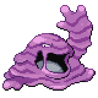

  

  

    

      
Types

      

        
        
      

    

    

      
Abilities

      

        <a href='' title="This Pokemon's damaging moves have a 10% chance to make the target flinch with each hit if they do not already cause flinching as a secondary effect.  This ability does not stack with a held item.  Overworld: The wild encounter rate is halved while this Pokemon is first in the party.">Stench</a>
        /<a href='' title="This Pokemon's hold item cannot be removed by other Pokemon.  Damaging moves that would remove this Pokemon's item can still inflict damage against this Pokemon, e.g. knock off or pluck.  This Pokemon can still use moves that involve the loss of its own item, e.g. fling or trick.  Overworld: If the lead Pokemon has this ability, the encounter rate while fishing is increased.">Sticky-hold</a>
      

    

  

## Base Stats
<table style="width: 100%">
  <tbody style="width: 100%;">
    <tr style="display: flex; align-items: center;">
      <th style="color: #737373;" >HP</th>
      <td style="border-top: none; width: 70px">105</td>
      <td style="width: 100%; min-width: 450px; border-top: none;">
        

        

      </td>
    </tr>
    <tr style="display: flex; align-items: center;">
      <th style="color: #737373;">Attack</th>
      <td style="border-top: none; width: 70px">105</td>
      <td style="width: 100%; min-width: 450px; border-top: none;">
        

        

      </td>
    </tr>
    <tr style="display: flex; align-items: center;">
      <th style="color: #737373;">Defense</th>
      <td style="border-top: none; width: 70px">75</td>
      <td style="width: 100%; min-width: 450px; border-top: none;">
        

        

      </td>
    </tr>
    <tr style="display: flex; align-items: center;">
      <th style="color: #737373;">SP Attack</th>
      <td style="border-top: none; width: 70px">65</td>
      <td style="width: 100%; min-width: 450px; border-top: none;">
        

        

      </td>
    </tr>
    <tr style="display: flex; align-items: center;">
      <th style="color: #737373;">SP Defense</th>
      <td style="border-top: none; width: 70px">100</td>
      <td style="width: 100%; min-width: 450px; border-top: none;">
        

        

      </td>
    </tr>
    <tr style="display: flex; align-items: center;">
      <th style="color: #737373;">Speed</th>
      <td style="border-top: none; width: 70px">50</td>
      <td style="width: 100%; min-width: 450px; border-top: none;">
        

        

      </td>
    </tr>
  </tbody>
</table>

## Moveset

=== "Level Up Moves"
    | Level | Name | Power | Accuracy | PP | Type | Damage Class |
        | -- | -- | -- | -- | -- | -- | -- |
        	| 1 | Pound | 40 | 100 | 35 |  |  |
	| 1 | Poison-gas | - | 90 | 40 |  |  |
	| 1 | Haze | - | - | 30 |  |  |
	| 1 | Moonblast | 95 | 100 | 15 |  |  |
	| 1 | Venom-drench | - | 100 | 20 |  |  |
	| 6 | Harden | - | - | 30 |  |  |
	| 7 | Mud-slap | 20 | 100 | 10 |  |  |
	| 12 | Minimize | - | - | 10 |  |  |
	| 15 | Acid-spray | 40 | 100 | 20 |  |  |
	| 18 | Disable | - | 100 | 20 |  |  |
	| 18 | Mud-bomb | 65 | 85 | 10 |  |  |
	| 18 | Poison-fang | 50 | 100 | 15 |  |  |
	| 24 | Bite | 60 | 100 | 25 |  |  |
	| 24 | Sludge | 65 | 100 | 20 |  |  |
	| 29 | Knock-off | 65 | 100 | 20 |  |  |
	| 30 | Screech | - | 85 | 40 |  |  |
	| 36 | Crunch | 80 | 100 | 15 |  |  |
	| 40 | Gunk-shot | 120 | 80 | 5 |  |  |
	| 48 | Acid-armor | - | - | 20 |  |  |
	| 52 | Belch | 120 | 90 | 10 |  |  |
	| 57 | Memento | - | 100 | 10 |  |  |

        

=== "Machine Moves"
    | Machine | Name | Power | Accuracy | PP | Type | Damage Class |
        | -- | -- | -- | -- | -- | -- | -- |
        	| TM22 | Rock-slide | 75 | 90 | 10 |  |  |
	| TM27 | Toxic | - | 90 | 10 |  |  |
	| TM36 | Thunderbolt | 90 | 100 | 15 |  |  |
	| TM66 | Payback | 50 | 100 | 10 |  |  |
	| TM100 | Confide | - | - | 20 |  |  |
	| TM21 | Foul-play | 95 | 100 | 15 |  |  |
	| TM27 | Return | - | 100 | 20 |  |  |
	| TM97 | Dark-pulse | 80 | 100 | 15 |  |  |
	| TM87 | Swagger | - | 85 | 15 |  |  |
	| TM09 | Venoshock | 65 | 100 | 10 |  |  |
	| TM31 | Fire-punch | 75 | 100 | 15 |  |  |
	| TM05 | Rest | - | - | 5 |  |  |
	| TM56 | Fling | - | 100 | 10 |  |  |
	| TM84 | Poison-jab | 80 | 100 | 20 |  |  |
	| TM36 | Sludge-bomb | 90 | 100 | 10 |  |  |
	| TM38 | Thunder | 110 | 70 | 10 |  |  |
	| TM01 | Headbutt | 70 | 100 | 15 |  |  |
	| TM88 | Sleep-talk | - | - | 10 |  |  |
	| TM63 | Embargo | - | 100 | 15 |  |  |
	| TM32 | Double-team | - | - | 15 |  |  |
	| TM41 | Torment | - | 100 | 15 |  |  |
	| TM46 | Thief | 60 | 100 | 25 |  |  |
	| TM39 | Rock-tomb | 60 | 95 | 15 |  |  |
	| TM13 | Brick-break | 75 | 100 | 15 |  |  |
	| TM10 | Dig | 80 | 100 | 10 |  |  |
	| TM38 | Fire-blast | 110 | 85 | 5 |  |  |
	| TM35 | Ice-punch | 75 | 100 | 15 |  |  |
	| TM69 | Rock-polish | - | - | 20 |  |  |
	| TM34 | Sludge-wave | 95 | 100 | 10 |  |  |
	| TM10 | Hidden-power | 60 | 100 | 15 |  |  |
	| TM21 | Frustration | - | 100 | 20 |  |  |
	| TM03 | Helping-hand | - | - | 20 |  |  |
	| TM30 | Shadow-ball | 80 | 100 | 15 |  |  |
	| TM83 | Infestation | 20 | 100 | 20 |  |  |
	| TM45 | Attract | - | 100 | 15 |  |  |
	| TM71 | Stone-edge | 100 | 80 | 5 |  |  |
	| TM59 | Brutal-swing | 60 | 100 | 20 |  |  |
	| TM95 | Snarl | 55 | 95 | 15 |  |  |
	| TM52 | Focus-blast | 120 | 70 | 5 |  |  |
	| TM11 | Sunny-day | - | - | 5 |  |  |
	| TM08 | Substitute | - | - | 10 |  |  |
	| TM23 | Thunder-punch | 75 | 100 | 15 |  |  |
	| TM48 | Hyper-beam | 150 | 90 | 5 |  |  |
	| TM07 | Protect | - | - | 10 |  |  |
	| TM64 | Explosion | 250 | 100 | 5 |  |  |
	| TM12 | Facade | 70 | 100 | 20 |  |  |
	| TM12 | Taunt | - | 100 | 20 |  |  |
	| TM48 | Round | 60 | 100 | 15 |  |  |
	| TM60 | Quash | - | 100 | 15 |  |  |
	| TM53 | Mega-drain | 40 | 100 | 15 |  |  |
	| TM18 | Rain-dance | - | - | 5 |  |  |
	| TM68 | Giga-impact | 150 | 90 | 5 |  |  |
	| TM35 | Flamethrower | 90 | 100 | 15 |  |  |
	| TM42 | Self-destruct | 200 | 100 | 5 |  |  |

        
