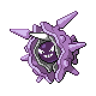

  

  

    

      
Types

      

        
        
      

    

    

      
Abilities

      

        <a href='' title="Moves cannot score critical hits against this Pokemon.  This ability functions identically to battle armor.">Shell-armor</a>
        /<a href='' title="This Pokemon always hits five times with two-to-five-hit moves, such as icicle spear.  It also bypasses the accuracy checks on triple kick's second and third hits.">Skill-link</a>
      

    

  

## Base Stats
<table style="width: 100%">
  <tbody style="width: 100%;">
    <tr style="display: flex; align-items: center;">
      <th style="color: #737373;" >HP</th>
      <td style="border-top: none; width: 70px">50</td>
      <td style="width: 100%; min-width: 450px; border-top: none;">
        

        

      </td>
    </tr>
    <tr style="display: flex; align-items: center;">
      <th style="color: #737373;">Attack</th>
      <td style="border-top: none; width: 70px">95</td>
      <td style="width: 100%; min-width: 450px; border-top: none;">
        

        

      </td>
    </tr>
    <tr style="display: flex; align-items: center;">
      <th style="color: #737373;">Defense</th>
      <td style="border-top: none; width: 70px">180</td>
      <td style="width: 100%; min-width: 450px; border-top: none;">
        

        

      </td>
    </tr>
    <tr style="display: flex; align-items: center;">
      <th style="color: #737373;">SP Attack</th>
      <td style="border-top: none; width: 70px">85</td>
      <td style="width: 100%; min-width: 450px; border-top: none;">
        

        

      </td>
    </tr>
    <tr style="display: flex; align-items: center;">
      <th style="color: #737373;">SP Defense</th>
      <td style="border-top: none; width: 70px">45</td>
      <td style="width: 100%; min-width: 450px; border-top: none;">
        

        

      </td>
    </tr>
    <tr style="display: flex; align-items: center;">
      <th style="color: #737373;">Speed</th>
      <td style="border-top: none; width: 70px">70</td>
      <td style="width: 100%; min-width: 450px; border-top: none;">
        

        

      </td>
    </tr>
  </tbody>
</table>

## Moveset

=== "Level Up Moves"
    | Level | Name | Power | Accuracy | PP | Type | Damage Class |
        | -- | -- | -- | -- | -- | -- | -- |
        	| 1 | Aurora-beam | 65 | 100 | 20 |  |  |
	| 1 | Twineedle | 25 | 100 | 20 |  |  |
	| 1 | Tackle | 40 | 100 | 35 |  |  |
	| 1 | Water-gun | 40 | 100 | 25 |  |  |
	| 1 | Barrier | - | - | 20 |  |  |
	| 1 | Leer | - | 100 | 30 |  |  |
	| 1 | Supersonic | - | 55 | 20 |  |  |
	| 1 | Spike-cannon | 20 | 100 | 15 |  |  |
	| 1 | Hydro-pump | 110 | 80 | 5 |  |  |
	| 1 | Withdraw | - | - | 40 |  |  |
	| 1 | Shell-smash | - | - | 15 |  |  |
	| 1 | Toxic-spikes | - | - | 20 |  |  |
	| 28 | Spikes | - | - | 20 |  |  |
	| 50 | Icicle-crash | 85 | 90 | 10 |  |  |

        

=== "Machine Moves"
    | Machine | Name | Power | Accuracy | PP | Type | Damage Class |
        | -- | -- | -- | -- | -- | -- | -- |
        	| TM27 | Toxic | - | 90 | 10 |  |  |
	| TM66 | Payback | 50 | 100 | 10 |  |  |
	| TM100 | Confide | - | - | 20 |  |  |
	| TM27 | Return | - | 100 | 20 |  |  |
	| TM87 | Swagger | - | 85 | 15 |  |  |
	| TM05 | Rest | - | - | 5 |  |  |
	| TM84 | Poison-jab | 80 | 100 | 20 |  |  |
	| TM01 | Headbutt | 70 | 100 | 15 |  |  |
	| TM67 | Smart-strike | 70 | - | 10 |  |  |
	| TM04 | Teleport | - | - | 20 |  |  |
	| TM28 | Tri-attack | 80 | 100 | 10 |  |  |
	| TM88 | Sleep-talk | - | - | 10 |  |  |
	| TM32 | Double-team | - | - | 15 |  |  |
	| TM41 | Torment | - | 100 | 15 |  |  |
	| TM07 | Hail | - | - | 10 |  |  |
	| TM10 | Hidden-power | 60 | 100 | 15 |  |  |
	| TM21 | Frustration | - | 100 | 20 |  |  |
	| TM45 | Attract | - | 100 | 15 |  |  |
	| TM79 | Frost-breath | 60 | 90 | 10 |  |  |
	| TM55 | Ice-beam | 90 | 100 | 10 |  |  |
	| TM08 | Substitute | - | - | 10 |  |  |
	| TM48 | Hyper-beam | 150 | 90 | 5 |  |  |
	| TM07 | Protect | - | - | 10 |  |  |
	| TM64 | Explosion | 250 | 100 | 5 |  |  |
	| TM12 | Facade | 70 | 100 | 20 |  |  |
	| TM48 | Round | 60 | 100 | 15 |  |  |
	| TM14 | Blizzard | 110 | 70 | 5 |  |  |
	| TM18 | Rain-dance | - | - | 5 |  |  |
	| TM68 | Giga-impact | 150 | 90 | 5 |  |  |
	| TM33 | Reflect | - | - | 20 |  |  |
	| TM42 | Self-destruct | 200 | 100 | 5 |  |  |
	| TM94 | Surf | 90 | 100 | 15 |  |  |

        
