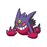

  

  

    

      
Types

      

        
        
      

    

    

      
Abilities

      

        <a href='' title="While this Pokemon is in battle, opposing Pokemon cannot flee or switch out.  Other Pokemon with this ability are unaffected.  Pokemon with run away can still flee.  Pokemon can still switch out with the use of a move or item.">Shadow-tag</a>
        
      

    

  

## Base Stats
<table style="width: 100%">
  <tbody style="width: 100%;">
    <tr style="display: flex; align-items: center;">
      <th style="color: #737373;" >HP</th>
      <td style="border-top: none; width: 70px">60</td>
      <td style="width: 100%; min-width: 450px; border-top: none;">
        

        

      </td>
    </tr>
    <tr style="display: flex; align-items: center;">
      <th style="color: #737373;">Attack</th>
      <td style="border-top: none; width: 70px">65</td>
      <td style="width: 100%; min-width: 450px; border-top: none;">
        

        

      </td>
    </tr>
    <tr style="display: flex; align-items: center;">
      <th style="color: #737373;">Defense</th>
      <td style="border-top: none; width: 70px">80</td>
      <td style="width: 100%; min-width: 450px; border-top: none;">
        

        

      </td>
    </tr>
    <tr style="display: flex; align-items: center;">
      <th style="color: #737373;">SP Attack</th>
      <td style="border-top: none; width: 70px">170</td>
      <td style="width: 100%; min-width: 450px; border-top: none;">
        

        

      </td>
    </tr>
    <tr style="display: flex; align-items: center;">
      <th style="color: #737373;">SP Defense</th>
      <td style="border-top: none; width: 70px">95</td>
      <td style="width: 100%; min-width: 450px; border-top: none;">
        

        

      </td>
    </tr>
    <tr style="display: flex; align-items: center;">
      <th style="color: #737373;">Speed</th>
      <td style="border-top: none; width: 70px">130</td>
      <td style="width: 100%; min-width: 450px; border-top: none;">
        

        

      </td>
    </tr>
  </tbody>
</table>

## Moveset

=== "Level Up Moves"
    | Level | Name | Power | Accuracy | PP | Type | Damage Class |
        | -- | -- | -- | -- | -- | -- | -- |
        	| 1 | Disable | - | 100 | 20 |  |  |
	| 1 | Smog | 30 | 70 | 20 |  |  |
	| 1 | Shadow-punch | 60 | - | 20 |  |  |
	| 1 | Haze | - | - | 30 |  |  |
	| 1 | Hypnosis | - | 60 | 20 |  |  |
	| 1 | Lick | 30 | 100 | 30 |  |  |
	| 5 | Confuse-ray | - | 100 | 10 |  |  |
	| 5 | Spite | - | 100 | 10 |  |  |
	| 7 | Poison-gas | - | 90 | 40 |  |  |
	| 8 | Mean-look | - | - | 5 |  |  |
	| 12 | Curse | - | - | 10 |  |  |
	| 12 | Night-shade | - | 100 | 15 |  |  |
	| 19 | Sucker-punch | 70 | 100 | 5 |  |  |
	| 50 | Destiny-bond | - | - | 5 |  |  |
	| 55 | Hex | 65 | 100 | 10 |  |  |
	| 61 | Nightmare | - | 100 | 15 |  |  |

        

=== "Machine Moves"
    | Machine | Name | Power | Accuracy | PP | Type | Damage Class |
        | -- | -- | -- | -- | -- | -- | -- |
        	| TM27 | Toxic | - | 90 | 10 |  |  |
	| TM36 | Thunderbolt | 90 | 100 | 15 |  |  |
	| TM66 | Payback | 50 | 100 | 10 |  |  |
	| TM100 | Confide | - | - | 20 |  |  |
	| TM21 | Foul-play | 95 | 100 | 15 |  |  |
	| TM27 | Return | - | 100 | 20 |  |  |
	| TM97 | Dark-pulse | 80 | 100 | 15 |  |  |
	| TM87 | Swagger | - | 85 | 15 |  |  |
	| TM85 | Dream-eater | 100 | 100 | 15 |  |  |
	| TM09 | Venoshock | 65 | 100 | 10 |  |  |
	| TM31 | Fire-punch | 75 | 100 | 15 |  |  |
	| TM05 | Rest | - | - | 5 |  |  |
	| TM56 | Fling | - | 100 | 10 |  |  |
	| TM84 | Poison-jab | 80 | 100 | 20 |  |  |
	| TM36 | Sludge-bomb | 90 | 100 | 10 |  |  |
	| TM38 | Thunder | 110 | 70 | 10 |  |  |
	| TM01 | Headbutt | 70 | 100 | 15 |  |  |
	| TM61 | Will-o-wisp | - | 85 | 15 |  |  |
	| TM88 | Sleep-talk | - | - | 10 |  |  |
	| TM65 | Shadow-claw | 70 | 100 | 15 |  |  |
	| TM63 | Embargo | - | 100 | 15 |  |  |
	| TM32 | Double-team | - | - | 15 |  |  |
	| TM41 | Torment | - | 100 | 15 |  |  |
	| TM46 | Thief | 60 | 100 | 25 |  |  |
	| TM13 | Brick-break | 75 | 100 | 15 |  |  |
	| TM29 | Psychic | 90 | 100 | 10 |  |  |
	| TM35 | Ice-punch | 75 | 100 | 15 |  |  |
	| TM10 | Hidden-power | 60 | 100 | 15 |  |  |
	| TM92 | Trick-room | - | - | 5 |  |  |
	| TM21 | Frustration | - | 100 | 20 |  |  |
	| TM30 | Shadow-ball | 80 | 100 | 15 |  |  |
	| TM53 | Energy-ball | 90 | 100 | 10 |  |  |
	| TM99 | Dazzling-gleam | 80 | 100 | 10 |  |  |
	| TM83 | Infestation | 20 | 100 | 20 |  |  |
	| TM45 | Attract | - | 100 | 15 |  |  |
	| TM52 | Focus-blast | 120 | 70 | 5 |  |  |
	| TM11 | Sunny-day | - | - | 5 |  |  |
	| TM08 | Substitute | - | - | 10 |  |  |
	| TM23 | Thunder-punch | 75 | 100 | 15 |  |  |
	| TM48 | Hyper-beam | 150 | 90 | 5 |  |  |
	| TM07 | Protect | - | - | 10 |  |  |
	| TM64 | Explosion | 250 | 100 | 5 |  |  |
	| TM12 | Facade | 70 | 100 | 20 |  |  |
	| TM12 | Taunt | - | 100 | 20 |  |  |
	| TM15 | Seismic-toss | - | 100 | 20 |  |  |
	| TM77 | Psych-up | - | - | 10 |  |  |
	| TM48 | Round | 60 | 100 | 15 |  |  |
	| TM53 | Mega-drain | 40 | 100 | 15 |  |  |
	| TM18 | Rain-dance | - | - | 5 |  |  |
	| TM68 | Giga-impact | 150 | 90 | 5 |  |  |
	| TM42 | Self-destruct | 200 | 100 | 5 |  |  |

        
