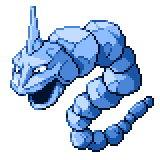

  

  

    

      
Types

      

        
        
      

    

    

      
Abilities

      

        <a href='' title="During Hail, this Pokemon has double Speed.">Slush-rush</a>
        /<a href='' title="During hail, this Pokemon has 1.25x its evasion, and it does not take hail damage regardless of type.  The evasion bonus does not count as a stat modifier.  Overworld: If the lead Pokemon has this ability, the wild encounter rate is halved in snow.">Snow-cloak</a>
      

    

  

## Base Stats
<table style="width: 100%">
  <tbody style="width: 100%;">
    <tr style="display: flex; align-items: center;">
      <th style="color: #737373;" >HP</th>
      <td style="border-top: none; width: 70px">65</td>
      <td style="width: 100%; min-width: 450px; border-top: none;">
        

        

      </td>
    </tr>
    <tr style="display: flex; align-items: center;">
      <th style="color: #737373;">Attack</th>
      <td style="border-top: none; width: 70px">90</td>
      <td style="width: 100%; min-width: 450px; border-top: none;">
        

        

      </td>
    </tr>
    <tr style="display: flex; align-items: center;">
      <th style="color: #737373;">Defense</th>
      <td style="border-top: none; width: 70px">160</td>
      <td style="width: 100%; min-width: 450px; border-top: none;">
        

        

      </td>
    </tr>
    <tr style="display: flex; align-items: center;">
      <th style="color: #737373;">SP Attack</th>
      <td style="border-top: none; width: 70px">30</td>
      <td style="width: 100%; min-width: 450px; border-top: none;">
        

        

      </td>
    </tr>
    <tr style="display: flex; align-items: center;">
      <th style="color: #737373;">SP Defense</th>
      <td style="border-top: none; width: 70px">60</td>
      <td style="width: 100%; min-width: 450px; border-top: none;">
        

        

      </td>
    </tr>
    <tr style="display: flex; align-items: center;">
      <th style="color: #737373;">Speed</th>
      <td style="border-top: none; width: 70px">70</td>
      <td style="width: 100%; min-width: 450px; border-top: none;">
        

        

      </td>
    </tr>
  </tbody>
</table>

## Moveset

=== "Level Up Moves"
    | Level | Name | Power | Accuracy | PP | Type | Damage Class |
        | -- | -- | -- | -- | -- | -- | -- |
        	| 1 | Tackle | 40 | 100 | 35 |  |  |
	| 1 | Harden | - | - | 30 |  |  |
	| 1 | Mud-sport | - | - | 15 |  |  |
	| 1 | Rock-throw | 50 | 90 | 15 |  |  |
	| 1 | Bind | 15 | 85 | 20 |  |  |
	| 4 | Curse | - | - | 10 |  |  |
	| 10 | Rage | 20 | 100 | 20 |  |  |
	| 15 | Screech | - | 85 | 40 |  |  |
	| 25 | Dragon-breath | 60 | 100 | 20 |  |  |
	| 25 | Slam | 80 | 75 | 20 |  |  |
	| 37 | Sand-tomb | 35 | 85 | 15 |  |  |
	| 45 | Double-edge | 120 | 100 | 15 |  |  |

        

=== "Machine Moves"
    | Machine | Name | Power | Accuracy | PP | Type | Damage Class |
        | -- | -- | -- | -- | -- | -- | -- |
        	| TM22 | Rock-slide | 75 | 90 | 10 |  |  |
	| TM27 | Toxic | - | 90 | 10 |  |  |
	| TM66 | Payback | 50 | 100 | 10 |  |  |
	| TM100 | Confide | - | - | 20 |  |  |
	| TM27 | Return | - | 100 | 20 |  |  |
	| TM87 | Swagger | - | 85 | 15 |  |  |
	| TM23 | Smack-down | 50 | 100 | 15 |  |  |
	| TM05 | Rest | - | - | 5 |  |  |
	| TM01 | Headbutt | 70 | 100 | 15 |  |  |
	| TM41 | Earthquake | 100 | 100 | 10 |  |  |
	| TM88 | Sleep-talk | - | - | 10 |  |  |
	| TM05 | Roar | - | - | 20 |  |  |
	| TM32 | Double-team | - | - | 15 |  |  |
	| TM41 | Torment | - | 100 | 15 |  |  |
	| TM39 | Rock-tomb | 60 | 95 | 15 |  |  |
	| TM10 | Dig | 80 | 100 | 10 |  |  |
	| TM69 | Rock-polish | - | - | 20 |  |  |
	| TM10 | Hidden-power | 60 | 100 | 15 |  |  |
	| TM56 | Stealth-rock | - | - | 20 |  |  |
	| TM21 | Frustration | - | 100 | 20 |  |  |
	| TM19 | Iron-tail | 100 | 75 | 15 |  |  |
	| TM78 | Bulldoze | 60 | 100 | 20 |  |  |
	| TM74 | Gyro-ball | - | 100 | 5 |  |  |
	| TM45 | Attract | - | 100 | 15 |  |  |
	| TM37 | Sandstorm | - | - | 10 |  |  |
	| TM71 | Stone-edge | 100 | 80 | 5 |  |  |
	| TM59 | Brutal-swing | 60 | 100 | 20 |  |  |
	| TM82 | Dragon-tail | 60 | 90 | 10 |  |  |
	| TM11 | Sunny-day | - | - | 5 |  |  |
	| TM54 | Flash-cannon | 80 | 100 | 10 |  |  |
	| TM08 | Substitute | - | - | 10 |  |  |
	| TM07 | Protect | - | - | 10 |  |  |
	| TM64 | Explosion | 250 | 100 | 5 |  |  |
	| TM12 | Facade | 70 | 100 | 20 |  |  |
	| TM12 | Taunt | - | 100 | 20 |  |  |
	| TM77 | Psych-up | - | - | 10 |  |  |
	| TM96 | Nature-power | - | - | 20 |  |  |
	| TM48 | Round | 60 | 100 | 15 |  |  |
	| TM34 | Dragon-pulse | 85 | 100 | 10 |  |  |
	| TM42 | Self-destruct | 200 | 100 | 5 |  |  |
	| TM101 | Carbon-crush | 90 | 95 | 15 |  |  |

        
