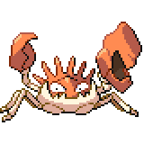

  

  

    

      
Types

      

        
        
      

    

    

      
Abilities

      

        <a href='' title="This Pokemon's Attack cannot be lowered by other Pokemon.  This ability does not prevent any Attack losses other than stat modifiers, such as the Attack cut from a burn.  This Pokemon can still be passed negative Attack modifiers through heart swap or power swap.">Hyper-cutter</a>
        /<a href='' title="Moves cannot score critical hits against this Pokemon.  This ability functions identically to battle armor.">Shell-armor</a>
      

    

  

## Base Stats
<table style="width: 100%">
  <tbody style="width: 100%;">
    <tr style="display: flex; align-items: center;">
      <th style="color: #737373;" >HP</th>
      <td style="border-top: none; width: 70px">55</td>
      <td style="width: 100%; min-width: 450px; border-top: none;">
        

        

      </td>
    </tr>
    <tr style="display: flex; align-items: center;">
      <th style="color: #737373;">Attack</th>
      <td style="border-top: none; width: 70px">130</td>
      <td style="width: 100%; min-width: 450px; border-top: none;">
        

        

      </td>
    </tr>
    <tr style="display: flex; align-items: center;">
      <th style="color: #737373;">Defense</th>
      <td style="border-top: none; width: 70px">115</td>
      <td style="width: 100%; min-width: 450px; border-top: none;">
        

        

      </td>
    </tr>
    <tr style="display: flex; align-items: center;">
      <th style="color: #737373;">SP Attack</th>
      <td style="border-top: none; width: 70px">50</td>
      <td style="width: 100%; min-width: 450px; border-top: none;">
        

        

      </td>
    </tr>
    <tr style="display: flex; align-items: center;">
      <th style="color: #737373;">SP Defense</th>
      <td style="border-top: none; width: 70px">50</td>
      <td style="width: 100%; min-width: 450px; border-top: none;">
        

        

      </td>
    </tr>
    <tr style="display: flex; align-items: center;">
      <th style="color: #737373;">Speed</th>
      <td style="border-top: none; width: 70px">75</td>
      <td style="width: 100%; min-width: 450px; border-top: none;">
        

        

      </td>
    </tr>
  </tbody>
</table>

## Moveset

=== "Level Up Moves"
    | Level | Name | Power | Accuracy | PP | Type | Damage Class |
        | -- | -- | -- | -- | -- | -- | -- |
        	| 1 | Wide-guard | - | - | 10 |  |  |
	| 1 | Bubble | 40 | 100 | 30 |  |  |
	| 1 | Mud-sport | - | - | 15 |  |  |
	| 1 | Amnesia | - | - | 20 |  |  |
	| 1 | Agility | - | - | 30 |  |  |
	| 5 | Vice-grip | 55 | 100 | 30 |  |  |
	| 9 | Leer | - | 100 | 30 |  |  |
	| 14 | Harden | - | - | 30 |  |  |
	| 18 | Bubble-beam | 65 | 100 | 20 |  |  |
	| 19 | Mud-shot | 55 | 95 | 15 |  |  |
	| 21 | Metal-claw | 50 | 95 | 35 |  |  |
	| 23 | Stomp | 65 | 100 | 20 |  |  |
	| 37 | Slam | 80 | 75 | 20 |  |  |
	| 41 | Crabhammer | 100 | 90 | 10 |  |  |
	| 51 | Brine | 65 | 100 | 10 |  |  |
	| 56 | Guillotine | - | 30 | 5 |  |  |
	| 63 | Flail | - | 100 | 15 |  |  |

        

=== "Machine Moves"
    | Machine | Name | Power | Accuracy | PP | Type | Damage Class |
        | -- | -- | -- | -- | -- | -- | -- |
        	| TM22 | Rock-slide | 75 | 90 | 10 |  |  |
	| TM27 | Toxic | - | 90 | 10 |  |  |
	| TM100 | Confide | - | - | 20 |  |  |
	| TM27 | Return | - | 100 | 20 |  |  |
	| TM87 | Swagger | - | 85 | 15 |  |  |
	| TM54 | False-swipe | 40 | 100 | 40 |  |  |
	| TM05 | Rest | - | - | 5 |  |  |
	| TM56 | Fling | - | 100 | 10 |  |  |
	| TM01 | Headbutt | 70 | 100 | 15 |  |  |
	| TM88 | Sleep-talk | - | - | 10 |  |  |
	| TM32 | Double-team | - | - | 15 |  |  |
	| TM46 | Thief | 60 | 100 | 25 |  |  |
	| TM39 | Rock-tomb | 60 | 95 | 15 |  |  |
	| TM13 | Brick-break | 75 | 100 | 15 |  |  |
	| TM10 | Dig | 80 | 100 | 10 |  |  |
	| TM07 | Hail | - | - | 10 |  |  |
	| TM10 | Hidden-power | 60 | 100 | 15 |  |  |
	| TM21 | Frustration | - | 100 | 20 |  |  |
	| TM55 | Scald | 80 | 100 | 15 |  |  |
	| TM45 | Attract | - | 100 | 15 |  |  |
	| TM55 | Ice-beam | 90 | 100 | 10 |  |  |
	| TM08 | Substitute | - | - | 10 |  |  |
	| TM48 | Hyper-beam | 150 | 90 | 5 |  |  |
	| TM07 | Protect | - | - | 10 |  |  |
	| TM12 | Facade | 70 | 100 | 20 |  |  |
	| TM81 | X-scissor | 80 | 100 | 15 |  |  |
	| TM48 | Round | 60 | 100 | 15 |  |  |
	| TM49 | Superpower | 120 | 100 | 5 |  |  |
	| TM60 | Quash | - | 100 | 15 |  |  |
	| TM14 | Blizzard | 110 | 70 | 5 |  |  |
	| TM18 | Rain-dance | - | - | 5 |  |  |
	| TM68 | Giga-impact | 150 | 90 | 5 |  |  |
	| TM75 | Swords-dance | - | - | 20 |  |  |
	| TM94 | Surf | 90 | 100 | 15 |  |  |

        
