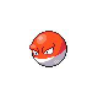

  

  

    

      
Types

      

        
        
      

    

    

      
Abilities

      

        <a href='' title="This Pokemon is immune to moves flagged as being sound-based.  heal bell is unaffected.  uproar still prevents this Pokemon from sleeping.  This Pokemon can still receive a Perish Song counter through baton pass, and will retain a Perish Song counter if it acquires this ability after Perish Song is used.  howl, roar of time, sonic boom, and yawn are not flagged as sound-based.">Soundproof</a>
        /<a href='' title="Whenever a move makes contact with this Pokemon, the move's user has a 30% chance of being paralyzed.  Pokemon that are immune to electric-type moves can still be paralyzed by this ability.  Overworld: If the lead Pokemon has this ability, there is a 50% chance that encounters will be with an electric Pokemon, if applicable.">Static</a>
      

    

  

## Base Stats
<table style="width: 100%">
  <tbody style="width: 100%;">
    <tr style="display: flex; align-items: center;">
      <th style="color: #737373;" >HP</th>
      <td style="border-top: none; width: 70px">40</td>
      <td style="width: 100%; min-width: 450px; border-top: none;">
        

        

      </td>
    </tr>
    <tr style="display: flex; align-items: center;">
      <th style="color: #737373;">Attack</th>
      <td style="border-top: none; width: 70px">30</td>
      <td style="width: 100%; min-width: 450px; border-top: none;">
        

        

      </td>
    </tr>
    <tr style="display: flex; align-items: center;">
      <th style="color: #737373;">Defense</th>
      <td style="border-top: none; width: 70px">50</td>
      <td style="width: 100%; min-width: 450px; border-top: none;">
        

        

      </td>
    </tr>
    <tr style="display: flex; align-items: center;">
      <th style="color: #737373;">SP Attack</th>
      <td style="border-top: none; width: 70px">55</td>
      <td style="width: 100%; min-width: 450px; border-top: none;">
        

        

      </td>
    </tr>
    <tr style="display: flex; align-items: center;">
      <th style="color: #737373;">SP Defense</th>
      <td style="border-top: none; width: 70px">55</td>
      <td style="width: 100%; min-width: 450px; border-top: none;">
        

        

      </td>
    </tr>
    <tr style="display: flex; align-items: center;">
      <th style="color: #737373;">Speed</th>
      <td style="border-top: none; width: 70px">100</td>
      <td style="width: 100%; min-width: 450px; border-top: none;">
        

        

      </td>
    </tr>
  </tbody>
</table>

## Moveset

=== "Level Up Moves"
    | Level | Name | Power | Accuracy | PP | Type | Damage Class |
        | -- | -- | -- | -- | -- | -- | -- |
        	| 1 | Tackle | 40 | 100 | 35 |  |  |
	| 1 | Charge | - | - | 20 |  |  |
	| 6 | Eerie-impulse | - | 100 | 15 |  |  |
	| 6 | Sonic-boom | - | 90 | 20 |  |  |
	| 9 | Thunder-shock | 40 | 100 | 30 |  |  |
	| 9 | Spark | 65 | 100 | 20 |  |  |
	| 11 | Rollout | 30 | 90 | 20 |  |  |
	| 14 | Swift | 60 | - | 20 |  |  |
	| 22 | Electro-ball | - | 100 | 10 |  |  |
	| 24 | Screech | - | 85 | 40 |  |  |
	| 34 | Magnet-rise | - | - | 10 |  |  |
	| 37 | Discharge | 80 | 100 | 15 |  |  |
	| 38 | Mirror-coat | - | 100 | 20 |  |  |
	| 45 | Explosion | 250 | 100 | 5 |  |  |

        

=== "Machine Moves"
    | Machine | Name | Power | Accuracy | PP | Type | Damage Class |
        | -- | -- | -- | -- | -- | -- | -- |
        	| TM27 | Toxic | - | 90 | 10 |  |  |
	| TM36 | Thunderbolt | 90 | 100 | 15 |  |  |
	| TM100 | Confide | - | - | 20 |  |  |
	| TM21 | Foul-play | 95 | 100 | 15 |  |  |
	| TM27 | Return | - | 100 | 20 |  |  |
	| TM87 | Swagger | - | 85 | 15 |  |  |
	| TM05 | Rest | - | - | 5 |  |  |
	| TM38 | Thunder | 110 | 70 | 10 |  |  |
	| TM01 | Headbutt | 70 | 100 | 15 |  |  |
	| TM04 | Teleport | - | - | 20 |  |  |
	| TM88 | Sleep-talk | - | - | 10 |  |  |
	| TM32 | Double-team | - | - | 15 |  |  |
	| TM41 | Torment | - | 100 | 15 |  |  |
	| TM46 | Thief | 60 | 100 | 25 |  |  |
	| TM10 | Hidden-power | 60 | 100 | 15 |  |  |
	| TM21 | Frustration | - | 100 | 20 |  |  |
	| TM57 | Charge-beam | 50 | 90 | 10 |  |  |
	| TM74 | Gyro-ball | - | 100 | 5 |  |  |
	| TM08 | Substitute | - | - | 10 |  |  |
	| TM16 | Light-screen | - | - | 30 |  |  |
	| TM72 | Volt-switch | 70 | 100 | 20 |  |  |
	| TM93 | Wild-charge | 90 | 100 | 15 |  |  |
	| TM07 | Protect | - | - | 10 |  |  |
	| TM12 | Facade | 70 | 100 | 20 |  |  |
	| TM12 | Taunt | - | 100 | 20 |  |  |
	| TM48 | Round | 60 | 100 | 15 |  |  |
	| TM18 | Rain-dance | - | - | 5 |  |  |
	| TM33 | Reflect | - | - | 20 |  |  |
	| TM42 | Self-destruct | 200 | 100 | 5 |  |  |
	| TM16 | Thunder-wave | - | 90 | 20 |  |  |

        
