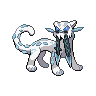

  

  

    

      
Types

      

        
        
      

    

    

      
Abilities

      

        <a href='' title="Increases super-effective damage dealt to 1.25x.">Sword-of-ruin</a>
        /<a href='' title="Increases super-effective damage dealt to 1.25x.">Sword-of-ruin</a>
      

    

  

## Base Stats
<table style="width: 100%">
  <tbody style="width: 100%;">
    <tr style="display: flex; align-items: center;">
      <th style="color: #737373;" >HP</th>
      <td style="border-top: none; width: 70px">80</td>
      <td style="width: 100%; min-width: 450px; border-top: none;">
        

        

      </td>
    </tr>
    <tr style="display: flex; align-items: center;">
      <th style="color: #737373;">Attack</th>
      <td style="border-top: none; width: 70px">120</td>
      <td style="width: 100%; min-width: 450px; border-top: none;">
        

        

      </td>
    </tr>
    <tr style="display: flex; align-items: center;">
      <th style="color: #737373;">Defense</th>
      <td style="border-top: none; width: 70px">80</td>
      <td style="width: 100%; min-width: 450px; border-top: none;">
        

        

      </td>
    </tr>
    <tr style="display: flex; align-items: center;">
      <th style="color: #737373;">SP Attack</th>
      <td style="border-top: none; width: 70px">90</td>
      <td style="width: 100%; min-width: 450px; border-top: none;">
        

        

      </td>
    </tr>
    <tr style="display: flex; align-items: center;">
      <th style="color: #737373;">SP Defense</th>
      <td style="border-top: none; width: 70px">65</td>
      <td style="width: 100%; min-width: 450px; border-top: none;">
        

        

      </td>
    </tr>
    <tr style="display: flex; align-items: center;">
      <th style="color: #737373;">Speed</th>
      <td style="border-top: none; width: 70px">135</td>
      <td style="width: 100%; min-width: 450px; border-top: none;">
        

        

      </td>
    </tr>
  </tbody>
</table>

## Moveset

=== "Level Up Moves"
    | Level | Name | Power | Accuracy | PP | Type | Damage Class |
        | -- | -- | -- | -- | -- | -- | -- |
        	| 1 | Powder-snow | 40 | 100 | 25 |  |  |
	| 1 | Mean-look | - | - | 5 |  |  |
	| 1 | Spite | - | 100 | 10 |  |  |
	| 10 | Payback | 50 | 100 | 10 |  |  |
	| 15 | Haze | - | - | 30 |  |  |
	| 15 | Mist | - | - | 30 |  |  |
	| 20 | Ice-shard | 40 | 100 | 30 |  |  |
	| 35 | Night-slash | 70 | 100 | 15 |  |  |
	| 45 | Icicle-crash | 85 | 90 | 10 |  |  |
	| 50 | Ruination | 1 | 90 | 10 |  |  |
	| 55 | Sucker-punch | 70 | 100 | 5 |  |  |
	| 60 | Sacred-sword | 90 | 100 | 15 |  |  |
	| 65 | Recover | - | - | 5 |  |  |
	| 70 | Throat-chop | 80 | 100 | 15 |  |  |
	| 75 | Sheer-cold | - | 30 | 5 |  |  |

        

=== "Machine Moves"
    | Machine | Name | Power | Accuracy | PP | Type | Damage Class |
        | -- | -- | -- | -- | -- | -- | -- |
        	| TM97 | Dark-pulse | 80 | 100 | 15 |  |  |
	| TM54 | False-swipe | 40 | 100 | 40 |  |  |
	| TM05 | Rest | - | - | 5 |  |  |
	| TM62 | Acrobatics | 55 | 100 | 15 |  |  |
	| TM116 | Ice-spinner | 80 | 100 | 15 |  |  |
	| TM88 | Sleep-talk | - | - | 10 |  |  |
	| TM13 | Brick-break | 75 | 100 | 15 |  |  |
	| TM16 | Icy-wind | 55 | 95 | 15 |  |  |
	| TR97 | Psychic-fangs | 85 | 100 | 10 |  |  |
	| TM40 | Aerial-ace | 60 | - | 20 |  |  |
	| TM26 | Scary-face | - | 100 | 10 |  |  |
	| TR32 | Crunch | 80 | 100 | 15 |  |  |
	| TM77 | Hex | 65 | 100 | 10 |  |  |
	| TM128 | Ice-fang | 65 | 95 | 15 |  |  |
	| TM95 | Snarl | 55 | 95 | 15 |  |  |
	| TM08 | Substitute | - | - | 10 |  |  |
	| TM20 | Endure | - | - | 10 |  |  |
	| TM48 | Hyper-beam | 150 | 90 | 5 |  |  |
	| TM07 | Protect | - | - | 10 |  |  |
	| TM12 | Facade | 70 | 100 | 20 |  |  |
	| TM12 | Taunt | - | 100 | 20 |  |  |
	| TM14 | Blizzard | 110 | 70 | 5 |  |  |
	| TM18 | Rain-dance | - | - | 5 |  |  |
	| TM68 | Giga-impact | 150 | 90 | 5 |  |  |
	| TM09 | Take-down | 90 | 85 | 20 |  |  |
	| TM64 | Avalanche | 60 | 100 | 10 |  |  |
	| TM75 | Swords-dance | - | - | 20 |  |  |

        
