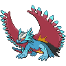

  

  

    

      
Types

      

        
        
      

    

    

      
Abilities

      

        <a href='' title="Increases super-effective damage dealt to 1.25x.">Protosynthesis</a>
        /<a href='' title="Increases super-effective damage dealt to 1.25x.">Protosynthesis</a>
      

    

  

## Base Stats
<table style="width: 100%">
  <tbody style="width: 100%;">
    <tr style="display: flex; align-items: center;">
      <th style="color: #737373;" >HP</th>
      <td style="border-top: none; width: 70px">105</td>
      <td style="width: 100%; min-width: 450px; border-top: none;">
        

        

      </td>
    </tr>
    <tr style="display: flex; align-items: center;">
      <th style="color: #737373;">Attack</th>
      <td style="border-top: none; width: 70px">139</td>
      <td style="width: 100%; min-width: 450px; border-top: none;">
        

        

      </td>
    </tr>
    <tr style="display: flex; align-items: center;">
      <th style="color: #737373;">Defense</th>
      <td style="border-top: none; width: 70px">71</td>
      <td style="width: 100%; min-width: 450px; border-top: none;">
        

        

      </td>
    </tr>
    <tr style="display: flex; align-items: center;">
      <th style="color: #737373;">SP Attack</th>
      <td style="border-top: none; width: 70px">55</td>
      <td style="width: 100%; min-width: 450px; border-top: none;">
        

        

      </td>
    </tr>
    <tr style="display: flex; align-items: center;">
      <th style="color: #737373;">SP Defense</th>
      <td style="border-top: none; width: 70px">101</td>
      <td style="width: 100%; min-width: 450px; border-top: none;">
        

        

      </td>
    </tr>
    <tr style="display: flex; align-items: center;">
      <th style="color: #737373;">Speed</th>
      <td style="border-top: none; width: 70px">119</td>
      <td style="width: 100%; min-width: 450px; border-top: none;">
        

        

      </td>
    </tr>
  </tbody>
</table>

## Moveset

=== "Level Up Moves"
    | Level | Name | Power | Accuracy | PP | Type | Damage Class |
        | -- | -- | -- | -- | -- | -- | -- |
        	| 1 | Dragon-breath | 60 | 100 | 20 |  |  |
	| 1 | Leer | - | 100 | 30 |  |  |
	| 1 | Focus-energy | - | - | 30 |  |  |
	| 1 | Bite | 60 | 100 | 25 |  |  |
	| 7 | Incinerate | 60 | 100 | 15 |  |  |
	| 14 | Headbutt | 70 | 100 | 15 |  |  |
	| 49 | Night-slash | 70 | 100 | 15 |  |  |
	| 63 | Dragon-rush | 100 | 75 | 10 |  |  |
	| 77 | Throat-chop | 80 | 100 | 15 |  |  |
	| 84 | Roost | - | - | 5 |  |  |
	| 91 | Double-edge | 120 | 100 | 15 |  |  |

        

=== "Machine Moves"
    | Machine | Name | Power | Accuracy | PP | Type | Damage Class |
        | -- | -- | -- | -- | -- | -- | -- |
        	| TM22 | Rock-slide | 75 | 90 | 10 |  |  |
	| TM97 | Dark-pulse | 80 | 100 | 15 |  |  |
	| TM05 | Rest | - | - | 5 |  |  |
	| TM13 | Fire-spin | 35 | 85 | 15 |  |  |
	| TM62 | Acrobatics | 55 | 100 | 15 |  |  |
	| TR74 | Iron-head | 80 | 100 | 15 |  |  |
	| TR89 | Hurricane | 110 | 70 | 10 |  |  |
	| TR69 | Zen-headbutt | 80 | 90 | 15 |  |  |
	| TM41 | Earthquake | 100 | 100 | 10 |  |  |
	| TM08 | Body-slam | 85 | 100 | 15 |  |  |
	| TM88 | Sleep-talk | - | - | 10 |  |  |
	| TM65 | Shadow-claw | 70 | 100 | 15 |  |  |
	| TM89 | U-turn | 70 | 100 | 20 |  |  |
	| TM130 | Thunder-fang | 65 | 95 | 15 |  |  |
	| TM13 | Brick-break | 75 | 100 | 15 |  |  |
	| TM10 | Dig | 80 | 100 | 10 |  |  |
	| TR03 | Hydro-pump | 110 | 80 | 5 |  |  |
	| TM38 | Fire-blast | 110 | 85 | 5 |  |  |
	| TR51 | Dragon-dance | - | - | 20 |  |  |
	| TM95 | Air-slash | 75 | 95 | 15 |  |  |
	| TR99 | Body-press | 80 | 100 | 10 |  |  |
	| TM40 | Aerial-ace | 60 | - | 20 |  |  |
	| TM126 | Fire-fang | 65 | 95 | 15 |  |  |
	| TM26 | Scary-face | - | 100 | 10 |  |  |
	| TR32 | Crunch | 80 | 100 | 15 |  |  |
	| TM71 | Stone-edge | 100 | 80 | 5 |  |  |
	| TM95 | Snarl | 55 | 95 | 15 |  |  |
	| TM82 | Dragon-tail | 60 | 90 | 10 |  |  |
	| TM02 | Dragon-claw | 80 | 100 | 15 |  |  |
	| TM11 | Sunny-day | - | - | 5 |  |  |
	| TM08 | Substitute | - | - | 10 |  |  |
	| TM98 | Stomping-tantrum | 75 | 100 | 10 |  |  |
	| TM20 | Endure | - | - | 10 |  |  |
	| TM39 | Outrage | 120 | 100 | 10 |  |  |
	| TR42 | Hyper-voice | 90 | 100 | 10 |  |  |
	| TM48 | Hyper-beam | 150 | 90 | 5 |  |  |
	| TM07 | Protect | - | - | 10 |  |  |
	| TM12 | Facade | 70 | 100 | 20 |  |  |
	| TM81 | X-scissor | 80 | 100 | 15 |  |  |
	| TM12 | Taunt | - | 100 | 20 |  |  |
	| TR36 | Heat-wave | 95 | 90 | 10 |  |  |
	| TM76 | Fly | 90 | 95 | 15 |  |  |
	| TM68 | Giga-impact | 150 | 90 | 5 |  |  |
	| TM34 | Dragon-pulse | 85 | 100 | 10 |  |  |
	| TM35 | Flamethrower | 90 | 100 | 15 |  |  |
	| TM09 | Take-down | 90 | 85 | 20 |  |  |

        
