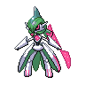

  

  

    

      
Types

      

        
        
      

    

    

      
Abilities

      

        <a href='' title="Increases super-effective damage dealt to 1.25x.">Quark-drive</a>
        /<a href='' title="Increases super-effective damage dealt to 1.25x.">Quark-drive</a>
      

    

  

## Base Stats
<table style="width: 100%">
  <tbody style="width: 100%;">
    <tr style="display: flex; align-items: center;">
      <th style="color: #737373;" >HP</th>
      <td style="border-top: none; width: 70px">74</td>
      <td style="width: 100%; min-width: 450px; border-top: none;">
        

        

      </td>
    </tr>
    <tr style="display: flex; align-items: center;">
      <th style="color: #737373;">Attack</th>
      <td style="border-top: none; width: 70px">130</td>
      <td style="width: 100%; min-width: 450px; border-top: none;">
        

        

      </td>
    </tr>
    <tr style="display: flex; align-items: center;">
      <th style="color: #737373;">Defense</th>
      <td style="border-top: none; width: 70px">90</td>
      <td style="width: 100%; min-width: 450px; border-top: none;">
        

        

      </td>
    </tr>
    <tr style="display: flex; align-items: center;">
      <th style="color: #737373;">SP Attack</th>
      <td style="border-top: none; width: 70px">120</td>
      <td style="width: 100%; min-width: 450px; border-top: none;">
        

        

      </td>
    </tr>
    <tr style="display: flex; align-items: center;">
      <th style="color: #737373;">SP Defense</th>
      <td style="border-top: none; width: 70px">60</td>
      <td style="width: 100%; min-width: 450px; border-top: none;">
        

        

      </td>
    </tr>
    <tr style="display: flex; align-items: center;">
      <th style="color: #737373;">Speed</th>
      <td style="border-top: none; width: 70px">116</td>
      <td style="width: 100%; min-width: 450px; border-top: none;">
        

        

      </td>
    </tr>
  </tbody>
</table>

## Moveset

=== "Level Up Moves"
    | Level | Name | Power | Accuracy | PP | Type | Damage Class |
        | -- | -- | -- | -- | -- | -- | -- |
        	| 1 | Disable | - | 100 | 20 |  |  |
	| 1 | Double-team | - | - | 15 |  |  |
	| 1 | Fury-cutter | 40 | 95 | 20 |  |  |
	| 1 | Shadow-sneak | 40 | 100 | 30 |  |  |
	| 7 | Hypnosis | - | 60 | 20 |  |  |
	| 14 | Feint | 30 | 100 | 10 |  |  |
	| 21 | Future-sight | 120 | 100 | 10 |  |  |
	| 35 | Psycho-cut | 70 | 100 | 20 |  |  |
	| 42 | Night-slash | 70 | 100 | 15 |  |  |
	| 49 | Leaf-blade | 90 | 100 | 15 |  |  |
	| 56 | Moonblast | 95 | 100 | 15 |  |  |
	| 70 | Knock-off | 65 | 100 | 20 |  |  |
	| 77 | Destiny-bond | - | - | 5 |  |  |
	| 84 | Wide-guard | - | - | 10 |  |  |
	| 84 | Quick-guard | - | - | 15 |  |  |
	| 91 | Spirit-break | 75 | 100 | 15 |  |  |

        

=== "Machine Moves"
    | Machine | Name | Power | Accuracy | PP | Type | Damage Class |
        | -- | -- | -- | -- | -- | -- | -- |
        	| TR30 | Encore | - | 100 | 5 |  |  |
	| TM36 | Thunderbolt | 90 | 100 | 15 |  |  |
	| TM54 | False-swipe | 40 | 100 | 40 |  |  |
	| TM135 | Fire-punch | 75 | 100 | 15 |  |  |
	| TM39 | Swift | 60 | - | 20 |  |  |
	| TM05 | Rest | - | - | 5 |  |  |
	| TM56 | Fling | - | 100 | 10 |  |  |
	| TM84 | Poison-jab | 80 | 100 | 20 |  |  |
	| TR69 | Zen-headbutt | 80 | 90 | 15 |  |  |
	| TM44 | Imprison | - | - | 10 |  |  |
	| TR98 | Liquidation | 85 | 100 | 10 |  |  |
	| TM04 | Calm-mind | - | - | 20 |  |  |
	| TM88 | Sleep-talk | - | - | 10 |  |  |
	| TR21 | Reversal | - | 100 | 15 |  |  |
	| TM65 | Shadow-claw | 70 | 100 | 15 |  |  |
	| TM60 | Drain-punch | 75 | 100 | 10 |  |  |
	| TM13 | Brick-break | 75 | 100 | 15 |  |  |
	| TR53 | Close-combat | 120 | 100 | 5 |  |  |
	| TM86 | Grass-knot | - | 100 | 20 |  |  |
	| TM16 | Icy-wind | 55 | 95 | 15 |  |  |
	| TM29 | Psychic | 90 | 100 | 10 |  |  |
	| TM134 | Ice-punch | 75 | 100 | 15 |  |  |
	| TM92 | Trick-room | - | - | 5 |  |  |
	| TM48 | Skill-swap | - | - | 10 |  |  |
	| TM03 | Helping-hand | - | - | 20 |  |  |
	| TR56 | Aura-sphere | 80 | - | 20 |  |  |
	| TM91 | Psychic-terrain | - | - | 10 |  |  |
	| TM30 | Shadow-ball | 80 | 100 | 15 |  |  |
	| TM53 | Energy-ball | 90 | 100 | 10 |  |  |
	| TM40 | Aerial-ace | 60 | - | 20 |  |  |
	| TR12 | Agility | - | - | 30 |  |  |
	| TM99 | Dazzling-gleam | 80 | 100 | 10 |  |  |
	| TM90 | Electric-terrain | - | - | 10 |  |  |
	| TM57 | Charge-beam | 50 | 90 | 10 |  |  |
	| TM89 | Misty-terrain | - | - | 10 |  |  |
	| TM77 | Hex | 65 | 100 | 10 |  |  |
	| TM52 | Focus-blast | 120 | 70 | 5 |  |  |
	| TM08 | Substitute | - | - | 10 |  |  |
	| TM16 | Light-screen | - | - | 30 |  |  |
	| TM136 | Thunder-punch | 75 | 100 | 15 |  |  |
	| TM20 | Endure | - | - | 10 |  |  |
	| TR07 | Low-kick | - | 100 | 20 |  |  |
	| TR42 | Hyper-voice | 90 | 100 | 10 |  |  |
	| TM48 | Hyper-beam | 150 | 90 | 5 |  |  |
	| TM07 | Protect | - | - | 10 |  |  |
	| TM03 | Psyshock | 80 | 100 | 10 |  |  |
	| TM81 | X-scissor | 80 | 100 | 15 |  |  |
	| TM12 | Taunt | - | 100 | 20 |  |  |
	| TM10 | Magical-leaf | 60 | - | 20 |  |  |
	| TR38 | Trick | - | 100 | 10 |  |  |
	| TR82 | Stored-power | 20 | 100 | 10 |  |  |
	| TM68 | Giga-impact | 150 | 90 | 5 |  |  |
	| TM35 | Metronome | - | - | 10 |  |  |
	| TM33 | Reflect | - | - | 20 |  |  |
	| TM75 | Swords-dance | - | - | 20 |  |  |
	| TM16 | Thunder-wave | - | 90 | 20 |  |  |

        
