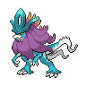

  

  

    

      
Types

      

        
        
      

    

    

      
Abilities

      

        <a href='' title="Increases super-effective damage dealt to 1.25x.">Protosynthesis</a>
        /<a href='' title="Increases super-effective damage dealt to 1.25x.">Protosynthesis</a>
      

    

  

## Base Stats
<table style="width: 100%">
  <tbody style="width: 100%;">
    <tr style="display: flex; align-items: center;">
      <th style="color: #737373;" >HP</th>
      <td style="border-top: none; width: 70px">99</td>
      <td style="width: 100%; min-width: 450px; border-top: none;">
        

        

      </td>
    </tr>
    <tr style="display: flex; align-items: center;">
      <th style="color: #737373;">Attack</th>
      <td style="border-top: none; width: 70px">83</td>
      <td style="width: 100%; min-width: 450px; border-top: none;">
        

        

      </td>
    </tr>
    <tr style="display: flex; align-items: center;">
      <th style="color: #737373;">Defense</th>
      <td style="border-top: none; width: 70px">91</td>
      <td style="width: 100%; min-width: 450px; border-top: none;">
        

        

      </td>
    </tr>
    <tr style="display: flex; align-items: center;">
      <th style="color: #737373;">SP Attack</th>
      <td style="border-top: none; width: 70px">125</td>
      <td style="width: 100%; min-width: 450px; border-top: none;">
        

        

      </td>
    </tr>
    <tr style="display: flex; align-items: center;">
      <th style="color: #737373;">SP Defense</th>
      <td style="border-top: none; width: 70px">83</td>
      <td style="width: 100%; min-width: 450px; border-top: none;">
        

        

      </td>
    </tr>
    <tr style="display: flex; align-items: center;">
      <th style="color: #737373;">Speed</th>
      <td style="border-top: none; width: 70px">109</td>
      <td style="width: 100%; min-width: 450px; border-top: none;">
        

        

      </td>
    </tr>
  </tbody>
</table>

## Moveset

=== "Level Up Moves"
    | Level | Name | Power | Accuracy | PP | Type | Damage Class |
        | -- | -- | -- | -- | -- | -- | -- |
        	| 1 | Leer | - | 100 | 30 |  |  |
	| 1 | Roar | - | - | 20 |  |  |
	| 1 | Aqua-jet | 40 | 100 | 20 |  |  |
	| 1 | Twister | 40 | 100 | 20 |  |  |
	| 7 | Bite | 60 | 100 | 25 |  |  |
	| 21 | Noble-roar | - | 100 | 30 |  |  |
	| 28 | Dragon-breath | 60 | 100 | 20 |  |  |
	| 35 | Breaking-swipe | 60 | 100 | 15 |  |  |
	| 42 | Dragon-rush | 100 | 75 | 10 |  |  |
	| 56 | Hydro-steam | 80 | 100 | 15 |  |  |

        

=== "Machine Moves"
    | Machine | Name | Power | Accuracy | PP | Type | Damage Class |
        | -- | -- | -- | -- | -- | -- | -- |
        	| TM39 | Swift | 60 | - | 20 |  |  |
	| TM05 | Rest | - | - | 5 |  |  |
	| TM115 | Chilling-water | 50 | 100 | 20 |  |  |
	| TR89 | Hurricane | 110 | 70 | 10 |  |  |
	| TR98 | Liquidation | 85 | 100 | 10 |  |  |
	| TM08 | Body-slam | 85 | 100 | 15 |  |  |
	| TM03 | Water-pulse | 60 | 100 | 20 |  |  |
	| TM88 | Sleep-talk | - | - | 10 |  |  |
	| TR03 | Hydro-pump | 110 | 80 | 5 |  |  |
	| TR51 | Dragon-dance | - | - | 20 |  |  |
	| TM53 | Mud-shot | 55 | 95 | 15 |  |  |
	| TR12 | Agility | - | - | 30 |  |  |
	| TM126 | Fire-fang | 65 | 95 | 15 |  |  |
	| TM26 | Scary-face | - | 100 | 10 |  |  |
	| TR32 | Crunch | 80 | 100 | 15 |  |  |
	| TM95 | Snarl | 55 | 95 | 15 |  |  |
	| TM82 | Dragon-tail | 60 | 90 | 10 |  |  |
	| TM02 | Dragon-claw | 80 | 100 | 15 |  |  |
	| TM11 | Sunny-day | - | - | 5 |  |  |
	| TM08 | Substitute | - | - | 10 |  |  |
	| TM20 | Endure | - | - | 10 |  |  |
	| TM39 | Outrage | 120 | 100 | 10 |  |  |
	| TR07 | Low-kick | - | 100 | 20 |  |  |
	| TM48 | Hyper-beam | 150 | 90 | 5 |  |  |
	| TM07 | Protect | - | - | 10 |  |  |
	| TM12 | Facade | 70 | 100 | 20 |  |  |
	| TM18 | Rain-dance | - | - | 5 |  |  |
	| TM68 | Giga-impact | 150 | 90 | 5 |  |  |
	| TM34 | Dragon-pulse | 85 | 100 | 10 |  |  |
	| TM35 | Flamethrower | 90 | 100 | 15 |  |  |
	| TM98 | Waterfall | 80 | 100 | 15 |  |  |
	| TM09 | Take-down | 90 | 85 | 20 |  |  |
	| TM94 | Surf | 90 | 100 | 15 |  |  |

        
