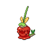

  

  

    

      
Types

      

        
        
      

    

    

      
Abilities

      

        <a href='' title="Lowers the evasion of opposing Pokémon by 1 stage when first sent into battle.">Supersweet-syrup</a>
        /<a href='' title="This Pokemon eats any held Berry triggered by low HP when it falls below 50% of its HP, regardless of the Berry's usual threshold.">Gluttony</a>
      

    

  

## Base Stats
<table style="width: 100%">
  <tbody style="width: 100%;">
    <tr style="display: flex; align-items: center;">
      <th style="color: #737373;" >HP</th>
      <td style="border-top: none; width: 70px">80</td>
      <td style="width: 100%; min-width: 450px; border-top: none;">
        

        

      </td>
    </tr>
    <tr style="display: flex; align-items: center;">
      <th style="color: #737373;">Attack</th>
      <td style="border-top: none; width: 70px">80</td>
      <td style="width: 100%; min-width: 450px; border-top: none;">
        

        

      </td>
    </tr>
    <tr style="display: flex; align-items: center;">
      <th style="color: #737373;">Defense</th>
      <td style="border-top: none; width: 70px">110</td>
      <td style="width: 100%; min-width: 450px; border-top: none;">
        

        

      </td>
    </tr>
    <tr style="display: flex; align-items: center;">
      <th style="color: #737373;">SP Attack</th>
      <td style="border-top: none; width: 70px">95</td>
      <td style="width: 100%; min-width: 450px; border-top: none;">
        

        

      </td>
    </tr>
    <tr style="display: flex; align-items: center;">
      <th style="color: #737373;">SP Defense</th>
      <td style="border-top: none; width: 70px">80</td>
      <td style="width: 100%; min-width: 450px; border-top: none;">
        

        

      </td>
    </tr>
    <tr style="display: flex; align-items: center;">
      <th style="color: #737373;">Speed</th>
      <td style="border-top: none; width: 70px">40</td>
      <td style="width: 100%; min-width: 450px; border-top: none;">
        

        

      </td>
    </tr>
  </tbody>
</table>

## Moveset

=== "Level Up Moves"
    | Level | Name | Power | Accuracy | PP | Type | Damage Class |
        | -- | -- | -- | -- | -- | -- | -- |
        	| 1 | Recycle | - | - | 10 |  |  |
	| 1 | Astonish | 30 | 100 | 15 |  |  |
	| 1 | Withdraw | - | - | 40 |  |  |
	| 1 | Sweet-scent | - | 100 | 20 |  |  |
	| 8 | Growth | - | - | 20 |  |  |
	| 12 | Dragon-breath | 60 | 100 | 20 |  |  |
	| 28 | Syrup-bomb | 60 | 85 | 10 |  |  |
	| 36 | Recover | - | - | 5 |  |  |

        

=== "Machine Moves"
    | Machine | Name | Power | Accuracy | PP | Type | Damage Class |
        | -- | -- | -- | -- | -- | -- | -- |
        	| TM19 | Giga-drain | 75 | 100 | 10 |  |  |
	| TM05 | Rest | - | - | 5 |  |  |
	| TM08 | Body-slam | 85 | 100 | 15 |  |  |
	| TR96 | Pollen-puff | 90 | 100 | 15 |  |  |
	| TM88 | Sleep-talk | - | - | 10 |  |  |
	| TR71 | Leaf-storm | 130 | 90 | 5 |  |  |
	| TM86 | Grass-knot | - | 100 | 20 |  |  |
	| TM09 | Bullet-seed | 25 | 100 | 30 |  |  |
	| TM117 | Pounce | 50 | 100 | 20 |  |  |
	| TM53 | Energy-ball | 90 | 100 | 10 |  |  |
	| TM74 | Gyro-ball | - | 100 | 5 |  |  |
	| TM45 | Solar-beam | 120 | 100 | 10 |  |  |
	| TM82 | Dragon-tail | 60 | 90 | 10 |  |  |
	| TM11 | Sunny-day | - | - | 5 |  |  |
	| TM08 | Substitute | - | - | 10 |  |  |
	| TM20 | Endure | - | - | 10 |  |  |
	| TM39 | Outrage | 120 | 100 | 10 |  |  |
	| TM48 | Hyper-beam | 150 | 90 | 5 |  |  |
	| TM07 | Protect | - | - | 10 |  |  |
	| TM12 | Facade | 70 | 100 | 20 |  |  |
	| TM88 | Grassy-terrain | - | - | 10 |  |  |
	| TR59 | Seed-bomb | 80 | 100 | 15 |  |  |
	| TM68 | Giga-impact | 150 | 90 | 5 |  |  |
	| TM34 | Dragon-pulse | 85 | 100 | 10 |  |  |
	| TM33 | Reflect | - | - | 20 |  |  |
	| TM09 | Take-down | 90 | 85 | 20 |  |  |

        
