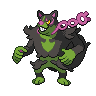

  

  

    

      
Types

      

        
        
      

    

    

      
Abilities

      

        <a href='' title="The power of the Pokémon's toxic chain may badly poison any target the Pokémon hits with a move.">Toxic-chain</a>
        /<a href='' title="Increases super-effective damage dealt to 1.25x.">Guard-dog</a>
      

    

  

## Base Stats
<table style="width: 100%">
  <tbody style="width: 100%;">
    <tr style="display: flex; align-items: center;">
      <th style="color: #737373;" >HP</th>
      <td style="border-top: none; width: 70px">88</td>
      <td style="width: 100%; min-width: 450px; border-top: none;">
        

        

      </td>
    </tr>
    <tr style="display: flex; align-items: center;">
      <th style="color: #737373;">Attack</th>
      <td style="border-top: none; width: 70px">128</td>
      <td style="width: 100%; min-width: 450px; border-top: none;">
        

        

      </td>
    </tr>
    <tr style="display: flex; align-items: center;">
      <th style="color: #737373;">Defense</th>
      <td style="border-top: none; width: 70px">115</td>
      <td style="width: 100%; min-width: 450px; border-top: none;">
        

        

      </td>
    </tr>
    <tr style="display: flex; align-items: center;">
      <th style="color: #737373;">SP Attack</th>
      <td style="border-top: none; width: 70px">58</td>
      <td style="width: 100%; min-width: 450px; border-top: none;">
        

        

      </td>
    </tr>
    <tr style="display: flex; align-items: center;">
      <th style="color: #737373;">SP Defense</th>
      <td style="border-top: none; width: 70px">86</td>
      <td style="width: 100%; min-width: 450px; border-top: none;">
        

        

      </td>
    </tr>
    <tr style="display: flex; align-items: center;">
      <th style="color: #737373;">Speed</th>
      <td style="border-top: none; width: 70px">80</td>
      <td style="width: 100%; min-width: 450px; border-top: none;">
        

        

      </td>
    </tr>
  </tbody>
</table>

## Moveset

=== "Level Up Moves"
    | Level | Name | Power | Accuracy | PP | Type | Damage Class |
        | -- | -- | -- | -- | -- | -- | -- |
        	| 1 | Bite | 60 | 100 | 25 |  |  |
	| 8 | Howl | - | - | 40 |  |  |
	| 16 | Poison-fang | 50 | 100 | 15 |  |  |
	| 24 | Force-palm | 60 | 100 | 10 |  |  |
	| 32 | Counter | - | 100 | 20 |  |  |
	| 48 | Brutal-swing | 60 | 100 | 20 |  |  |
	| 64 | Superpower | 120 | 100 | 5 |  |  |

        

=== "Machine Moves"
    | Machine | Name | Power | Accuracy | PP | Type | Damage Class |
        | -- | -- | -- | -- | -- | -- | -- |
        	| TM47 | Low-sweep | 65 | 100 | 20 |  |  |
	| TM27 | Toxic | - | 90 | 10 |  |  |
	| TM08 | Bulk-up | - | - | 20 |  |  |
	| TR73 | Gunk-shot | 120 | 80 | 5 |  |  |
	| TM135 | Fire-punch | 75 | 100 | 15 |  |  |
	| TM05 | Rest | - | - | 5 |  |  |
	| TM56 | Fling | - | 100 | 10 |  |  |
	| TM84 | Poison-jab | 80 | 100 | 20 |  |  |
	| TM36 | Sludge-bomb | 90 | 100 | 10 |  |  |
	| TR74 | Iron-head | 80 | 100 | 15 |  |  |
	| TM08 | Body-slam | 85 | 100 | 15 |  |  |
	| TM88 | Sleep-talk | - | - | 10 |  |  |
	| TR21 | Reversal | - | 100 | 15 |  |  |
	| TM65 | Shadow-claw | 70 | 100 | 15 |  |  |
	| TM05 | Roar | - | - | 20 |  |  |
	| TM60 | Drain-punch | 75 | 100 | 10 |  |  |
	| TM46 | Thief | 60 | 100 | 25 |  |  |
	| TM39 | Rock-tomb | 60 | 95 | 15 |  |  |
	| TM01 | Focus-punch | 150 | 100 | 20 |  |  |
	| TM130 | Thunder-fang | 65 | 95 | 15 |  |  |
	| TM13 | Brick-break | 75 | 100 | 15 |  |  |
	| TR53 | Close-combat | 120 | 100 | 5 |  |  |
	| TM10 | Dig | 80 | 100 | 10 |  |  |
	| TM134 | Ice-punch | 75 | 100 | 15 |  |  |
	| TR99 | Body-press | 80 | 100 | 10 |  |  |
	| TR35 | Uproar | 90 | 100 | 10 |  |  |
	| TR97 | Psychic-fangs | 85 | 100 | 10 |  |  |
	| TM126 | Fire-fang | 65 | 95 | 15 |  |  |
	| TM26 | Scary-face | - | 100 | 10 |  |  |
	| TR32 | Crunch | 80 | 100 | 15 |  |  |
	| TM128 | Ice-fang | 65 | 95 | 15 |  |  |
	| TM95 | Snarl | 55 | 95 | 15 |  |  |
	| TM52 | Focus-blast | 120 | 70 | 5 |  |  |
	| TM08 | Substitute | - | - | 10 |  |  |
	| TM136 | Thunder-punch | 75 | 100 | 15 |  |  |
	| TM98 | Stomping-tantrum | 75 | 100 | 10 |  |  |
	| TM20 | Endure | - | - | 10 |  |  |
	| TM39 | Outrage | 120 | 100 | 10 |  |  |
	| TR07 | Low-kick | - | 100 | 20 |  |  |
	| TM48 | Hyper-beam | 150 | 90 | 5 |  |  |
	| TM07 | Protect | - | - | 10 |  |  |
	| TM12 | Facade | 70 | 100 | 20 |  |  |
	| TM12 | Taunt | - | 100 | 20 |  |  |
	| TM68 | Giga-impact | 150 | 90 | 5 |  |  |
	| TR94 | High-horsepower | 95 | 95 | 10 |  |  |
	| TM09 | Take-down | 90 | 85 | 20 |  |  |

        
