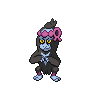

  

  

    

      
Types

      

        
        
      

    

    

      
Abilities

      

        <a href='' title="The power of the Pokémon's toxic chain may badly poison any target the Pokémon hits with a move.">Toxic-chain</a>
        /<a href='' title="When this Pokemon enters battle, it reveals an opposing Pokemon's held item to all participating trainers.  In a double battle, if one opponent has an item, this Pokemon will Frisk that Pokemon; if both have an item, it will Frisk one at random.">Frisk</a>
      

    

  

## Base Stats
<table style="width: 100%">
  <tbody style="width: 100%;">
    <tr style="display: flex; align-items: center;">
      <th style="color: #737373;" >HP</th>
      <td style="border-top: none; width: 70px">88</td>
      <td style="width: 100%; min-width: 450px; border-top: none;">
        

        

      </td>
    </tr>
    <tr style="display: flex; align-items: center;">
      <th style="color: #737373;">Attack</th>
      <td style="border-top: none; width: 70px">75</td>
      <td style="width: 100%; min-width: 450px; border-top: none;">
        

        

      </td>
    </tr>
    <tr style="display: flex; align-items: center;">
      <th style="color: #737373;">Defense</th>
      <td style="border-top: none; width: 70px">66</td>
      <td style="width: 100%; min-width: 450px; border-top: none;">
        

        

      </td>
    </tr>
    <tr style="display: flex; align-items: center;">
      <th style="color: #737373;">SP Attack</th>
      <td style="border-top: none; width: 70px">130</td>
      <td style="width: 100%; min-width: 450px; border-top: none;">
        

        

      </td>
    </tr>
    <tr style="display: flex; align-items: center;">
      <th style="color: #737373;">SP Defense</th>
      <td style="border-top: none; width: 70px">90</td>
      <td style="width: 100%; min-width: 450px; border-top: none;">
        

        

      </td>
    </tr>
    <tr style="display: flex; align-items: center;">
      <th style="color: #737373;">Speed</th>
      <td style="border-top: none; width: 70px">106</td>
      <td style="width: 100%; min-width: 450px; border-top: none;">
        

        

      </td>
    </tr>
  </tbody>
</table>

## Moveset

=== "Level Up Moves"
    | Level | Name | Power | Accuracy | PP | Type | Damage Class |
        | -- | -- | -- | -- | -- | -- | -- |
        	| 1 | Fake-out | 40 | 100 | 10 |  |  |
	| 1 | Scratch | 40 | 100 | 35 |  |  |
	| 1 | Confusion | 50 | 100 | 25 |  |  |
	| 1 | Flatter | - | 100 | 15 |  |  |
	| 24 | Clear-smog | 50 | - | 15 |  |  |
	| 48 | Sludge-wave | 95 | 100 | 10 |  |  |
	| 64 | Future-sight | 120 | 100 | 10 |  |  |
	| 72 | Parting-shot | - | 100 | 20 |  |  |

        

=== "Machine Moves"
    | Machine | Name | Power | Accuracy | PP | Type | Damage Class |
        | -- | -- | -- | -- | -- | -- | -- |
        	| TM114 | Trailblaze | 50 | 100 | 20 |  |  |
	| TM27 | Toxic | - | 90 | 10 |  |  |
	| TR73 | Gunk-shot | 120 | 80 | 5 |  |  |
	| TM09 | Venoshock | 65 | 100 | 10 |  |  |
	| TM39 | Swift | 60 | - | 20 |  |  |
	| TM05 | Rest | - | - | 5 |  |  |
	| TM56 | Fling | - | 100 | 10 |  |  |
	| TM84 | Poison-jab | 80 | 100 | 20 |  |  |
	| TM36 | Sludge-bomb | 90 | 100 | 10 |  |  |
	| TM44 | Imprison | - | - | 10 |  |  |
	| TM04 | Calm-mind | - | - | 20 |  |  |
	| TM88 | Sleep-talk | - | - | 10 |  |  |
	| TR68 | Nasty-plot | - | - | 20 |  |  |
	| TM65 | Shadow-claw | 70 | 100 | 15 |  |  |
	| TM46 | Thief | 60 | 100 | 25 |  |  |
	| TM89 | U-turn | 70 | 100 | 20 |  |  |
	| TM31 | Mud-slap | 20 | 100 | 10 |  |  |
	| TM86 | Grass-knot | - | 100 | 20 |  |  |
	| TM29 | Psychic | 90 | 100 | 10 |  |  |
	| TM03 | Helping-hand | - | - | 20 |  |  |
	| TM91 | Psychic-terrain | - | - | 10 |  |  |
	| TR35 | Uproar | 90 | 100 | 10 |  |  |
	| TM30 | Shadow-ball | 80 | 100 | 15 |  |  |
	| TM77 | Hex | 65 | 100 | 10 |  |  |
	| TM52 | Focus-blast | 120 | 70 | 5 |  |  |
	| TM08 | Substitute | - | - | 10 |  |  |
	| TM16 | Light-screen | - | - | 30 |  |  |
	| TM20 | Endure | - | - | 10 |  |  |
	| TM48 | Hyper-beam | 150 | 90 | 5 |  |  |
	| TM07 | Protect | - | - | 10 |  |  |
	| TM03 | Psyshock | 80 | 100 | 10 |  |  |
	| TM12 | Facade | 70 | 100 | 20 |  |  |
	| TM12 | Taunt | - | 100 | 20 |  |  |
	| TR38 | Trick | - | 100 | 10 |  |  |
	| TR82 | Stored-power | 20 | 100 | 10 |  |  |
	| TM68 | Giga-impact | 150 | 90 | 5 |  |  |
	| TR29 | Baton-pass | - | - | 40 |  |  |
	| TM35 | Metronome | - | - | 10 |  |  |

        
