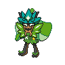

  

  

    

      
Types

      

        
        
      

    

    

      
Abilities

      

        <a href='' title="When any of this Pokemon's stats are lowered, its Attack rises by two stages.  If multiple stats are lowered at once, this ability takes effect with each stat lowered.">Defiant</a>
        
      

    

  

## Base Stats
<table style="width: 100%">
  <tbody style="width: 100%;">
    <tr style="display: flex; align-items: center;">
      <th style="color: #737373;" >HP</th>
      <td style="border-top: none; width: 70px">80</td>
      <td style="width: 100%; min-width: 450px; border-top: none;">
        

        

      </td>
    </tr>
    <tr style="display: flex; align-items: center;">
      <th style="color: #737373;">Attack</th>
      <td style="border-top: none; width: 70px">120</td>
      <td style="width: 100%; min-width: 450px; border-top: none;">
        

        

      </td>
    </tr>
    <tr style="display: flex; align-items: center;">
      <th style="color: #737373;">Defense</th>
      <td style="border-top: none; width: 70px">84</td>
      <td style="width: 100%; min-width: 450px; border-top: none;">
        

        

      </td>
    </tr>
    <tr style="display: flex; align-items: center;">
      <th style="color: #737373;">SP Attack</th>
      <td style="border-top: none; width: 70px">60</td>
      <td style="width: 100%; min-width: 450px; border-top: none;">
        

        

      </td>
    </tr>
    <tr style="display: flex; align-items: center;">
      <th style="color: #737373;">SP Defense</th>
      <td style="border-top: none; width: 70px">96</td>
      <td style="width: 100%; min-width: 450px; border-top: none;">
        

        

      </td>
    </tr>
    <tr style="display: flex; align-items: center;">
      <th style="color: #737373;">Speed</th>
      <td style="border-top: none; width: 70px">110</td>
      <td style="width: 100%; min-width: 450px; border-top: none;">
        

        

      </td>
    </tr>
  </tbody>
</table>

## Moveset

=== "Level Up Moves"
    | Level | Name | Power | Accuracy | PP | Type | Damage Class |
        | -- | -- | -- | -- | -- | -- | -- |
        	| 1 | Leech-seed | - | 90 | 10 |  |  |
	| 1 | Vine-whip | 45 | 100 | 25 |  |  |
	| 1 | Quick-attack | 40 | 100 | 30 |  |  |
	| 1 | Follow-me | - | - | 20 |  |  |
	| 6 | Focus-energy | - | - | 30 |  |  |
	| 12 | Growth | - | - | 20 |  |  |
	| 18 | Slam | 80 | 75 | 20 |  |  |
	| 30 | Ivy-cudgel | 100 | 100 | 10 |  |  |
	| 36 | Throat-chop | 80 | 100 | 15 |  |  |
	| 42 | Synthesis | - | - | 5 |  |  |
	| 48 | Spiky-shield | - | - | 10 |  |  |
	| 54 | Power-whip | 120 | 85 | 10 |  |  |
	| 60 | Superpower | 120 | 100 | 5 |  |  |
	| 66 | Wood-hammer | 120 | 100 | 15 |  |  |

        

=== "Machine Moves"
    | Machine | Name | Power | Accuracy | PP | Type | Damage Class |
        | -- | -- | -- | -- | -- | -- | -- |
        	| TM47 | Low-sweep | 65 | 100 | 20 |  |  |
	| TM114 | Trailblaze | 50 | 100 | 20 |  |  |
	| TR30 | Encore | - | 100 | 5 |  |  |
	| TM54 | False-swipe | 40 | 100 | 40 |  |  |
	| TM19 | Giga-drain | 75 | 100 | 10 |  |  |
	| TM05 | Rest | - | - | 5 |  |  |
	| TM56 | Fling | - | 100 | 10 |  |  |
	| TM12 | Solar-blade | 125 | 100 | 10 |  |  |
	| TR69 | Zen-headbutt | 80 | 90 | 15 |  |  |
	| TM29 | Charm | - | 100 | 20 |  |  |
	| TM88 | Sleep-talk | - | - | 10 |  |  |
	| TR21 | Reversal | - | 100 | 15 |  |  |
	| TR71 | Leaf-storm | 130 | 90 | 5 |  |  |
	| TM39 | Rock-tomb | 60 | 95 | 15 |  |  |
	| TM89 | U-turn | 70 | 100 | 20 |  |  |
	| TM13 | Brick-break | 75 | 100 | 15 |  |  |
	| TM86 | Grass-knot | - | 100 | 20 |  |  |
	| TM09 | Bullet-seed | 25 | 100 | 30 |  |  |
	| TM03 | Helping-hand | - | - | 20 |  |  |
	| TM44 | Play-rough | 90 | 90 | 10 |  |  |
	| TM53 | Energy-ball | 90 | 100 | 10 |  |  |
	| TM26 | Scary-face | - | 100 | 10 |  |  |
	| TM37 | Sandstorm | - | - | 10 |  |  |
	| TM45 | Solar-beam | 120 | 100 | 10 |  |  |
	| TM11 | Sunny-day | - | - | 5 |  |  |
	| TM08 | Substitute | - | - | 10 |  |  |
	| TM98 | Stomping-tantrum | 75 | 100 | 10 |  |  |
	| TM20 | Endure | - | - | 10 |  |  |
	| TR07 | Low-kick | - | 100 | 20 |  |  |
	| TM07 | Protect | - | - | 10 |  |  |
	| TM12 | Facade | 70 | 100 | 20 |  |  |
	| TM88 | Grassy-terrain | - | - | 10 |  |  |
	| TM12 | Taunt | - | 100 | 20 |  |  |
	| TM10 | Magical-leaf | 60 | - | 20 |  |  |
	| TR59 | Seed-bomb | 80 | 100 | 15 |  |  |
	| TR23 | Spikes | - | - | 20 |  |  |
	| TM18 | Rain-dance | - | - | 5 |  |  |
	| TM68 | Giga-impact | 150 | 90 | 5 |  |  |
	| TM09 | Take-down | 90 | 85 | 20 |  |  |
	| TM75 | Swords-dance | - | - | 20 |  |  |

        
