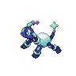

  

  

    

      
Types

      

        
        
      

    

    

      
Abilities

      

        <a href='' title="When the Pokémon enters a battle, it absorbs the energy around itself and transforms into its Terastal Form.">Tera-shift</a>
        
      

    

  

## Base Stats
<table style="width: 100%">
  <tbody style="width: 100%;">
    <tr style="display: flex; align-items: center;">
      <th style="color: #737373;" >HP</th>
      <td style="border-top: none; width: 70px">90</td>
      <td style="width: 100%; min-width: 450px; border-top: none;">
        

        

      </td>
    </tr>
    <tr style="display: flex; align-items: center;">
      <th style="color: #737373;">Attack</th>
      <td style="border-top: none; width: 70px">65</td>
      <td style="width: 100%; min-width: 450px; border-top: none;">
        

        

      </td>
    </tr>
    <tr style="display: flex; align-items: center;">
      <th style="color: #737373;">Defense</th>
      <td style="border-top: none; width: 70px">85</td>
      <td style="width: 100%; min-width: 450px; border-top: none;">
        

        

      </td>
    </tr>
    <tr style="display: flex; align-items: center;">
      <th style="color: #737373;">SP Attack</th>
      <td style="border-top: none; width: 70px">65</td>
      <td style="width: 100%; min-width: 450px; border-top: none;">
        

        

      </td>
    </tr>
    <tr style="display: flex; align-items: center;">
      <th style="color: #737373;">SP Defense</th>
      <td style="border-top: none; width: 70px">85</td>
      <td style="width: 100%; min-width: 450px; border-top: none;">
        

        

      </td>
    </tr>
    <tr style="display: flex; align-items: center;">
      <th style="color: #737373;">Speed</th>
      <td style="border-top: none; width: 70px">60</td>
      <td style="width: 100%; min-width: 450px; border-top: none;">
        

        

      </td>
    </tr>
  </tbody>
</table>

## Moveset

=== "Level Up Moves"
    | Level | Name | Power | Accuracy | PP | Type | Damage Class |
        | -- | -- | -- | -- | -- | -- | -- |
        	| 1 | Tri-attack | 80 | 100 | 10 |  |  |
	| 1 | Rapid-spin | 50 | 100 | 40 |  |  |
	| 1 | Withdraw | - | - | 40 |  |  |
	| 10 | Ancient-power | 60 | 100 | 5 |  |  |
	| 20 | Headbutt | 70 | 100 | 15 |  |  |
	| 80 | Rock-polish | - | - | 20 |  |  |

        

=== "Machine Moves"
    | Machine | Name | Power | Accuracy | PP | Type | Damage Class |
        | -- | -- | -- | -- | -- | -- | -- |
        	| TM22 | Rock-slide | 75 | 90 | 10 |  |  |
	| TM27 | Toxic | - | 90 | 10 |  |  |
	| TM36 | Thunderbolt | 90 | 100 | 15 |  |  |
	| TM46 | Weather-ball | 50 | 100 | 10 |  |  |
	| TM97 | Dark-pulse | 80 | 100 | 15 |  |  |
	| TM05 | Rest | - | - | 5 |  |  |
	| TR67 | Earth-power | 90 | 100 | 10 |  |  |
	| TR55 | Flare-blitz | 120 | 100 | 15 |  |  |
	| TR74 | Iron-head | 80 | 100 | 15 |  |  |
	| TM116 | Ice-spinner | 80 | 100 | 15 |  |  |
	| TR69 | Zen-headbutt | 80 | 90 | 15 |  |  |
	| TM38 | Thunder | 110 | 70 | 10 |  |  |
	| TM41 | Earthquake | 100 | 100 | 10 |  |  |
	| TM04 | Calm-mind | - | - | 20 |  |  |
	| TM08 | Body-slam | 85 | 100 | 15 |  |  |
	| TM03 | Water-pulse | 60 | 100 | 20 |  |  |
	| TM88 | Sleep-talk | - | - | 10 |  |  |
	| TM05 | Roar | - | - | 20 |  |  |
	| TM56 | Stealth-rock | - | - | 20 |  |  |
	| TR99 | Body-press | 80 | 100 | 10 |  |  |
	| TR56 | Aura-sphere | 80 | - | 20 |  |  |
	| TM10 | Double-edge | 120 | 100 | 15 |  |  |
	| TM53 | Energy-ball | 90 | 100 | 10 |  |  |
	| TM99 | Dazzling-gleam | 80 | 100 | 10 |  |  |
	| TM74 | Gyro-ball | - | 100 | 5 |  |  |
	| TR32 | Crunch | 80 | 100 | 15 |  |  |
	| TM45 | Solar-beam | 120 | 100 | 10 |  |  |
	| TM71 | Stone-edge | 100 | 80 | 5 |  |  |
	| TR61 | Bug-buzz | 90 | 100 | 10 |  |  |
	| TM55 | Ice-beam | 90 | 100 | 10 |  |  |
	| TM11 | Sunny-day | - | - | 5 |  |  |
	| TM54 | Flash-cannon | 80 | 100 | 10 |  |  |
	| TM08 | Substitute | - | - | 10 |  |  |
	| TM93 | Wild-charge | 90 | 100 | 15 |  |  |
	| TM20 | Endure | - | - | 10 |  |  |
	| TM48 | Hyper-beam | 150 | 90 | 5 |  |  |
	| TM07 | Protect | - | - | 10 |  |  |
	| TR63 | Power-gem | 80 | 100 | 20 |  |  |
	| TM12 | Facade | 70 | 100 | 20 |  |  |
	| TM104 | Scorching-sands | 70 | 100 | 10 |  |  |
	| TR82 | Stored-power | 20 | 100 | 10 |  |  |
	| TM18 | Rain-dance | - | - | 5 |  |  |
	| TM68 | Giga-impact | 150 | 90 | 5 |  |  |
	| TR88 | Heat-crash | - | 100 | 10 |  |  |
	| TM34 | Dragon-pulse | 85 | 100 | 10 |  |  |
	| TR79 | Heavy-slam | - | 100 | 10 |  |  |
	| TM35 | Flamethrower | 90 | 100 | 15 |  |  |
	| TM09 | Take-down | 90 | 85 | 20 |  |  |
	| TM94 | Surf | 90 | 100 | 15 |  |  |

        
