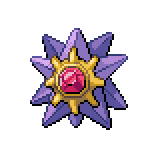

  

  

    

      
Types

      

        
        
      

    

    

      
Abilities

      

        <a href='' title="Overworld: If the lead Pokemon has this ability, the wild encounter rate is doubled.  This ability has no effect in battle.">Illuminate</a>
        /<a href='' title="This Pokemon is cured of any major status ailment when it is switched out for another Pokemon.  If this ability is acquired during battle, the Pokemon is cured upon leaving battle before losing the temporary ability.">Natural-cure</a>
      

    

  

## Base Stats
<table style="width: 100%">
  <tbody style="width: 100%;">
    <tr style="display: flex; align-items: center;">
      <th style="color: #737373;" >HP</th>
      <td style="border-top: none; width: 70px">60</td>
      <td style="width: 100%; min-width: 450px; border-top: none;">
        

        

      </td>
    </tr>
    <tr style="display: flex; align-items: center;">
      <th style="color: #737373;">Attack</th>
      <td style="border-top: none; width: 70px">75</td>
      <td style="width: 100%; min-width: 450px; border-top: none;">
        

        

      </td>
    </tr>
    <tr style="display: flex; align-items: center;">
      <th style="color: #737373;">Defense</th>
      <td style="border-top: none; width: 70px">85</td>
      <td style="width: 100%; min-width: 450px; border-top: none;">
        

        

      </td>
    </tr>
    <tr style="display: flex; align-items: center;">
      <th style="color: #737373;">SP Attack</th>
      <td style="border-top: none; width: 70px">100</td>
      <td style="width: 100%; min-width: 450px; border-top: none;">
        

        

      </td>
    </tr>
    <tr style="display: flex; align-items: center;">
      <th style="color: #737373;">SP Defense</th>
      <td style="border-top: none; width: 70px">85</td>
      <td style="width: 100%; min-width: 450px; border-top: none;">
        

        

      </td>
    </tr>
    <tr style="display: flex; align-items: center;">
      <th style="color: #737373;">Speed</th>
      <td style="border-top: none; width: 70px">115</td>
      <td style="width: 100%; min-width: 450px; border-top: none;">
        

        

      </td>
    </tr>
  </tbody>
</table>

## Moveset

=== "Level Up Moves"
    | Level | Name | Power | Accuracy | PP | Type | Damage Class |
        | -- | -- | -- | -- | -- | -- | -- |
        	| 1 | Recover | - | - | 5 |  |  |
	| 1 | Tackle | 40 | 100 | 35 |  |  |
	| 1 | Harden | - | - | 30 |  |  |
	| 1 | Swift | 60 | - | 20 |  |  |
	| 1 | Water-gun | 40 | 100 | 25 |  |  |
	| 1 | Psywave | - | 100 | 15 |  |  |
	| 1 | Hydro-pump | 110 | 80 | 5 |  |  |
	| 1 | Rapid-spin | 50 | 100 | 40 |  |  |
	| 1 | Spotlight | - | - | 15 |  |  |
	| 40 | Confuse-ray | - | 100 | 10 |  |  |

        

=== "Machine Moves"
    | Machine | Name | Power | Accuracy | PP | Type | Damage Class |
        | -- | -- | -- | -- | -- | -- | -- |
        	| TM27 | Toxic | - | 90 | 10 |  |  |
	| TM36 | Thunderbolt | 90 | 100 | 15 |  |  |
	| TM100 | Confide | - | - | 20 |  |  |
	| TM27 | Return | - | 100 | 20 |  |  |
	| TM87 | Swagger | - | 85 | 15 |  |  |
	| TM85 | Dream-eater | 100 | 100 | 15 |  |  |
	| TM05 | Rest | - | - | 5 |  |  |
	| TM38 | Thunder | 110 | 70 | 10 |  |  |
	| TM01 | Headbutt | 70 | 100 | 15 |  |  |
	| TM04 | Teleport | - | - | 20 |  |  |
	| TM28 | Tri-attack | 80 | 100 | 10 |  |  |
	| TM88 | Sleep-talk | - | - | 10 |  |  |
	| TM32 | Double-team | - | - | 15 |  |  |
	| TM86 | Grass-knot | - | 100 | 20 |  |  |
	| TM29 | Psychic | 90 | 100 | 10 |  |  |
	| TM07 | Hail | - | - | 10 |  |  |
	| TM10 | Hidden-power | 60 | 100 | 15 |  |  |
	| TM92 | Trick-room | - | - | 5 |  |  |
	| TM21 | Frustration | - | 100 | 20 |  |  |
	| TM99 | Dazzling-gleam | 80 | 100 | 10 |  |  |
	| TM74 | Gyro-ball | - | 100 | 5 |  |  |
	| TM55 | Scald | 80 | 100 | 15 |  |  |
	| TM55 | Ice-beam | 90 | 100 | 10 |  |  |
	| TM54 | Flash-cannon | 80 | 100 | 10 |  |  |
	| TM08 | Substitute | - | - | 10 |  |  |
	| TM16 | Light-screen | - | - | 30 |  |  |
	| TM48 | Hyper-beam | 150 | 90 | 5 |  |  |
	| TM07 | Protect | - | - | 10 |  |  |
	| TM03 | Psyshock | 80 | 100 | 10 |  |  |
	| TM12 | Facade | 70 | 100 | 20 |  |  |
	| TM77 | Psych-up | - | - | 10 |  |  |
	| TM48 | Round | 60 | 100 | 15 |  |  |
	| TM14 | Blizzard | 110 | 70 | 5 |  |  |
	| TM18 | Rain-dance | - | - | 5 |  |  |
	| TM68 | Giga-impact | 150 | 90 | 5 |  |  |
	| TM33 | Reflect | - | - | 20 |  |  |
	| TM98 | Waterfall | 80 | 100 | 15 |  |  |
	| TM16 | Thunder-wave | - | 90 | 20 |  |  |
	| TM94 | Surf | 90 | 100 | 15 |  |  |

        
