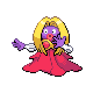

  

  

    

      
Types

      

        
        
      

    

    

      
Abilities

      

        <a href='' title="This Pokemon cannot be infatuated and is immune to captivate.  If a Pokemon is infatuated and acquires this ability, its infatuation is cleared.">Oblivious</a>
        /<a href='' title="When this Pokemon enters battle, it reveals the move with the highest base power known by any opposing Pokemon to all participating trainers.  In the event of a tie, one is chosen at random.  Moves without a listed base power are assigned one as follows:  Power | Moves ----: | -----   160 | One-hit KO moves: fissure, guillotine, horn drill, and sheer cold   120 | Counter moves: counter, metal burst, and mirror coat    80 | Variable power or set damage: crush grip, dragon rage, electro ball, endeavor, final gambit, flail, frustration, grass knot, gyro ball, heat crash, heavy slam, hidden power, low kick, natural gift, night shade, psywave, return, reversal, seismic toss, sonic boom, trump card, and wring out     0 | Any such move not listed ">Forewarn</a>
      

    

  

## Base Stats
<table style="width: 100%">
  <tbody style="width: 100%;">
    <tr style="display: flex; align-items: center;">
      <th style="color: #737373;" >HP</th>
      <td style="border-top: none; width: 70px">65</td>
      <td style="width: 100%; min-width: 450px; border-top: none;">
        

        

      </td>
    </tr>
    <tr style="display: flex; align-items: center;">
      <th style="color: #737373;">Attack</th>
      <td style="border-top: none; width: 70px">50</td>
      <td style="width: 100%; min-width: 450px; border-top: none;">
        

        

      </td>
    </tr>
    <tr style="display: flex; align-items: center;">
      <th style="color: #737373;">Defense</th>
      <td style="border-top: none; width: 70px">35</td>
      <td style="width: 100%; min-width: 450px; border-top: none;">
        

        

      </td>
    </tr>
    <tr style="display: flex; align-items: center;">
      <th style="color: #737373;">SP Attack</th>
      <td style="border-top: none; width: 70px">115</td>
      <td style="width: 100%; min-width: 450px; border-top: none;">
        

        

      </td>
    </tr>
    <tr style="display: flex; align-items: center;">
      <th style="color: #737373;">SP Defense</th>
      <td style="border-top: none; width: 70px">95</td>
      <td style="width: 100%; min-width: 450px; border-top: none;">
        

        

      </td>
    </tr>
    <tr style="display: flex; align-items: center;">
      <th style="color: #737373;">Speed</th>
      <td style="border-top: none; width: 70px">95</td>
      <td style="width: 100%; min-width: 450px; border-top: none;">
        

        

      </td>
    </tr>
  </tbody>
</table>

## Moveset

=== "Level Up Moves"
    | Level | Name | Power | Accuracy | PP | Type | Damage Class |
        | -- | -- | -- | -- | -- | -- | -- |
        	| 1 | Pound | 40 | 100 | 35 |  |  |
	| 1 | Draining-kiss | 50 | 100 | 10 |  |  |
	| 6 | Lick | 30 | 100 | 30 |  |  |
	| 11 | Powder-snow | 40 | 100 | 25 |  |  |
	| 12 | Confusion | 50 | 100 | 25 |  |  |
	| 18 | Screech | - | 85 | 40 |  |  |
	| 21 | Heart-stamp | 60 | 100 | 25 |  |  |
	| 22 | Double-slap | 15 | 85 | 10 |  |  |
	| 25 | Mean-look | - | - | 5 |  |  |
	| 28 | Fake-tears | - | 100 | 20 |  |  |
	| 30 | Body-slam | 85 | 100 | 15 |  |  |
	| 33 | Wake-up-slap | 70 | 100 | 10 |  |  |
	| 35 | Lovely-kiss | - | 75 | 10 |  |  |
	| 39 | Avalanche | 60 | 100 | 10 |  |  |
	| 49 | Wring-out | - | 100 | 5 |  |  |
	| 55 | Perish-song | - | - | 5 |  |  |

        

=== "Machine Moves"
    | Machine | Name | Power | Accuracy | PP | Type | Damage Class |
        | -- | -- | -- | -- | -- | -- | -- |
        	| TM27 | Toxic | - | 90 | 10 |  |  |
	| TM66 | Payback | 50 | 100 | 10 |  |  |
	| TM100 | Confide | - | - | 20 |  |  |
	| TM27 | Return | - | 100 | 20 |  |  |
	| TM87 | Swagger | - | 85 | 15 |  |  |
	| TM85 | Dream-eater | 100 | 100 | 15 |  |  |
	| TM05 | Rest | - | - | 5 |  |  |
	| TM56 | Fling | - | 100 | 10 |  |  |
	| TM01 | Headbutt | 70 | 100 | 15 |  |  |
	| TM04 | Calm-mind | - | - | 20 |  |  |
	| TM04 | Teleport | - | - | 20 |  |  |
	| TM88 | Sleep-talk | - | - | 10 |  |  |
	| TM32 | Double-team | - | - | 15 |  |  |
	| TM41 | Torment | - | 100 | 15 |  |  |
	| TM46 | Thief | 60 | 100 | 25 |  |  |
	| TM13 | Brick-break | 75 | 100 | 15 |  |  |
	| TM86 | Grass-knot | - | 100 | 20 |  |  |
	| TM29 | Psychic | 90 | 100 | 10 |  |  |
	| TM35 | Ice-punch | 75 | 100 | 15 |  |  |
	| TM07 | Hail | - | - | 10 |  |  |
	| TM10 | Hidden-power | 60 | 100 | 15 |  |  |
	| TM92 | Trick-room | - | - | 5 |  |  |
	| TM21 | Frustration | - | 100 | 20 |  |  |
	| TM03 | Helping-hand | - | - | 20 |  |  |
	| TM30 | Shadow-ball | 80 | 100 | 15 |  |  |
	| TM53 | Energy-ball | 90 | 100 | 10 |  |  |
	| TM70 | Aurora-veil | - | - | 20 |  |  |
	| TM45 | Attract | - | 100 | 15 |  |  |
	| TM79 | Frost-breath | 60 | 90 | 10 |  |  |
	| TM52 | Focus-blast | 120 | 70 | 5 |  |  |
	| TM55 | Ice-beam | 90 | 100 | 10 |  |  |
	| TM08 | Substitute | - | - | 10 |  |  |
	| TM16 | Light-screen | - | - | 30 |  |  |
	| TM48 | Hyper-beam | 150 | 90 | 5 |  |  |
	| TM07 | Protect | - | - | 10 |  |  |
	| TM03 | Psyshock | 80 | 100 | 10 |  |  |
	| TM12 | Facade | 70 | 100 | 20 |  |  |
	| TM12 | Taunt | - | 100 | 20 |  |  |
	| TM15 | Seismic-toss | - | 100 | 20 |  |  |
	| TM77 | Psych-up | - | - | 10 |  |  |
	| TM48 | Round | 60 | 100 | 15 |  |  |
	| TM49 | Echoed-voice | 40 | 100 | 15 |  |  |
	| TM14 | Blizzard | 110 | 70 | 5 |  |  |
	| TM18 | Rain-dance | - | - | 5 |  |  |
	| TM68 | Giga-impact | 150 | 90 | 5 |  |  |
	| TM33 | Reflect | - | - | 20 |  |  |

        
