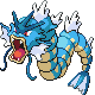

  

  

    

      
Types

      

        
        
      

    

    

      
Abilities

      

        <a href='' title="When this Pokemon enters battle, the opponent's Attack is lowered by one stage.  In a double battle, both opponents are affected.  This ability also takes effect when acquired during a battle, but will not take effect again if lost and reobtained without leaving battle.  This ability has no effect on an opponent that has a substitute.  Overworld: If the first Pokemon in the party has this ability, any random encounter with a Pokemon five or more levels lower than it has a 50% chance of being skipped.">Intimidate</a>
        /<a href='' title="This Pokemon's Attack rises one stage upon knocking out another Pokemon, even a friendly Pokemon.  This ability does not take effect when the Pokemon indirectly causes another Pokemon to faint, e.g. through poison or spikes.  If this Pokemon knocks out a Pokemon with mummy, the former's ability will change without taking effect.">Moxie</a>
      

    

  

## Base Stats
<table style="width: 100%">
  <tbody style="width: 100%;">
    <tr style="display: flex; align-items: center;">
      <th style="color: #737373;" >HP</th>
      <td style="border-top: none; width: 70px">95</td>
      <td style="width: 100%; min-width: 450px; border-top: none;">
        

        

      </td>
    </tr>
    <tr style="display: flex; align-items: center;">
      <th style="color: #737373;">Attack</th>
      <td style="border-top: none; width: 70px">125</td>
      <td style="width: 100%; min-width: 450px; border-top: none;">
        

        

      </td>
    </tr>
    <tr style="display: flex; align-items: center;">
      <th style="color: #737373;">Defense</th>
      <td style="border-top: none; width: 70px">79</td>
      <td style="width: 100%; min-width: 450px; border-top: none;">
        

        

      </td>
    </tr>
    <tr style="display: flex; align-items: center;">
      <th style="color: #737373;">SP Attack</th>
      <td style="border-top: none; width: 70px">60</td>
      <td style="width: 100%; min-width: 450px; border-top: none;">
        

        

      </td>
    </tr>
    <tr style="display: flex; align-items: center;">
      <th style="color: #737373;">SP Defense</th>
      <td style="border-top: none; width: 70px">100</td>
      <td style="width: 100%; min-width: 450px; border-top: none;">
        

        

      </td>
    </tr>
    <tr style="display: flex; align-items: center;">
      <th style="color: #737373;">Speed</th>
      <td style="border-top: none; width: 70px">81</td>
      <td style="width: 100%; min-width: 450px; border-top: none;">
        

        

      </td>
    </tr>
  </tbody>
</table>

## Moveset

=== "Level Up Moves"
    | Level | Name | Power | Accuracy | PP | Type | Damage Class |
        | -- | -- | -- | -- | -- | -- | -- |
        	| 1 | Thrash | 120 | 100 | 10 |  |  |
	| 1 | Bite | 60 | 100 | 25 |  |  |
	| 6 | Leer | - | 100 | 30 |  |  |
	| 11 | Dragon-rage | - | 100 | 10 |  |  |
	| 16 | Bind | 15 | 85 | 20 |  |  |
	| 21 | Rage | 20 | 100 | 20 |  |  |
	| 24 | Twister | 40 | 100 | 20 |  |  |
	| 27 | Ice-fang | 65 | 95 | 15 |  |  |
	| 30 | Aqua-tail | 90 | 90 | 10 |  |  |
	| 33 | Scary-face | - | 100 | 10 |  |  |
	| 36 | Crunch | 80 | 100 | 15 |  |  |
	| 45 | Dragon-dance | - | - | 20 |  |  |
	| 46 | Hydro-pump | 110 | 80 | 5 |  |  |
	| 48 | Hurricane | 110 | 70 | 10 |  |  |

        

=== "Machine Moves"
    | Machine | Name | Power | Accuracy | PP | Type | Damage Class |
        | -- | -- | -- | -- | -- | -- | -- |
        	| TM27 | Toxic | - | 90 | 10 |  |  |
	| TM36 | Thunderbolt | 90 | 100 | 15 |  |  |
	| TM66 | Payback | 50 | 100 | 10 |  |  |
	| TM100 | Confide | - | - | 20 |  |  |
	| TM27 | Return | - | 100 | 20 |  |  |
	| TM97 | Dark-pulse | 80 | 100 | 15 |  |  |
	| TM87 | Swagger | - | 85 | 15 |  |  |
	| TM05 | Rest | - | - | 5 |  |  |
	| TM38 | Thunder | 110 | 70 | 10 |  |  |
	| TM01 | Headbutt | 70 | 100 | 15 |  |  |
	| TM41 | Earthquake | 100 | 100 | 10 |  |  |
	| TM88 | Sleep-talk | - | - | 10 |  |  |
	| TM05 | Roar | - | - | 20 |  |  |
	| TM32 | Double-team | - | - | 15 |  |  |
	| TM41 | Torment | - | 100 | 15 |  |  |
	| TM38 | Fire-blast | 110 | 85 | 5 |  |  |
	| TM07 | Hail | - | - | 10 |  |  |
	| TM10 | Hidden-power | 60 | 100 | 15 |  |  |
	| TM21 | Frustration | - | 100 | 20 |  |  |
	| TM19 | Iron-tail | 100 | 75 | 15 |  |  |
	| TM78 | Bulldoze | 60 | 100 | 20 |  |  |
	| TM55 | Scald | 80 | 100 | 15 |  |  |
	| TM45 | Attract | - | 100 | 15 |  |  |
	| TM37 | Sandstorm | - | - | 10 |  |  |
	| TM71 | Stone-edge | 100 | 80 | 5 |  |  |
	| TM59 | Brutal-swing | 60 | 100 | 20 |  |  |
	| TM82 | Dragon-tail | 60 | 90 | 10 |  |  |
	| TM55 | Ice-beam | 90 | 100 | 10 |  |  |
	| TM08 | Substitute | - | - | 10 |  |  |
	| TM39 | Outrage | 120 | 100 | 10 |  |  |
	| TM48 | Hyper-beam | 150 | 90 | 5 |  |  |
	| TM07 | Protect | - | - | 10 |  |  |
	| TM12 | Facade | 70 | 100 | 20 |  |  |
	| TM12 | Taunt | - | 100 | 20 |  |  |
	| TM48 | Round | 60 | 100 | 15 |  |  |
	| TM14 | Blizzard | 110 | 70 | 5 |  |  |
	| TM18 | Rain-dance | - | - | 5 |  |  |
	| TM68 | Giga-impact | 150 | 90 | 5 |  |  |
	| TM34 | Dragon-pulse | 85 | 100 | 10 |  |  |
	| TM35 | Flamethrower | 90 | 100 | 15 |  |  |
	| TM33 | Reflect | - | - | 20 |  |  |
	| TM98 | Waterfall | 80 | 100 | 15 |  |  |
	| TM16 | Thunder-wave | - | 90 | 20 |  |  |
	| TM94 | Surf | 90 | 100 | 15 |  |  |

        
