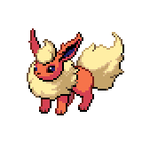

  

  

    

      
Types

      

        
        
      

    

    

      
Abilities

      

        <a href='' title="Restores HP if hit by a Fire-type move.">Flame-absorb</a>
        /<a href='' title="Whenever this Pokemon is asleep, burned, paralyzed, or poisoned, it has 1.5x its Attack.  This Pokemon is not affected by the usual Attack cut from a burn.  This bonus does not count as a stat modifier.">Guts</a>
      

    

  

## Base Stats
<table style="width: 100%">
  <tbody style="width: 100%;">
    <tr style="display: flex; align-items: center;">
      <th style="color: #737373;" >HP</th>
      <td style="border-top: none; width: 70px">65</td>
      <td style="width: 100%; min-width: 450px; border-top: none;">
        

        

      </td>
    </tr>
    <tr style="display: flex; align-items: center;">
      <th style="color: #737373;">Attack</th>
      <td style="border-top: none; width: 70px">130</td>
      <td style="width: 100%; min-width: 450px; border-top: none;">
        

        

      </td>
    </tr>
    <tr style="display: flex; align-items: center;">
      <th style="color: #737373;">Defense</th>
      <td style="border-top: none; width: 70px">60</td>
      <td style="width: 100%; min-width: 450px; border-top: none;">
        

        

      </td>
    </tr>
    <tr style="display: flex; align-items: center;">
      <th style="color: #737373;">SP Attack</th>
      <td style="border-top: none; width: 70px">95</td>
      <td style="width: 100%; min-width: 450px; border-top: none;">
        

        

      </td>
    </tr>
    <tr style="display: flex; align-items: center;">
      <th style="color: #737373;">SP Defense</th>
      <td style="border-top: none; width: 70px">110</td>
      <td style="width: 100%; min-width: 450px; border-top: none;">
        

        

      </td>
    </tr>
    <tr style="display: flex; align-items: center;">
      <th style="color: #737373;">Speed</th>
      <td style="border-top: none; width: 70px">65</td>
      <td style="width: 100%; min-width: 450px; border-top: none;">
        

        

      </td>
    </tr>
  </tbody>
</table>

## Moveset

=== "Level Up Moves"
    | Level | Name | Power | Accuracy | PP | Type | Damage Class |
        | -- | -- | -- | -- | -- | -- | -- |
        	| 1 | Tackle | 40 | 100 | 35 |  |  |
	| 1 | Ember | 40 | 100 | 25 |  |  |
	| 1 | Yawn | - | - | 10 |  |  |
	| 1 | Growl | - | 100 | 40 |  |  |
	| 3 | Tail-whip | - | 100 | 30 |  |  |
	| 6 | Quick-attack | 40 | 100 | 30 |  |  |
	| 9 | Baby-doll-eyes | - | 100 | 30 |  |  |
	| 10 | Double-kick | 30 | 100 | 30 |  |  |
	| 14 | Sand-attack | - | 100 | 15 |  |  |
	| 17 | Fire-spin | 35 | 85 | 15 |  |  |
	| 17 | Bite | 60 | 100 | 25 |  |  |
	| 20 | Fire-fang | 65 | 95 | 15 |  |  |
	| 21 | Smog | 30 | 70 | 20 |  |  |
	| 24 | Focus-energy | - | - | 30 |  |  |
	| 29 | Scary-face | - | 100 | 10 |  |  |
	| 31 | Flare-blitz | 120 | 100 | 15 |  |  |
	| 37 | Lava-plume | 80 | 100 | 15 |  |  |
	| 41 | Last-resort | 140 | 100 | 5 |  |  |

        

=== "Machine Moves"
    | Machine | Name | Power | Accuracy | PP | Type | Damage Class |
        | -- | -- | -- | -- | -- | -- | -- |
        	| TM27 | Toxic | - | 90 | 10 |  |  |
	| TM100 | Confide | - | - | 20 |  |  |
	| TM27 | Return | - | 100 | 20 |  |  |
	| TM87 | Swagger | - | 85 | 15 |  |  |
	| TM05 | Rest | - | - | 5 |  |  |
	| TM01 | Headbutt | 70 | 100 | 15 |  |  |
	| TM61 | Will-o-wisp | - | 85 | 15 |  |  |
	| TM57 | Pay-day | 40 | 100 | 20 |  |  |
	| TM88 | Sleep-talk | - | - | 10 |  |  |
	| TM05 | Roar | - | - | 20 |  |  |
	| TM32 | Double-team | - | - | 15 |  |  |
	| TM10 | Dig | 80 | 100 | 10 |  |  |
	| TM38 | Fire-blast | 110 | 85 | 5 |  |  |
	| TM50 | Overheat | 130 | 90 | 5 |  |  |
	| TM43 | Flame-charge | 50 | 100 | 20 |  |  |
	| TM10 | Hidden-power | 60 | 100 | 15 |  |  |
	| TM21 | Frustration | - | 100 | 20 |  |  |
	| TM19 | Iron-tail | 100 | 75 | 15 |  |  |
	| TM03 | Helping-hand | - | - | 20 |  |  |
	| TM30 | Shadow-ball | 80 | 100 | 15 |  |  |
	| TM45 | Attract | - | 100 | 15 |  |  |
	| TM11 | Sunny-day | - | - | 5 |  |  |
	| TM08 | Substitute | - | - | 10 |  |  |
	| TM48 | Hyper-beam | 150 | 90 | 5 |  |  |
	| TM07 | Protect | - | - | 10 |  |  |
	| TM12 | Facade | 70 | 100 | 20 |  |  |
	| TM01 | Work-up | - | - | 30 |  |  |
	| TM48 | Round | 60 | 100 | 15 |  |  |
	| TM49 | Echoed-voice | 40 | 100 | 15 |  |  |
	| TM49 | Superpower | 120 | 100 | 5 |  |  |
	| TM18 | Rain-dance | - | - | 5 |  |  |
	| TM68 | Giga-impact | 150 | 90 | 5 |  |  |
	| TM35 | Flamethrower | 90 | 100 | 15 |  |  |
	| TM33 | Reflect | - | - | 20 |  |  |

        
