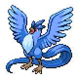

  

  

    

      
Types

      

        
        
      

    

    

      
Abilities

      

        <a href='' title="During hail, this Pokemon has 1.25x its evasion, and it does not take hail damage regardless of type.  The evasion bonus does not count as a stat modifier.  Overworld: If the lead Pokemon has this ability, the wild encounter rate is halved in snow.">Snow-cloak</a>
        /<a href='' title="The weather changes to hail when this Pokemon enters battle and does not end unless cancelled by another weather condition.  If multiple Pokemon with this ability, drizzle, drought, or sand stream are sent out at the same time, the abilities will activate in order of Speed, respecting trick room.  Each ability's weather will cancel the previous weather, and only the weather summoned by the slowest of the Pokemon will stay.">Snow-warning</a>
      

    

  

## Base Stats
<table style="width: 100%">
  <tbody style="width: 100%;">
    <tr style="display: flex; align-items: center;">
      <th style="color: #737373;" >HP</th>
      <td style="border-top: none; width: 70px">90</td>
      <td style="width: 100%; min-width: 450px; border-top: none;">
        

        

      </td>
    </tr>
    <tr style="display: flex; align-items: center;">
      <th style="color: #737373;">Attack</th>
      <td style="border-top: none; width: 70px">85</td>
      <td style="width: 100%; min-width: 450px; border-top: none;">
        

        

      </td>
    </tr>
    <tr style="display: flex; align-items: center;">
      <th style="color: #737373;">Defense</th>
      <td style="border-top: none; width: 70px">100</td>
      <td style="width: 100%; min-width: 450px; border-top: none;">
        

        

      </td>
    </tr>
    <tr style="display: flex; align-items: center;">
      <th style="color: #737373;">SP Attack</th>
      <td style="border-top: none; width: 70px">95</td>
      <td style="width: 100%; min-width: 450px; border-top: none;">
        

        

      </td>
    </tr>
    <tr style="display: flex; align-items: center;">
      <th style="color: #737373;">SP Defense</th>
      <td style="border-top: none; width: 70px">125</td>
      <td style="width: 100%; min-width: 450px; border-top: none;">
        

        

      </td>
    </tr>
    <tr style="display: flex; align-items: center;">
      <th style="color: #737373;">Speed</th>
      <td style="border-top: none; width: 70px">85</td>
      <td style="width: 100%; min-width: 450px; border-top: none;">
        

        

      </td>
    </tr>
  </tbody>
</table>

## Moveset

=== "Level Up Moves"
    | Level | Name | Power | Accuracy | PP | Type | Damage Class |
        | -- | -- | -- | -- | -- | -- | -- |
        	| 1 | Powder-snow | 40 | 100 | 25 |  |  |
	| 1 | Gust | 40 | 100 | 35 |  |  |
	| 1 | Ice-shard | 40 | 100 | 30 |  |  |
	| 8 | Mist | - | - | 30 |  |  |
	| 16 | Leer | - | 100 | 30 |  |  |
	| 22 | Mind-reader | - | - | 5 |  |  |
	| 24 | Mirror-coat | - | 100 | 20 |  |  |
	| 29 | Ancient-power | 60 | 100 | 5 |  |  |
	| 40 | Agility | - | - | 30 |  |  |
	| 43 | Freeze-dry | 70 | 100 | 20 |  |  |
	| 64 | Tailwind | - | - | 15 |  |  |
	| 72 | Sky-attack | 140 | 90 | 5 |  |  |
	| 92 | Hurricane | 110 | 70 | 10 |  |  |
	| 99 | Sheer-cold | - | 30 | 5 |  |  |

        

=== "Machine Moves"
    | Machine | Name | Power | Accuracy | PP | Type | Damage Class |
        | -- | -- | -- | -- | -- | -- | -- |
        	| TM27 | Toxic | - | 90 | 10 |  |  |
	| TM100 | Confide | - | - | 20 |  |  |
	| TM27 | Return | - | 100 | 20 |  |  |
	| TM87 | Swagger | - | 85 | 15 |  |  |
	| TM05 | Rest | - | - | 5 |  |  |
	| TM01 | Headbutt | 70 | 100 | 15 |  |  |
	| TM88 | Sleep-talk | - | - | 10 |  |  |
	| TM05 | Roar | - | - | 20 |  |  |
	| TM32 | Double-team | - | - | 15 |  |  |
	| TM51 | Steel-wing | 70 | 90 | 25 |  |  |
	| TM89 | U-turn | 70 | 100 | 20 |  |  |
	| TM07 | Hail | - | - | 10 |  |  |
	| TM10 | Hidden-power | 60 | 100 | 15 |  |  |
	| TM21 | Frustration | - | 100 | 20 |  |  |
	| TM70 | Aurora-veil | - | - | 20 |  |  |
	| TM19 | Roost | - | - | 5 |  |  |
	| TM40 | Aerial-ace | 60 | - | 20 |  |  |
	| TM79 | Frost-breath | 60 | 90 | 10 |  |  |
	| TM37 | Sandstorm | - | - | 10 |  |  |
	| TM55 | Ice-beam | 90 | 100 | 10 |  |  |
	| TM58 | Sky-drop | 60 | 100 | 10 |  |  |
	| TM11 | Sunny-day | - | - | 5 |  |  |
	| TM08 | Substitute | - | - | 10 |  |  |
	| TM48 | Hyper-beam | 150 | 90 | 5 |  |  |
	| TM07 | Protect | - | - | 10 |  |  |
	| TM12 | Facade | 70 | 100 | 20 |  |  |
	| TM48 | Round | 60 | 100 | 15 |  |  |
	| TM76 | Fly | 90 | 95 | 15 |  |  |
	| TM14 | Blizzard | 110 | 70 | 5 |  |  |
	| TM18 | Rain-dance | - | - | 5 |  |  |
	| TM68 | Giga-impact | 150 | 90 | 5 |  |  |
	| TM33 | Reflect | - | - | 20 |  |  |

        
