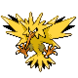

  

  

    

      
Types

      

        
        
      

    

    

      
Abilities

      

        <a href='' title="Whenever a move makes contact with this Pokemon, the move's user has a 30% chance of being paralyzed.  Pokemon that are immune to electric-type moves can still be paralyzed by this ability.  Overworld: If the lead Pokemon has this ability, there is a 50% chance that encounters will be with an electric Pokemon, if applicable.">Static</a>
        /<a href='' title="The weather changes to rain when this Pokemon enters battle and does not end unless replaced by another weather condition.  If multiple Pokemon with this ability, drought, sand stream, or snow warning are sent out at the same time, the abilities will activate in order of Speed, respecting trick room.  Each ability's weather will cancel the previous weather, and only the weather summoned by the slowest of the Pokemon will stay.">Drizzle</a>
      

    

  

## Base Stats
<table style="width: 100%">
  <tbody style="width: 100%;">
    <tr style="display: flex; align-items: center;">
      <th style="color: #737373;" >HP</th>
      <td style="border-top: none; width: 70px">90</td>
      <td style="width: 100%; min-width: 450px; border-top: none;">
        

        

      </td>
    </tr>
    <tr style="display: flex; align-items: center;">
      <th style="color: #737373;">Attack</th>
      <td style="border-top: none; width: 70px">90</td>
      <td style="width: 100%; min-width: 450px; border-top: none;">
        

        

      </td>
    </tr>
    <tr style="display: flex; align-items: center;">
      <th style="color: #737373;">Defense</th>
      <td style="border-top: none; width: 70px">85</td>
      <td style="width: 100%; min-width: 450px; border-top: none;">
        

        

      </td>
    </tr>
    <tr style="display: flex; align-items: center;">
      <th style="color: #737373;">SP Attack</th>
      <td style="border-top: none; width: 70px">125</td>
      <td style="width: 100%; min-width: 450px; border-top: none;">
        

        

      </td>
    </tr>
    <tr style="display: flex; align-items: center;">
      <th style="color: #737373;">SP Defense</th>
      <td style="border-top: none; width: 70px">90</td>
      <td style="width: 100%; min-width: 450px; border-top: none;">
        

        

      </td>
    </tr>
    <tr style="display: flex; align-items: center;">
      <th style="color: #737373;">Speed</th>
      <td style="border-top: none; width: 70px">100</td>
      <td style="width: 100%; min-width: 450px; border-top: none;">
        

        

      </td>
    </tr>
  </tbody>
</table>

## Moveset

=== "Level Up Moves"
    | Level | Name | Power | Accuracy | PP | Type | Damage Class |
        | -- | -- | -- | -- | -- | -- | -- |
        	| 1 | Peck | 35 | 100 | 35 |  |  |
	| 1 | Thunder-shock | 40 | 100 | 30 |  |  |
	| 15 | Detect | - | - | 5 |  |  |
	| 16 | Leer | - | 100 | 30 |  |  |
	| 22 | Pluck | 60 | 100 | 20 |  |  |
	| 24 | Drill-peck | 80 | 100 | 20 |  |  |
	| 29 | Ancient-power | 60 | 100 | 5 |  |  |
	| 36 | Charge | - | - | 20 |  |  |
	| 40 | Agility | - | - | 30 |  |  |
	| 50 | Discharge | 80 | 100 | 15 |  |  |
	| 72 | Sky-attack | 140 | 90 | 5 |  |  |
	| 92 | Magnetic-flux | - | - | 20 |  |  |
	| 99 | Zap-cannon | 120 | 50 | 5 |  |  |

        

=== "Machine Moves"
    | Machine | Name | Power | Accuracy | PP | Type | Damage Class |
        | -- | -- | -- | -- | -- | -- | -- |
        	| TM27 | Toxic | - | 90 | 10 |  |  |
	| TM36 | Thunderbolt | 90 | 100 | 15 |  |  |
	| TM100 | Confide | - | - | 20 |  |  |
	| TM27 | Return | - | 100 | 20 |  |  |
	| TM87 | Swagger | - | 85 | 15 |  |  |
	| TM05 | Rest | - | - | 5 |  |  |
	| TM38 | Thunder | 110 | 70 | 10 |  |  |
	| TM01 | Headbutt | 70 | 100 | 15 |  |  |
	| TM88 | Sleep-talk | - | - | 10 |  |  |
	| TM05 | Roar | - | - | 20 |  |  |
	| TM32 | Double-team | - | - | 15 |  |  |
	| TM51 | Steel-wing | 70 | 90 | 25 |  |  |
	| TM89 | U-turn | 70 | 100 | 20 |  |  |
	| TM10 | Hidden-power | 60 | 100 | 15 |  |  |
	| TM21 | Frustration | - | 100 | 20 |  |  |
	| TM19 | Roost | - | - | 5 |  |  |
	| TM40 | Aerial-ace | 60 | - | 20 |  |  |
	| TM57 | Charge-beam | 50 | 90 | 10 |  |  |
	| TM37 | Sandstorm | - | - | 10 |  |  |
	| TM58 | Sky-drop | 60 | 100 | 10 |  |  |
	| TM11 | Sunny-day | - | - | 5 |  |  |
	| TM08 | Substitute | - | - | 10 |  |  |
	| TM16 | Light-screen | - | - | 30 |  |  |
	| TM72 | Volt-switch | 70 | 100 | 20 |  |  |
	| TM93 | Wild-charge | 90 | 100 | 15 |  |  |
	| TM48 | Hyper-beam | 150 | 90 | 5 |  |  |
	| TM07 | Protect | - | - | 10 |  |  |
	| TM12 | Facade | 70 | 100 | 20 |  |  |
	| TM48 | Round | 60 | 100 | 15 |  |  |
	| TM76 | Fly | 90 | 95 | 15 |  |  |
	| TM18 | Rain-dance | - | - | 5 |  |  |
	| TM68 | Giga-impact | 150 | 90 | 5 |  |  |
	| TM33 | Reflect | - | - | 20 |  |  |
	| TM16 | Thunder-wave | - | 90 | 20 |  |  |

        
