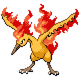

  

  

    

      
Types

      

        
        
      

    

    

      
Abilities

      

        <a href='' title="Whenever a move makes contact with this Pokemon, the move's user has a 30% chance of being burned.  Overworld: If any Pokemon in the party has this ability, each egg in the party has its hatch counter decreased by 2 (rather than 1) each step cycle, making eggs hatch roughly twice as quickly.  This effect does not stack if multiple Pokemon have this ability or magma armor.">Flame-body</a>
        /<a href='' title="The weather changes to strong sunlight when this Pokemon enters battle and does not end unless cancelled by another weather condition.  If multiple Pokemon with this ability, drizzle, sand stream, or snow warning are sent out at the same time, the abilities will activate in order of Speed, respecting trick room.  Each ability's weather will cancel the previous weather, and only the weather summoned by the slowest of the Pokemon will stay.">Drought</a>
      

    

  

## Base Stats
<table style="width: 100%">
  <tbody style="width: 100%;">
    <tr style="display: flex; align-items: center;">
      <th style="color: #737373;" >HP</th>
      <td style="border-top: none; width: 70px">90</td>
      <td style="width: 100%; min-width: 450px; border-top: none;">
        

        

      </td>
    </tr>
    <tr style="display: flex; align-items: center;">
      <th style="color: #737373;">Attack</th>
      <td style="border-top: none; width: 70px">100</td>
      <td style="width: 100%; min-width: 450px; border-top: none;">
        

        

      </td>
    </tr>
    <tr style="display: flex; align-items: center;">
      <th style="color: #737373;">Defense</th>
      <td style="border-top: none; width: 70px">90</td>
      <td style="width: 100%; min-width: 450px; border-top: none;">
        

        

      </td>
    </tr>
    <tr style="display: flex; align-items: center;">
      <th style="color: #737373;">SP Attack</th>
      <td style="border-top: none; width: 70px">125</td>
      <td style="width: 100%; min-width: 450px; border-top: none;">
        

        

      </td>
    </tr>
    <tr style="display: flex; align-items: center;">
      <th style="color: #737373;">SP Defense</th>
      <td style="border-top: none; width: 70px">85</td>
      <td style="width: 100%; min-width: 450px; border-top: none;">
        

        

      </td>
    </tr>
    <tr style="display: flex; align-items: center;">
      <th style="color: #737373;">Speed</th>
      <td style="border-top: none; width: 70px">90</td>
      <td style="width: 100%; min-width: 450px; border-top: none;">
        

        

      </td>
    </tr>
  </tbody>
</table>

## Moveset

=== "Level Up Moves"
    | Level | Name | Power | Accuracy | PP | Type | Damage Class |
        | -- | -- | -- | -- | -- | -- | -- |
        	| 1 | Ember | 40 | 100 | 25 |  |  |
	| 1 | Wing-attack | 60 | 100 | 35 |  |  |
	| 8 | Fire-spin | 35 | 85 | 15 |  |  |
	| 16 | Leer | - | 100 | 30 |  |  |
	| 22 | Endure | - | - | 10 |  |  |
	| 24 | Air-slash | 75 | 95 | 15 |  |  |
	| 29 | Ancient-power | 60 | 100 | 5 |  |  |
	| 40 | Agility | - | - | 30 |  |  |
	| 48 | Heat-wave | 95 | 90 | 10 |  |  |
	| 72 | Sky-attack | 140 | 90 | 5 |  |  |
	| 92 | Hurricane | 110 | 70 | 10 |  |  |
	| 99 | Burn-up | 130 | 100 | 5 |  |  |

        

=== "Machine Moves"
    | Machine | Name | Power | Accuracy | PP | Type | Damage Class |
        | -- | -- | -- | -- | -- | -- | -- |
        	| TM27 | Toxic | - | 90 | 10 |  |  |
	| TM100 | Confide | - | - | 20 |  |  |
	| TM27 | Return | - | 100 | 20 |  |  |
	| TM87 | Swagger | - | 85 | 15 |  |  |
	| TM05 | Rest | - | - | 5 |  |  |
	| TM01 | Headbutt | 70 | 100 | 15 |  |  |
	| TM61 | Will-o-wisp | - | 85 | 15 |  |  |
	| TM88 | Sleep-talk | - | - | 10 |  |  |
	| TM05 | Roar | - | - | 20 |  |  |
	| TM32 | Double-team | - | - | 15 |  |  |
	| TM51 | Steel-wing | 70 | 90 | 25 |  |  |
	| TM89 | U-turn | 70 | 100 | 20 |  |  |
	| TM38 | Fire-blast | 110 | 85 | 5 |  |  |
	| TM50 | Overheat | 130 | 90 | 5 |  |  |
	| TM43 | Flame-charge | 50 | 100 | 20 |  |  |
	| TM10 | Hidden-power | 60 | 100 | 15 |  |  |
	| TM21 | Frustration | - | 100 | 20 |  |  |
	| TM19 | Roost | - | - | 5 |  |  |
	| TM40 | Aerial-ace | 60 | - | 20 |  |  |
	| TM37 | Sandstorm | - | - | 10 |  |  |
	| TM45 | Solar-beam | 120 | 100 | 10 |  |  |
	| TM58 | Sky-drop | 60 | 100 | 10 |  |  |
	| TM11 | Sunny-day | - | - | 5 |  |  |
	| TM08 | Substitute | - | - | 10 |  |  |
	| TM20 | Safeguard | - | - | 25 |  |  |
	| TM48 | Hyper-beam | 150 | 90 | 5 |  |  |
	| TM07 | Protect | - | - | 10 |  |  |
	| TM12 | Facade | 70 | 100 | 20 |  |  |
	| TM48 | Round | 60 | 100 | 15 |  |  |
	| TM76 | Fly | 90 | 95 | 15 |  |  |
	| TM18 | Rain-dance | - | - | 5 |  |  |
	| TM68 | Giga-impact | 150 | 90 | 5 |  |  |
	| TM35 | Flamethrower | 90 | 100 | 15 |  |  |
	| TM33 | Reflect | - | - | 20 |  |  |

        
