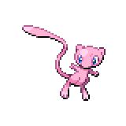

  

  

    

      
Types

      

        
        
      

    

    

      
Abilities

      

        <a href='' title="When this Pokemon enters battle, it changes the terrain to psychic terrain.">Psychic-surge</a>
        
      

    

  

## Base Stats
<table style="width: 100%">
  <tbody style="width: 100%;">
    <tr style="display: flex; align-items: center;">
      <th style="color: #737373;" >HP</th>
      <td style="border-top: none; width: 70px">100</td>
      <td style="width: 100%; min-width: 450px; border-top: none;">
        

        

      </td>
    </tr>
    <tr style="display: flex; align-items: center;">
      <th style="color: #737373;">Attack</th>
      <td style="border-top: none; width: 70px">100</td>
      <td style="width: 100%; min-width: 450px; border-top: none;">
        

        

      </td>
    </tr>
    <tr style="display: flex; align-items: center;">
      <th style="color: #737373;">Defense</th>
      <td style="border-top: none; width: 70px">100</td>
      <td style="width: 100%; min-width: 450px; border-top: none;">
        

        

      </td>
    </tr>
    <tr style="display: flex; align-items: center;">
      <th style="color: #737373;">SP Attack</th>
      <td style="border-top: none; width: 70px">100</td>
      <td style="width: 100%; min-width: 450px; border-top: none;">
        

        

      </td>
    </tr>
    <tr style="display: flex; align-items: center;">
      <th style="color: #737373;">SP Defense</th>
      <td style="border-top: none; width: 70px">100</td>
      <td style="width: 100%; min-width: 450px; border-top: none;">
        

        

      </td>
    </tr>
    <tr style="display: flex; align-items: center;">
      <th style="color: #737373;">Speed</th>
      <td style="border-top: none; width: 70px">100</td>
      <td style="width: 100%; min-width: 450px; border-top: none;">
        

        

      </td>
    </tr>
  </tbody>
</table>

## Moveset

=== "Level Up Moves"
    | Level | Name | Power | Accuracy | PP | Type | Damage Class |
        | -- | -- | -- | -- | -- | -- | -- |
        	| 1 | Mimic | - | - | 10 |  |  |
	| 1 | Reflect-type | - | - | 15 |  |  |
	| 1 | Pound | 40 | 100 | 35 |  |  |
	| 1 | Confusion | 50 | 100 | 25 |  |  |
	| 11 | Swift | 60 | - | 20 |  |  |
	| 22 | Amnesia | - | - | 20 |  |  |
	| 33 | Psywave | - | 100 | 15 |  |  |
	| 44 | Barrier | - | - | 20 |  |  |
	| 50 | Ancient-power | 60 | 100 | 5 |  |  |
	| 55 | Mega-punch | 80 | 85 | 20 |  |  |
	| 66 | Metronome | - | - | 10 |  |  |
	| 70 | Me-first | - | - | 20 |  |  |
	| 80 | Baton-pass | - | - | 40 |  |  |
	| 88 | Nasty-plot | - | - | 20 |  |  |
	| 99 | Transform | - | - | 10 |  |  |
	| 100 | Aura-sphere | 80 | - | 20 |  |  |

        

=== "Machine Moves"
    | Machine | Name | Power | Accuracy | PP | Type | Damage Class |
        | -- | -- | -- | -- | -- | -- | -- |
        	| TM47 | Low-sweep | 65 | 100 | 20 |  |  |
	| TM22 | Rock-slide | 75 | 90 | 10 |  |  |
	| TM27 | Toxic | - | 90 | 10 |  |  |
	| TM36 | Thunderbolt | 90 | 100 | 15 |  |  |
	| TM66 | Payback | 50 | 100 | 10 |  |  |
	| TM08 | Bulk-up | - | - | 20 |  |  |
	| TM100 | Confide | - | - | 20 |  |  |
	| TM21 | Foul-play | 95 | 100 | 15 |  |  |
	| TM27 | Return | - | 100 | 20 |  |  |
	| TM97 | Dark-pulse | 80 | 100 | 15 |  |  |
	| TM87 | Swagger | - | 85 | 15 |  |  |
	| TM85 | Dream-eater | 100 | 100 | 15 |  |  |
	| TM09 | Venoshock | 65 | 100 | 10 |  |  |
	| TM54 | False-swipe | 40 | 100 | 40 |  |  |
	| TM23 | Smack-down | 50 | 100 | 15 |  |  |
	| TM135 | Fire-punch | 75 | 100 | 15 |  |  |
	| TM05 | Rest | - | - | 5 |  |  |
	| TM56 | Fling | - | 100 | 10 |  |  |
	| TM84 | Poison-jab | 80 | 100 | 20 |  |  |
	| TM36 | Sludge-bomb | 90 | 100 | 10 |  |  |
	| TM62 | Acrobatics | 55 | 100 | 15 |  |  |
	| TM38 | Thunder | 110 | 70 | 10 |  |  |
	| TM01 | Headbutt | 70 | 100 | 15 |  |  |
	| TM61 | Will-o-wisp | - | 85 | 15 |  |  |
	| TM67 | Smart-strike | 70 | - | 10 |  |  |
	| TM41 | Earthquake | 100 | 100 | 10 |  |  |
	| TM04 | Calm-mind | - | - | 20 |  |  |
	| TM04 | Teleport | - | - | 20 |  |  |
	| TM28 | Tri-attack | 80 | 100 | 10 |  |  |
	| TM57 | Pay-day | 40 | 100 | 20 |  |  |
	| TM88 | Sleep-talk | - | - | 10 |  |  |
	| TM58 | Drill-run | 80 | 95 | 10 |  |  |
	| TM65 | Shadow-claw | 70 | 100 | 15 |  |  |
	| TM05 | Roar | - | - | 20 |  |  |
	| TM63 | Embargo | - | 100 | 15 |  |  |
	| TM32 | Double-team | - | - | 15 |  |  |
	| TM41 | Torment | - | 100 | 15 |  |  |
	| TM51 | Steel-wing | 70 | 90 | 25 |  |  |
	| TM46 | Thief | 60 | 100 | 25 |  |  |
	| TM39 | Rock-tomb | 60 | 95 | 15 |  |  |
	| TM89 | U-turn | 70 | 100 | 20 |  |  |
	| TM13 | Brick-break | 75 | 100 | 15 |  |  |
	| TM10 | Dig | 80 | 100 | 10 |  |  |
	| TM38 | Fire-blast | 110 | 85 | 5 |  |  |
	| TM86 | Grass-knot | - | 100 | 20 |  |  |
	| TM29 | Psychic | 90 | 100 | 10 |  |  |
	| TM134 | Ice-punch | 75 | 100 | 15 |  |  |
	| TM69 | Rock-polish | - | - | 20 |  |  |
	| TM34 | Sludge-wave | 95 | 100 | 10 |  |  |
	| TM50 | Overheat | 130 | 90 | 5 |  |  |
	| TM07 | Hail | - | - | 10 |  |  |
	| TM43 | Flame-charge | 50 | 100 | 20 |  |  |
	| TM10 | Hidden-power | 60 | 100 | 15 |  |  |
	| TM56 | Stealth-rock | - | - | 20 |  |  |
	| TM92 | Trick-room | - | - | 5 |  |  |
	| TM21 | Frustration | - | 100 | 20 |  |  |
	| TM19 | Iron-tail | 100 | 75 | 15 |  |  |
	| TM03 | Helping-hand | - | - | 20 |  |  |
	| TM44 | Play-rough | 90 | 90 | 10 |  |  |
	| TM30 | Shadow-ball | 80 | 100 | 15 |  |  |
	| TM53 | Energy-ball | 90 | 100 | 10 |  |  |
	| TM70 | Aurora-veil | - | - | 20 |  |  |
	| TM19 | Roost | - | - | 5 |  |  |
	| TM40 | Aerial-ace | 60 | - | 20 |  |  |
	| TM99 | Dazzling-gleam | 80 | 100 | 10 |  |  |
	| TM78 | Bulldoze | 60 | 100 | 20 |  |  |
	| TM83 | Infestation | 20 | 100 | 20 |  |  |
	| TM57 | Charge-beam | 50 | 90 | 10 |  |  |
	| TM74 | Gyro-ball | - | 100 | 5 |  |  |
	| TM55 | Scald | 80 | 100 | 15 |  |  |
	| TM45 | Attract | - | 100 | 15 |  |  |
	| TM79 | Frost-breath | 60 | 90 | 10 |  |  |
	| TM37 | Sandstorm | - | - | 10 |  |  |
	| TM45 | Solar-beam | 120 | 100 | 10 |  |  |
	| TM71 | Stone-edge | 100 | 80 | 5 |  |  |
	| TM59 | Brutal-swing | 60 | 100 | 20 |  |  |
	| TM28 | Leech-life | 80 | 100 | 10 |  |  |
	| TM95 | Snarl | 55 | 95 | 15 |  |  |
	| TM82 | Dragon-tail | 60 | 90 | 10 |  |  |
	| TM52 | Focus-blast | 120 | 70 | 5 |  |  |
	| TM60 | Megahorn | 120 | 85 | 10 |  |  |
	| TM55 | Ice-beam | 90 | 100 | 10 |  |  |
	| TM58 | Sky-drop | 60 | 100 | 10 |  |  |
	| TM02 | Dragon-claw | 80 | 100 | 15 |  |  |
	| TM11 | Sunny-day | - | - | 5 |  |  |
	| TM54 | Flash-cannon | 80 | 100 | 10 |  |  |
	| TM08 | Substitute | - | - | 10 |  |  |
	| TM16 | Light-screen | - | - | 30 |  |  |
	| TM72 | Volt-switch | 70 | 100 | 20 |  |  |
	| TM136 | Thunder-punch | 75 | 100 | 15 |  |  |
	| TM93 | Wild-charge | 90 | 100 | 15 |  |  |
	| TM39 | Outrage | 120 | 100 | 10 |  |  |
	| TM20 | Safeguard | - | - | 25 |  |  |
	| TM48 | Hyper-beam | 150 | 90 | 5 |  |  |
	| TM07 | Protect | - | - | 10 |  |  |
	| TM03 | Psyshock | 80 | 100 | 10 |  |  |
	| TM64 | Explosion | 250 | 100 | 5 |  |  |
	| TM12 | Facade | 70 | 100 | 20 |  |  |
	| TM81 | X-scissor | 80 | 100 | 15 |  |  |
	| TM12 | Taunt | - | 100 | 20 |  |  |
	| TM15 | Seismic-toss | - | 100 | 20 |  |  |
	| TM77 | Psych-up | - | - | 10 |  |  |
	| TM01 | Work-up | - | - | 30 |  |  |
	| TM96 | Nature-power | - | - | 20 |  |  |
	| TM48 | Round | 60 | 100 | 15 |  |  |
	| TM76 | Fly | 90 | 95 | 15 |  |  |
	| TM49 | Echoed-voice | 40 | 100 | 15 |  |  |
	| TM49 | Superpower | 120 | 100 | 5 |  |  |
	| TM60 | Quash | - | 100 | 15 |  |  |
	| TM14 | Blizzard | 110 | 70 | 5 |  |  |
	| TM53 | Mega-drain | 40 | 100 | 15 |  |  |
	| TM18 | Rain-dance | - | - | 5 |  |  |
	| TM68 | Giga-impact | 150 | 90 | 5 |  |  |
	| TM34 | Dragon-pulse | 85 | 100 | 10 |  |  |
	| TM35 | Flamethrower | 90 | 100 | 15 |  |  |
	| TM33 | Reflect | - | - | 20 |  |  |
	| TM98 | Waterfall | 80 | 100 | 15 |  |  |
	| TM75 | Swords-dance | - | - | 20 |  |  |
	| TM42 | Self-destruct | 200 | 100 | 5 |  |  |
	| TM16 | Thunder-wave | - | 90 | 20 |  |  |
	| TM94 | Surf | 90 | 100 | 15 |  |  |

        
