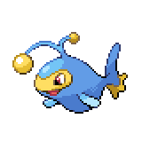

  

  

    

      
Types

      

        
        
      

    

    

      
Abilities

      

        <a href='' title="Whenever an electric-type move hits this Pokemon, it heals for 1/4 of its maximum HP, negating any other effect on it.  This ability will not take effect if this Pokemon is ground-type and thus immune to Electric moves.  Electric moves will ignore this Pokemon's substitute.  This effect includes non-damaging moves, i.e. thunder wave.">Volt-absorb</a>
        /<a href='' title="Overworld: If the lead Pokemon has this ability, the wild encounter rate is doubled.  This ability has no effect in battle.">Illuminate</a>
      

    

  

## Base Stats
<table style="width: 100%">
  <tbody style="width: 100%;">
    <tr style="display: flex; align-items: center;">
      <th style="color: #737373;" >HP</th>
      <td style="border-top: none; width: 70px">125</td>
      <td style="width: 100%; min-width: 450px; border-top: none;">
        

        

      </td>
    </tr>
    <tr style="display: flex; align-items: center;">
      <th style="color: #737373;">Attack</th>
      <td style="border-top: none; width: 70px">58</td>
      <td style="width: 100%; min-width: 450px; border-top: none;">
        

        

      </td>
    </tr>
    <tr style="display: flex; align-items: center;">
      <th style="color: #737373;">Defense</th>
      <td style="border-top: none; width: 70px">58</td>
      <td style="width: 100%; min-width: 450px; border-top: none;">
        

        

      </td>
    </tr>
    <tr style="display: flex; align-items: center;">
      <th style="color: #737373;">SP Attack</th>
      <td style="border-top: none; width: 70px">76</td>
      <td style="width: 100%; min-width: 450px; border-top: none;">
        

        

      </td>
    </tr>
    <tr style="display: flex; align-items: center;">
      <th style="color: #737373;">SP Defense</th>
      <td style="border-top: none; width: 70px">76</td>
      <td style="width: 100%; min-width: 450px; border-top: none;">
        

        

      </td>
    </tr>
    <tr style="display: flex; align-items: center;">
      <th style="color: #737373;">Speed</th>
      <td style="border-top: none; width: 70px">67</td>
      <td style="width: 100%; min-width: 450px; border-top: none;">
        

        

      </td>
    </tr>
  </tbody>
</table>

## Moveset

=== "Level Up Moves"
    | Level | Name | Power | Accuracy | PP | Type | Damage Class |
        | -- | -- | -- | -- | -- | -- | -- |
        	| 1 | Spit-up | - | 100 | 10 |  |  |
	| 1 | Eerie-impulse | - | 100 | 15 |  |  |
	| 1 | Bubble | 40 | 100 | 30 |  |  |
	| 1 | Supersonic | - | 55 | 20 |  |  |
	| 1 | Swallow | - | - | 10 |  |  |
	| 1 | Stockpile | - | - | 20 |  |  |
	| 1 | Spotlight | - | - | 15 |  |  |
	| 9 | Electro-ball | - | 100 | 10 |  |  |
	| 12 | Water-gun | 40 | 100 | 25 |  |  |
	| 17 | Confuse-ray | - | 100 | 10 |  |  |
	| 20 | Bubble-beam | 65 | 100 | 20 |  |  |
	| 23 | Spark | 65 | 100 | 20 |  |  |
	| 29 | Signal-beam | 75 | 100 | 15 |  |  |
	| 33 | Flail | - | 100 | 15 |  |  |
	| 37 | Discharge | 80 | 100 | 15 |  |  |
	| 43 | Take-down | 90 | 85 | 20 |  |  |
	| 47 | Aqua-ring | - | - | 20 |  |  |
	| 51 | Hydro-pump | 110 | 80 | 5 |  |  |
	| 54 | Ion-deluge | - | - | 25 |  |  |
	| 58 | Charge | - | - | 20 |  |  |

        

=== "Machine Moves"
    | Machine | Name | Power | Accuracy | PP | Type | Damage Class |
        | -- | -- | -- | -- | -- | -- | -- |
        	| TM27 | Toxic | - | 90 | 10 |  |  |
	| TM36 | Thunderbolt | 90 | 100 | 15 |  |  |
	| TM100 | Confide | - | - | 20 |  |  |
	| TM27 | Return | - | 100 | 20 |  |  |
	| TM87 | Swagger | - | 85 | 15 |  |  |
	| TM05 | Rest | - | - | 5 |  |  |
	| TM38 | Thunder | 110 | 70 | 10 |  |  |
	| TM88 | Sleep-talk | - | - | 10 |  |  |
	| TM32 | Double-team | - | - | 15 |  |  |
	| TM07 | Hail | - | - | 10 |  |  |
	| TM10 | Hidden-power | 60 | 100 | 15 |  |  |
	| TM21 | Frustration | - | 100 | 20 |  |  |
	| TM99 | Dazzling-gleam | 80 | 100 | 10 |  |  |
	| TM57 | Charge-beam | 50 | 90 | 10 |  |  |
	| TM55 | Scald | 80 | 100 | 15 |  |  |
	| TM45 | Attract | - | 100 | 15 |  |  |
	| TM55 | Ice-beam | 90 | 100 | 10 |  |  |
	| TM08 | Substitute | - | - | 10 |  |  |
	| TM72 | Volt-switch | 70 | 100 | 20 |  |  |
	| TM93 | Wild-charge | 90 | 100 | 15 |  |  |
	| TM48 | Hyper-beam | 150 | 90 | 5 |  |  |
	| TM07 | Protect | - | - | 10 |  |  |
	| TM12 | Facade | 70 | 100 | 20 |  |  |
	| TM48 | Round | 60 | 100 | 15 |  |  |
	| TM14 | Blizzard | 110 | 70 | 5 |  |  |
	| TM18 | Rain-dance | - | - | 5 |  |  |
	| TM68 | Giga-impact | 150 | 90 | 5 |  |  |
	| TM98 | Waterfall | 80 | 100 | 15 |  |  |
	| TM16 | Thunder-wave | - | 90 | 20 |  |  |
	| TM94 | Surf | 90 | 100 | 15 |  |  |

        
