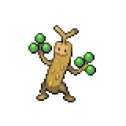

  

  

    

      
Types

      

        
        
      

    

    

      
Abilities

      

        <a href='' title="When this Pokemon is at full HP, any hit that would knock it out will instead leave it with 1 HP.  Regardless of its current HP, it is also immune to the one-hit KO moves: fissure, guillotine, horn drill, and sheer cold.  If this Pokemon is holding a focus sash, this ability takes precedence and the item will not be consumed.">Sturdy</a>
        /<a href='' title="This Pokemon does not receive recoil damage from its recoil moves.  struggle's recoil is unaffected.  This ability does not prevent crash damage from missing with jump kick or high jump kick.">Rock-head</a>
      

    

  

## Base Stats
<table style="width: 100%">
  <tbody style="width: 100%;">
    <tr style="display: flex; align-items: center;">
      <th style="color: #737373;" >HP</th>
      <td style="border-top: none; width: 70px">70</td>
      <td style="width: 100%; min-width: 450px; border-top: none;">
        

        

      </td>
    </tr>
    <tr style="display: flex; align-items: center;">
      <th style="color: #737373;">Attack</th>
      <td style="border-top: none; width: 70px">100</td>
      <td style="width: 100%; min-width: 450px; border-top: none;">
        

        

      </td>
    </tr>
    <tr style="display: flex; align-items: center;">
      <th style="color: #737373;">Defense</th>
      <td style="border-top: none; width: 70px">115</td>
      <td style="width: 100%; min-width: 450px; border-top: none;">
        

        

      </td>
    </tr>
    <tr style="display: flex; align-items: center;">
      <th style="color: #737373;">SP Attack</th>
      <td style="border-top: none; width: 70px">30</td>
      <td style="width: 100%; min-width: 450px; border-top: none;">
        

        

      </td>
    </tr>
    <tr style="display: flex; align-items: center;">
      <th style="color: #737373;">SP Defense</th>
      <td style="border-top: none; width: 70px">65</td>
      <td style="width: 100%; min-width: 450px; border-top: none;">
        

        

      </td>
    </tr>
    <tr style="display: flex; align-items: center;">
      <th style="color: #737373;">Speed</th>
      <td style="border-top: none; width: 70px">30</td>
      <td style="width: 100%; min-width: 450px; border-top: none;">
        

        

      </td>
    </tr>
  </tbody>
</table>

## Moveset

=== "Level Up Moves"
    | Level | Name | Power | Accuracy | PP | Type | Damage Class |
        | -- | -- | -- | -- | -- | -- | -- |
        	| 1 | Wood-hammer | 120 | 100 | 15 |  |  |
	| 1 | Copycat | - | - | 20 |  |  |
	| 1 | Slam | 80 | 75 | 20 |  |  |
	| 5 | Flail | - | 100 | 15 |  |  |
	| 8 | Low-kick | - | 100 | 20 |  |  |
	| 12 | Rock-throw | 50 | 90 | 15 |  |  |
	| 15 | Mimic | - | - | 10 |  |  |
	| 19 | Feint-attack | 60 | - | 20 |  |  |
	| 22 | Tearful-look | - | - | 20 |  |  |
	| 29 | Block | - | - | 5 |  |  |
	| 36 | Counter | - | 100 | 20 |  |  |
	| 40 | Sucker-punch | 70 | 100 | 5 |  |  |
	| 43 | Double-edge | 120 | 100 | 15 |  |  |
	| 50 | Hammer-arm | 100 | 90 | 10 |  |  |
	| 54 | Head-smash | 150 | 80 | 5 |  |  |

        

=== "Machine Moves"
    | Machine | Name | Power | Accuracy | PP | Type | Damage Class |
        | -- | -- | -- | -- | -- | -- | -- |
        	| TM22 | Rock-slide | 75 | 90 | 10 |  |  |
	| TM27 | Toxic | - | 90 | 10 |  |  |
	| TM100 | Confide | - | - | 20 |  |  |
	| TM27 | Return | - | 100 | 20 |  |  |
	| TM87 | Swagger | - | 85 | 15 |  |  |
	| TM23 | Smack-down | 50 | 100 | 15 |  |  |
	| TM05 | Rest | - | - | 5 |  |  |
	| TM56 | Fling | - | 100 | 10 |  |  |
	| TM41 | Earthquake | 100 | 100 | 10 |  |  |
	| TM04 | Calm-mind | - | - | 20 |  |  |
	| TM88 | Sleep-talk | - | - | 10 |  |  |
	| TM32 | Double-team | - | - | 15 |  |  |
	| TM41 | Torment | - | 100 | 15 |  |  |
	| TM46 | Thief | 60 | 100 | 25 |  |  |
	| TM39 | Rock-tomb | 60 | 95 | 15 |  |  |
	| TM13 | Brick-break | 75 | 100 | 15 |  |  |
	| TM69 | Rock-polish | - | - | 20 |  |  |
	| TM10 | Hidden-power | 60 | 100 | 15 |  |  |
	| TM21 | Frustration | - | 100 | 20 |  |  |
	| TM78 | Bulldoze | 60 | 100 | 20 |  |  |
	| TM45 | Attract | - | 100 | 15 |  |  |
	| TM37 | Sandstorm | - | - | 10 |  |  |
	| TM71 | Stone-edge | 100 | 80 | 5 |  |  |
	| TM11 | Sunny-day | - | - | 5 |  |  |
	| TM08 | Substitute | - | - | 10 |  |  |
	| TM07 | Protect | - | - | 10 |  |  |
	| TM64 | Explosion | 250 | 100 | 5 |  |  |
	| TM12 | Facade | 70 | 100 | 20 |  |  |
	| TM12 | Taunt | - | 100 | 20 |  |  |
	| TM77 | Psych-up | - | - | 10 |  |  |
	| TM96 | Nature-power | - | - | 20 |  |  |
	| TM48 | Round | 60 | 100 | 15 |  |  |

        
