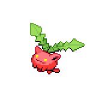

  

  

    

      
Types

      

        
        
      

    

    

      
Abilities

      

        <a href='' title="This Pokemon's Speed is doubled during strong sunlight.  This bonus does not count as a stat modifier.">Chlorophyll</a>
        /<a href='' title="This Pokemon cannot be given a major status ailment during strong sunlight.  This ability does not heal prior status ailments.  rest will fail altogether with this ability in effect.  yawn will immediately fail if used on this Pokemon during strong sunlight, and an already-used Yawn will fail if the weather turns to strong sunlight in the meantime.">Leaf-guard</a>
      

    

  

## Base Stats
<table style="width: 100%">
  <tbody style="width: 100%;">
    <tr style="display: flex; align-items: center;">
      <th style="color: #737373;" >HP</th>
      <td style="border-top: none; width: 70px">35</td>
      <td style="width: 100%; min-width: 450px; border-top: none;">
        

        

      </td>
    </tr>
    <tr style="display: flex; align-items: center;">
      <th style="color: #737373;">Attack</th>
      <td style="border-top: none; width: 70px">35</td>
      <td style="width: 100%; min-width: 450px; border-top: none;">
        

        

      </td>
    </tr>
    <tr style="display: flex; align-items: center;">
      <th style="color: #737373;">Defense</th>
      <td style="border-top: none; width: 70px">40</td>
      <td style="width: 100%; min-width: 450px; border-top: none;">
        

        

      </td>
    </tr>
    <tr style="display: flex; align-items: center;">
      <th style="color: #737373;">SP Attack</th>
      <td style="border-top: none; width: 70px">35</td>
      <td style="width: 100%; min-width: 450px; border-top: none;">
        

        

      </td>
    </tr>
    <tr style="display: flex; align-items: center;">
      <th style="color: #737373;">SP Defense</th>
      <td style="border-top: none; width: 70px">55</td>
      <td style="width: 100%; min-width: 450px; border-top: none;">
        

        

      </td>
    </tr>
    <tr style="display: flex; align-items: center;">
      <th style="color: #737373;">Speed</th>
      <td style="border-top: none; width: 70px">50</td>
      <td style="width: 100%; min-width: 450px; border-top: none;">
        

        

      </td>
    </tr>
  </tbody>
</table>

## Moveset

=== "Level Up Moves"
    | Level | Name | Power | Accuracy | PP | Type | Damage Class |
        | -- | -- | -- | -- | -- | -- | -- |
        	| 1 | Splash | - | - | 40 |  |  |
	| 1 | Absorb | 20 | 100 | 25 |  |  |
	| 4 | Synthesis | - | - | 5 |  |  |
	| 6 | Tail-whip | - | 100 | 30 |  |  |
	| 8 | Tackle | 40 | 100 | 35 |  |  |
	| 10 | Fairy-wind | 40 | 100 | 30 |  |  |
	| 12 | Poison-powder | - | 75 | 35 |  |  |
	| 14 | Stun-spore | - | 75 | 30 |  |  |
	| 16 | Sleep-powder | - | 75 | 15 |  |  |
	| 19 | Bullet-seed | 25 | 100 | 30 |  |  |
	| 22 | Leech-seed | - | 90 | 10 |  |  |
	| 25 | Mega-drain | 40 | 100 | 15 |  |  |
	| 31 | Rage-powder | - | - | 20 |  |  |
	| 34 | Cotton-spore | - | 100 | 40 |  |  |
	| 40 | Worry-seed | - | 100 | 10 |  |  |
	| 43 | Giga-drain | 75 | 100 | 10 |  |  |
	| 46 | Bounce | 85 | 85 | 5 |  |  |
	| 49 | Memento | - | 100 | 10 |  |  |

        

=== "Machine Moves"
    | Machine | Name | Power | Accuracy | PP | Type | Damage Class |
        | -- | -- | -- | -- | -- | -- | -- |
        	| TM27 | Toxic | - | 90 | 10 |  |  |
	| TM100 | Confide | - | - | 20 |  |  |
	| TM27 | Return | - | 100 | 20 |  |  |
	| TM87 | Swagger | - | 85 | 15 |  |  |
	| TM05 | Rest | - | - | 5 |  |  |
	| TM62 | Acrobatics | 55 | 100 | 15 |  |  |
	| TM88 | Sleep-talk | - | - | 10 |  |  |
	| TM32 | Double-team | - | - | 15 |  |  |
	| TM89 | U-turn | 70 | 100 | 20 |  |  |
	| TM86 | Grass-knot | - | 100 | 20 |  |  |
	| TM10 | Hidden-power | 60 | 100 | 15 |  |  |
	| TM21 | Frustration | - | 100 | 20 |  |  |
	| TM53 | Energy-ball | 90 | 100 | 10 |  |  |
	| TM40 | Aerial-ace | 60 | - | 20 |  |  |
	| TM99 | Dazzling-gleam | 80 | 100 | 10 |  |  |
	| TM83 | Infestation | 20 | 100 | 20 |  |  |
	| TM45 | Attract | - | 100 | 15 |  |  |
	| TM45 | Solar-beam | 120 | 100 | 10 |  |  |
	| TM11 | Sunny-day | - | - | 5 |  |  |
	| TM08 | Substitute | - | - | 10 |  |  |
	| TM07 | Protect | - | - | 10 |  |  |
	| TM12 | Facade | 70 | 100 | 20 |  |  |
	| TM77 | Psych-up | - | - | 10 |  |  |
	| TM48 | Round | 60 | 100 | 15 |  |  |
	| TM33 | Reflect | - | - | 20 |  |  |
	| TM75 | Swords-dance | - | - | 20 |  |  |

        
