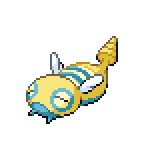

  

  

    

      
Types

      

        
        
      

    

    

      
Abilities

      

        <a href='' title="This Pokemon's moves have twice their usual effect chance.  An effect chance is a move's chance to inflict a status ailment, cause a stat change, or make the target flinch in addition to the move's main effect.  For example, flamethrower's chance of burning the target is doubled, but protect's chance of success and air cutter's increased critical hit rate are unaffected.  secret power is unaffected.">Serene-grace</a>
        /<a href='' title="This Pokemon is always successful fleeing from wild battles, even if trapped by a move or ability.">Run-away</a>
      

    

  

## Base Stats
<table style="width: 100%">
  <tbody style="width: 100%;">
    <tr style="display: flex; align-items: center;">
      <th style="color: #737373;" >HP</th>
      <td style="border-top: none; width: 70px">100</td>
      <td style="width: 100%; min-width: 450px; border-top: none;">
        

        

      </td>
    </tr>
    <tr style="display: flex; align-items: center;">
      <th style="color: #737373;">Attack</th>
      <td style="border-top: none; width: 70px">70</td>
      <td style="width: 100%; min-width: 450px; border-top: none;">
        

        

      </td>
    </tr>
    <tr style="display: flex; align-items: center;">
      <th style="color: #737373;">Defense</th>
      <td style="border-top: none; width: 70px">70</td>
      <td style="width: 100%; min-width: 450px; border-top: none;">
        

        

      </td>
    </tr>
    <tr style="display: flex; align-items: center;">
      <th style="color: #737373;">SP Attack</th>
      <td style="border-top: none; width: 70px">65</td>
      <td style="width: 100%; min-width: 450px; border-top: none;">
        

        

      </td>
    </tr>
    <tr style="display: flex; align-items: center;">
      <th style="color: #737373;">SP Defense</th>
      <td style="border-top: none; width: 70px">65</td>
      <td style="width: 100%; min-width: 450px; border-top: none;">
        

        

      </td>
    </tr>
    <tr style="display: flex; align-items: center;">
      <th style="color: #737373;">Speed</th>
      <td style="border-top: none; width: 70px">45</td>
      <td style="width: 100%; min-width: 450px; border-top: none;">
        

        

      </td>
    </tr>
  </tbody>
</table>

## Moveset

=== "Level Up Moves"
    | Level | Name | Power | Accuracy | PP | Type | Damage Class |
        | -- | -- | -- | -- | -- | -- | -- |
        	| 1 | Defense-curl | - | - | 40 |  |  |
	| 1 | Rage | 20 | 100 | 20 |  |  |
	| 3 | Rollout | 30 | 90 | 20 |  |  |
	| 6 | Spite | - | 100 | 10 |  |  |
	| 8 | Pursuit | 40 | 100 | 20 |  |  |
	| 11 | Screech | - | 85 | 40 |  |  |
	| 13 | Mud-slap | 20 | 100 | 10 |  |  |
	| 16 | Yawn | - | - | 10 |  |  |
	| 18 | Ancient-power | 60 | 100 | 5 |  |  |
	| 21 | Body-slam | 85 | 100 | 15 |  |  |
	| 23 | Drill-run | 80 | 95 | 10 |  |  |
	| 28 | Take-down | 90 | 85 | 20 |  |  |
	| 31 | Coil | - | - | 20 |  |  |
	| 33 | Dig | 80 | 100 | 10 |  |  |
	| 36 | Glare | - | 100 | 30 |  |  |
	| 38 | Double-edge | 120 | 100 | 15 |  |  |
	| 41 | Endeavor | - | 100 | 5 |  |  |
	| 43 | Air-slash | 75 | 95 | 15 |  |  |
	| 46 | Dragon-rush | 100 | 75 | 10 |  |  |
	| 48 | Endure | - | - | 10 |  |  |
	| 51 | Flail | - | 100 | 15 |  |  |

        

=== "Machine Moves"
    | Machine | Name | Power | Accuracy | PP | Type | Damage Class |
        | -- | -- | -- | -- | -- | -- | -- |
        	| TM22 | Rock-slide | 75 | 90 | 10 |  |  |
	| TM27 | Toxic | - | 90 | 10 |  |  |
	| TM36 | Thunderbolt | 90 | 100 | 15 |  |  |
	| TM100 | Confide | - | - | 20 |  |  |
	| TM27 | Return | - | 100 | 20 |  |  |
	| TM87 | Swagger | - | 85 | 15 |  |  |
	| TM85 | Dream-eater | 100 | 100 | 15 |  |  |
	| TM05 | Rest | - | - | 5 |  |  |
	| TM84 | Poison-jab | 80 | 100 | 20 |  |  |
	| TM38 | Thunder | 110 | 70 | 10 |  |  |
	| TM41 | Earthquake | 100 | 100 | 10 |  |  |
	| TM04 | Calm-mind | - | - | 20 |  |  |
	| TM88 | Sleep-talk | - | - | 10 |  |  |
	| TM32 | Double-team | - | - | 15 |  |  |
	| TM46 | Thief | 60 | 100 | 25 |  |  |
	| TM39 | Rock-tomb | 60 | 95 | 15 |  |  |
	| TM38 | Fire-blast | 110 | 85 | 5 |  |  |
	| TM10 | Hidden-power | 60 | 100 | 15 |  |  |
	| TM21 | Frustration | - | 100 | 20 |  |  |
	| TM30 | Shadow-ball | 80 | 100 | 15 |  |  |
	| TM19 | Roost | - | - | 5 |  |  |
	| TM78 | Bulldoze | 60 | 100 | 20 |  |  |
	| TM57 | Charge-beam | 50 | 90 | 10 |  |  |
	| TM74 | Gyro-ball | - | 100 | 5 |  |  |
	| TM45 | Attract | - | 100 | 15 |  |  |
	| TM45 | Solar-beam | 120 | 100 | 10 |  |  |
	| TM55 | Ice-beam | 90 | 100 | 10 |  |  |
	| TM11 | Sunny-day | - | - | 5 |  |  |
	| TM08 | Substitute | - | - | 10 |  |  |
	| TM93 | Wild-charge | 90 | 100 | 15 |  |  |
	| TM07 | Protect | - | - | 10 |  |  |
	| TM12 | Facade | 70 | 100 | 20 |  |  |
	| TM77 | Psych-up | - | - | 10 |  |  |
	| TM48 | Round | 60 | 100 | 15 |  |  |
	| TM14 | Blizzard | 110 | 70 | 5 |  |  |
	| TM18 | Rain-dance | - | - | 5 |  |  |
	| TM35 | Flamethrower | 90 | 100 | 15 |  |  |
	| TM16 | Thunder-wave | - | 90 | 20 |  |  |

        
